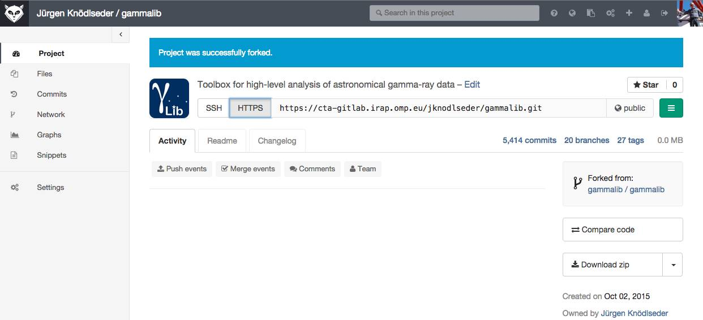

.. _git:

Using Git and GitLab
====================

The GammaLib source code is version controlled using
`Git <https://git-scm.com/>`_ that is managed through a
`GitLab <https://cta-gitlab.irap.omp.eu/gammalib/gammalib>`_ web interface.

Every developer will create a user in
`GitLab <https://cta-gitlab.irap.omp.eu/gammalib/gammalib>`_
and have an own copy (a so called fork) of the GammaLib code in his/her
user space.
There is hence no need or possibility to push to the main GammaLib
repository.
Once you forked from the GammaLib repository, you can create
feature branches and add some new code (or correct a bug), and issue a pull
request so that your change gets included in the trunk.
Note that we do not use
`GitLab's <https://cta-gitlab.irap.omp.eu/gammalib/gammalib>`_
pull request feature  for the moment, as all issues are tracked on our
`Redmine <https://cta-redmine.irap.omp.eu/projects/gammalib>`_
system, but this may change in the future.
Our `Git <https://git-scm.com/>`_ workflow is identical to the one you
typically use on `GitHub <https://github.com/gammalib/gammalib>`_.
You may in fact also use `GitHub <https://github.com/gammalib/gammalib>`_
for your code developments, as the GammaLib source code is mirrored to
`GitHub <https://github.com/gammalib/gammalib>`_ in a read only repository.

Before you start
----------------

Make sure you configured your `Git <https://git-scm.com/>`_ using your user
name and e-mail address (you only need to do this once on your machine):

.. code-block:: sh

   $ git config --global user.name "John Doe"
   $ git config --global user.email johndoe@example.com

In addition, you may need to add

.. code-block:: sh

   $ git config --global http.sslverify "false"

so that you have no SSL certificate error when you access the
repository.

Overview
--------

The figure below illustrates the `Git <https://git-scm.com/>`_ workflow
that we use for the GammaLib development.
Permanent branches are shown as black lines, temporary branches as grey lines.
The yellow area is the GammaLib repository, the light blue area is your
forked user space.
There are three permanent branches in the GammaLib repository:

* the ``master`` branch that holds the latest release
* the ``devel`` branch that is the trunk on which development progresses
* the ``integration`` branch that is used for code integration

A temporary ``release`` branch is used for hotfixes and generally for code
testing prior to any release.
As developer you will work in your user space and work on temporary
``feature`` branches.

Forking the project
-------------------

As the first step you need to create a fork of the project in your user
space.
Connect to `GitLab <https://cta-gitlab.irap.omp.eu/gammalib/gammalib>`_
using your Redmine user name and password (if you have not yet an
account on
`Redmine <https://cta-redmine.irap.omp.eu/projects/gammalib>`_ then go
ahead and create one).
Select the `GammaLib <https://cta-gitlab.irap.omp.eu/gammalib/gammalib>`_
project and click on ``Fork`` (see below).

This brings you to a screen that invites you to fork the project into
your user space.
Click on your user (see below).

After a short while a fork will be created that now is under your
ownership (see below).

Now you can clone this fork using

.. code-block:: sh

   $ git clone https://cta-gitlab.irap.omp.eu/[user]/gammalib.git

where ``[user]`` is your
`GitLab <https://cta-gitlab.irap.omp.eu/gammalib/gammalib>`_
(or `Redmine <https://cta-redmine.irap.omp.eu/projects/gammalib>`_)
user name.
To keep in sync with the GammaLib repository you should add it as
a remote repository using

.. code-block:: sh

   $ git remote add upstream https://cta-gitlab.irap.omp.eu/gammalib/gammalib.git

You can then type

.. code-block:: sh

   $ git pull upstream devel

to pull in changes from the ``devel`` branch of GammaLib in your
repository.

Modifying or adding code
------------------------

To work on a new feature or to correct a bug you should always create a new
branch.
You do this by typing

.. code-block:: sh

   $ git checkout devel
   $ git pull upstream devel
   $ git checkout -b 9101-skymap-smooth-method

which makes sure that you are on your ``devel`` branch, then pulls in changes
from the GammaLib repository, and finally creates the
``9101-skymap-smooth-method`` branch.
New branches should always start with an issue number, followed by
a meaningful name that indicates what the branch is good for (use hyphens
to separate words).
You can find the relevant issue number using the
`Redmine issue tracker <https://cta-redmine.irap.omp.eu/projects/gammalib/issues>`_.

Suppose that your goal is to add a ``smooth()`` method to the ``GSkyMap``
class.
You would then add this method to ``GSkyMap`` by editing the
``GSkyMap.hpp``, ``GSkyMap.cpp`` and ``GSkyMap.i`` files.
You should also add unit tests for the new method, and you would do
this by editing the ``test_GSky.hpp`` and ``test_GSky.cpp`` files.
Once you have verified that the new method works you should commit
your changes.

First stage all files you want to commit.
To commit for example only the new class method you should type

.. code-block:: sh

   $ git add src/sky/GSkyMap.hpp
   $ git add src/sky/GSkyMap.cpp
   $ git add src/sky/GSkyMap.i

followed by

.. code-block:: sh

   $ git commit -m "Add GSkyMap::smooth() method (#9101)
   >
   > The GSkyMap::smooth() allows the smoothing of sky maps using
   > various kernels."

where the message in quotes should be comprised of a single line subject
that describes what was changed, and a message body that describes why
the change was made. Subject line and message body should be separated
by a blank line (see `How to Write a Git Commit Message
<http://chris.beams.io/posts/git-commit/>`_).

You should then also stage and commit the remaining files.

To make the changes available to other users, and specifically to allow
their merging into the GammaLib repository, you need to push you local
changes into your
`GitLab's <https://cta-gitlab.irap.omp.eu/gammalib/gammalib>`_
repository.
You do this by typing

.. code-block:: sh

   $ git push origin 9101-skymap-smooth-method

Note that the ``origin`` argument specifies that you want to push your
changes into the same repository from which you cloned the code.

You can now verify on
`GitLab's <https://cta-gitlab.irap.omp.eu/gammalib/gammalib>`_
that a new branch exists in your project:

.. image:: gitlab-push.jpg
   :width: 600px
   :alt: Pushing a new branch
   :align: center

