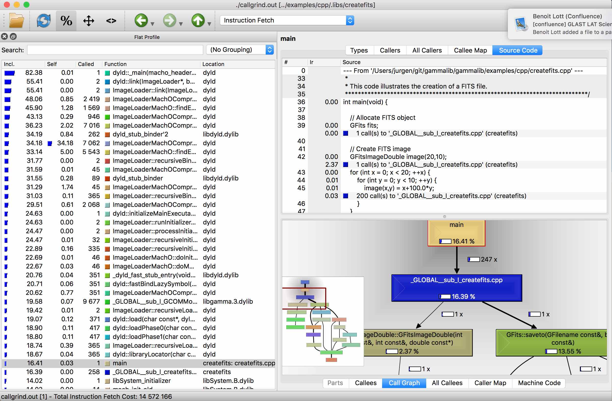

.. _dev_profiling_usage:

Using valgrind
==============

Mac OS X
--------

A valgrind analysis is performed using the ``valgrind`` tool. Here we
show as example how the ``createfits`` executable in the C++ example folder
is profiled. Please create a ``profiling`` directory in the GammaLib source
tree, step into that directory and type:

.. code-block:: bash

   $ mkdir profiling
   $ cd profiling
   $ valgrind --tool=callgrind -v --dump-every-bb=10000000 ../examples/cpp/.libs/createfits

.. warning::
   You should run the ``valgrind`` tool in a dedicated repository since a large
   number of output files will be generated.

.. note::
   To profile a C++ class you need to create a binary executable. Please make
   sure that you profile the binary executable and not a script that is
   eventually generated and wrapped around the binary executable.

The ``valgrind`` tool will generate a number of ASCII output files with names
``callgrind.out.XXXX`` where ``XXXX`` is a number. You can display the results
contained in these files using the ``qcachegrind`` tool:

.. code-block:: bash

   $ qcachegrind

The figure below shows the result obtained when running the ``createfits``
executable.

   *qcachegrind window*
