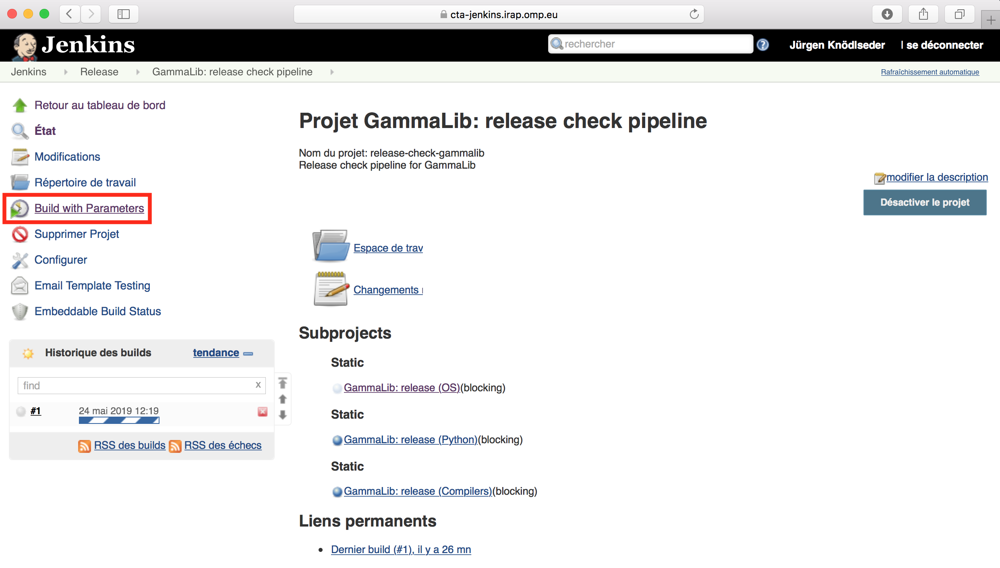

.. _dev_releasing_check:

Launch the release check pipeline
=================================

Once you have checked that the code is complete and unit tests were added
for all new code, connect to
`Jenkins <https://cta-jenkins.irap.omp.eu/view/Release/job/release-check-gammalib/>`_
and launch the GammaLib release check pipeline by clicking on the
``Build with Parameters`` link:

   *GammaLib release check pipeline*

In case that any errors occur during running the release check pipeline, you
should fix the errors and re-run the pipeline until it terminates with success.
