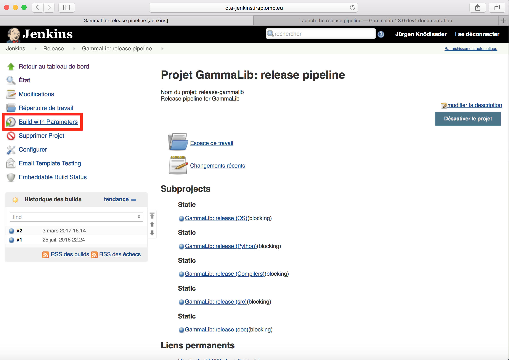

.. _dev_releasing_pipeline:

Launch the release pipeline
===========================

Now you should connect to
`Jenkins <https://cta-jenkins.irap.omp.eu>`_
and launch the GammaLib release pipeline by clicking on the dedicated
button:

   *GammaLib release pipeline*

In case that any errors occur during running the release pipeline, you should
fix the errors and rerun the pipeline until it terminates with success.
