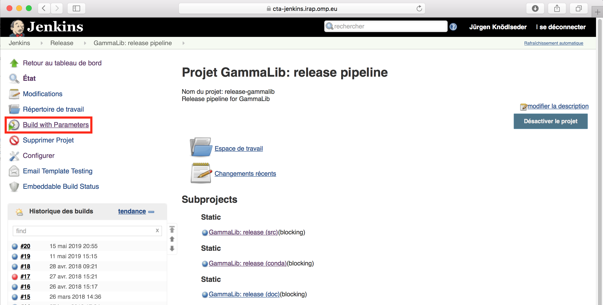

.. _dev_releasing_pipeline:

Launch the release pipeline
===========================

Once you have made a final check that all the User documentation is updated
and accurate, connect to
`Jenkins <https://cta-jenkins.irap.omp.eu/view/Release/job/release-gammalib/>`_
and launch the GammaLib release pipeline by clicking on the
``Build with Parameters`` link:

   *GammaLib release pipeline*

In case that any errors occur during running the release pipeline, you should
fix the errors and re-run the pipeline until it terminates with success.
