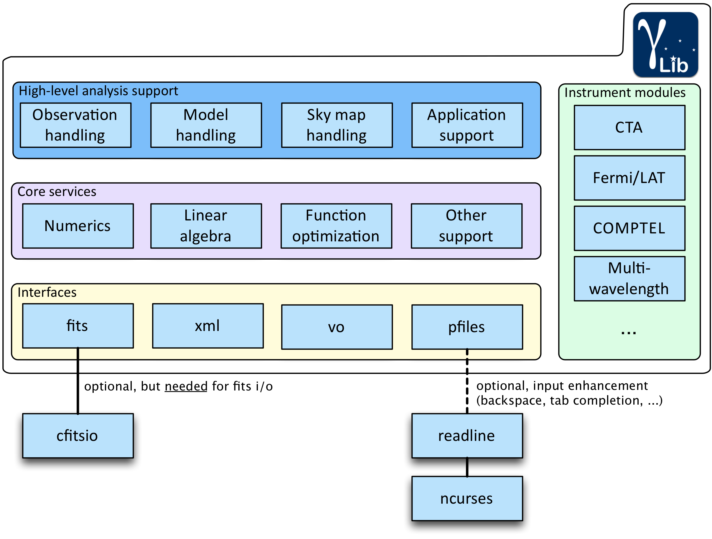

Introduction
============

Scope
-----

This User Manual provides a complete description of the GammaLib C++ library. It
is equally well suited for beginners as well as experienced users.

Overview
--------

GammaLib is a self-contained, instrument independent, open source,
multi-platform C++ library that implements all code required for the
scientific analysis of astronomical gamma-ray data. GammaLib works with
high-level data, which are data that are already calibrated and that
generally come in form of event lists or histograms.

GammaLib does not rely on any third-party software, with the only exception of
the cfitsio library from HEASARC that is used to implement the FITS
interface. This makes GammaLib basically independent of any other software
package, increasing the maintainability and enhancing the portability of
the library.

GammaLib potentially supports any gamma-ray astronomy instrument. Large parts of
the code treat gamma-ray observations in an abstract representation, and
do neither depend on the characteristics of the employed instrument, nor
on the particular formats in which data and instrument response
functions are delivered. Instrument specific aspects are implemented as
isolated and well defined modules that interact with the rest of the
library through a common interface. This philosophy also enables the
joint analysis of data from different instruments, providing a framework
that allows for consistent broad-band spectral fitting or imaging.

GammaLib source code is freely available under the GNU General Public license
version 3. The latest source code can be downloaded from
https://sourceforge.net/projects/gammalib/ which also provides bug
trackers and mailing lists. Further information and documentation on
GammaLib can be found on http://gammalib.sourceforge.net/. The present document
applies to GammaLib version 0.8.

GammaLib is designed to compile on any POSIX compliant platform. So far, 
GammaLib has been successfully compiled and tested on Mac OS X, OpenBSD, OpenSolaris
(using the gcc compiler) and many Linux flavours. Pre-packed binary
versions of the code are also available for Mac OS X. For known problems
with specific platforms, please refer to section [sec:knownproblems].

GammaLib makes heavily use of C++ classes. Instrument independency is achieved
by using abstract virtual base classes, which are implemented as derived
classes in the instrument specific modules.

GammaLib is organized into four software layers, each of which comprises a
number of modules (see :ref:`fig_structure`; the quoted module names
correspond to the folders in the source code distribution):

-  **High-level analysis support**

   GammaLib implements classes needed for the instrument independent high-level
   analysis of gamma-ray data, enabling the joint multi-instrument
   spectral and spatial fitting by forwards folding of parametric source
   and background models. This layer comprises modules for instrument
   independent handling of observations (obs), sky and background models
   (model), sky maps and sky coordinates (sky), and for the generation
   of analysis executables in form of ftools (app).

-  **Instrument specific modules**

   GammaLib support the analysis of data from the Cherenkov Telescope Array
   (cta), the *Fermi*/LAT telescope (lat), and any multi-wavelength
   information in form of spectral data points (mwl).

-  **Core services**

   GammaLib comprise modules for numerical computations (numerics), linear
   algebra (linalg), parameter optimization (opt), and support functions
   and classes (support).

-  **Interfaces**

   are implemented for reading and writing of FITS files (fits) and XML
   files (xml).

.. _fig_structure:

   GammaLib structure

GammaLib can be used as C++ application program interface (API) or as a Python
module (provided that Python is installed on your system). The GammaLib Python
bindings were built using `swig <http://www.swig.org/>`_ version 2.0.8, and are
shipped together with the source code. This enables using all
GammaLib functionalities from within Python.

The development of GammaLib has been initiated by scientists from `IRAP (Institut
de Recherche en Astrophysique et Planetologie) <http://www.irap.omp.eu/>`_, an
astrophysics laboratory of CNRS and of the `University Paul Sabatier 
<http://www.univ-tlse3.fr/>`_ situated in
Toulouse, France. GammaLib is based on past experience gained in developing
software for gamma-ray space missions, such as the COMPTEL telescope
aboard *CGRO*, the SPI telescope aboard *INTEGRAL*, and the LAT
telescope aboard *Fermi*. Initial elements of GammaLib can be found in the
``spi_toolslib`` that is part of the Off-line Science Analysis (OSA)
software distributed by ISDC for the science analysis of *INTEGRAL*
data. The development of GammaLib is nowadays mainly driven by the advances in
ground-based gamma-ray astronomy, and in particular by the development
of the CTA observatory.

