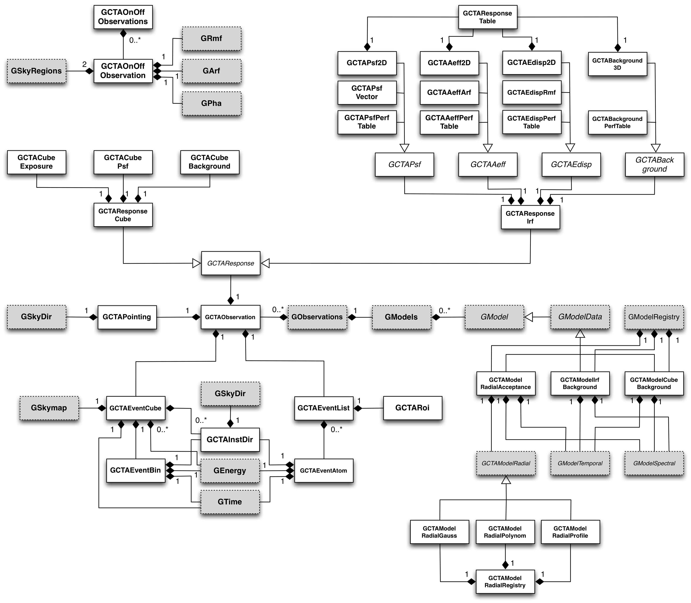

.. _sec_cta:

CTA interface
-------------

Overview
~~~~~~~~

The CTA module provides an instrument interface for Imaging Air Cherenkov 
Telescopes (IACT). The interface currently supports the event list data
format developed in the context of the Cherenkov Telescope Array (CTA)
project and provides support for various instrument response formats that
are currently used in the CTA consortium or that are under study. The interface
provides support for unbinned and binned maximum likelihood analysis, and
implements Monte Carlo simulations of high-level data based on the 
instrumental response functions.

:ref:`fig_uml_cta` present an overview over the C++ classes of the CTA
module and their relations.

.. _fig_uml_cta:

   CTA module

Two types of observations are implemented so far:
:doxy:`GCTAObservation` that derives from :doxy:`GObservation` and that
describes either a binned or unbinned data set, and
:doxy:`GCTAOnOffObservation` that describes an On-Off observation
used in classical Cherenkov Telescope data analysis.
Binned or unbinned observations are collected in the
:doxy:`GObservations` container class, while the On-Off observations
are collected in a specific :doxy:`GCTAOnOffObservations` container
class (note that the :doxy:`GCTAOnOffObservations` container may vanish
in the future when :doxy:`GCTAOnOffObservation` objects will also be
collected by the :doxy:`GObservations` container class).

The data of binned observations are stored by the
:doxy:`GCTAEventCube` class. The :doxy:`GCTAEventCube` class holds the
binned event data in form of a sky map, implemented by the
:doxy:`GSkymap` class. The sky coordinates of all sky map pixels
are stored in an array of CTA instrument directions, implemented
by the :doxy:`GCTAInstDir` class which holds a single :doxy:`GSkyDir`
object. The mean energies of the event cube
are stored in an array of :doxy:`GEnergy` objects, and the mean
time is stored by a :doxy:`GTime` object. The :doxy:`GCTAEventCube` class
holds in fact only a single event bin, implemented by the
:doxy:`GCTAEventBin` class. When the event bin is accessed using
the :doxy:`GCTAEventCube::operator[]` operator, the operator updates
references to the event cube data so that the :doxy:`GCTAEventBin`
object represents the selected event bin. This allows a memory-efficient
storage of event bin information (without storing for example the
instrument direction or the energy for each bin), while preserving
the abstract data model where an event cube of abstract type
:doxy:`GEventCube` is composed of event bins of abstract type 
:doxy:`GEventBin` (see :ref:`sec_obs`).

The data of unbinned observations are stored by the :doxy:`GCTAEventList`
class. The :doxy:`GCTAEventList` class is a container of :doxy:`GCTAEventAtom`
objects that represent individual events. Each event is composed of
a :doxy:`GCTAInstDir` object, a :doxy:`GEnergy` object and a :doxy:`GTime` object.
The region of interest covered by an event list is described by the
:doxy:`GCTARoi` class that derives from the abstract :doxy:`GRoi` class.

In addition to the event, each :doxy:`GCTAObservation` holds a
pointing object, implemented by the :doxy:`GCTAPointing` class, and
a response object, implemented by the :doxy:`GCTAResponse` class.
The :doxy:`GCTAPointing` class holds a single sky direction of type
:doxy:`GSkyDir` to describe the fixed pointing direction of the
observation. The :doxy:`GCTAResponse` class provides the instrument
response factorised in an effective area term, a point spread
function term and an energy dispersion term 
(see :ref:`sec_cta_response` for details on the response
implementation).

Models of the instrumental background are provided by the
:doxy:`GCTAModelCubeBackground` and :doxy:`GCTAModelRadialAcceptance`
classes that derive from the abstract :doxy:`GModelData` base
class
(see :ref:`sec_cta_background` for details on the background
model implementation).

.. _sec_cta_xml:

Describing CTA observations using XML
~~~~~~~~~~~~~~~~~~~~~~~~~~~~~~~~~~~~~

CTA observations can be described in GammaLib using an ASCII file in XML
format (see :ref:`sec_obsxml`). The CTA specific section of this file has
the format:

.. code-block:: xml

    <observation name="..." id="..." instrument="...">
        <parameter name="EventList"           file="..."/>
        <parameter name="EffectiveArea"       file="..."/>
        <parameter name="PointSpreadFunction" file="..."/>
        <parameter name="EnergyDispersion"    file="..."/>
        <parameter name="Background"          file="..."/>
    </observation>

for an unbinned observation and:

.. code-block:: xml

    <observation name="..." id="..." instrument="...">
        <parameter name="CountsMap"           file="..."/>
        <parameter name="EffectiveArea"       file="..."/>
        <parameter name="PointSpreadFunction" file="..."/>
        <parameter name="EnergyDispersion"    file="..."/>
        <parameter name="Background"          file="..."/>
    </observation>
 
for a binned observation. Each parameter within the ``<observation>`` tag
specifies the filename for a specific file that is needed for the analysis.
The difference between an unbinned and a binned observation is that the 
first uses an event list (requiring a parameter with name ``EventList``)
while the latter uses an event cube  (requiring a parameter with name
``CountsMap``). The ``EffectiveArea``, ``PointSpreadFunction`` and
``EnergyDispersion`` parameters provide the filenames of the instrument
specific response function components for each observation 
(see :ref:`sec_cta_response`). Note that for compatibility reasons,
``ARF`` may be used instead of ``EffectiveArea``, ``PSF`` instead
of ``PointSpreadFunction``, and ``RMF`` instead of ``EnergyDispersion``.
The ``EffectiveArea`` parameter supports the additional optional
attributes ``sigma``, ``scale`` and ``thetacut`` to provide information
about the off-axis reponse and event selection (see 
:ref:`sec_cta_response`).
So far, energy dispersion is not supported by GammaLib, hence the
``file`` attribute for the ``EnergyDispersion`` parameter can be left 
blank.
The ``Background`` parameter allows specifying of a file that contains
the instrument background model for the observation.

The ``instrument`` attribute of CTA observations can be one of
``CTA``, ``HESS``, ``MAGIC`` or ``VERITAS``. This allows mixing of
observations from difference IACTs within a single analysis.
Note that no code that is specific to any of these four instruments is
implemented in GammaLib, but the ``instrument`` attribute is used to
tie models to instruments, allowing thus to provide specific background
models for each of the instruments in a combined analysis. 

.. _sec_cta_background:

Modelling CTA background
~~~~~~~~~~~~~~~~~~~~~~~~

The generic class for modelling the CTA background is the 
:doxy:`GCTAModelCubeBackground` class. This class derives from the :doxy:`GModelData`
base class and provides a description of the background count rate as
function of reconstructued sky direction, measured energy and event trigger
time.

The XML description of the background model has the following format:

.. code-block:: xml

    <source name="CTABackgroundModel" type="CTABackground" instrument="CTA">
        <spatialModel type="...">
            ...
        </spatialModel>
        <spectrum type="...">
            ...
        </spectrum>
        <temporalModel type="...">
            ...
        </temporalModel>
    </source>

The ``<temporalModel>`` tag is optional and can generally be omitted from 
the XML file. In that case, the background rate is assumed to be constant
in time.

The ``<spatialModel>`` may be any of the spatial model components available
in GammaLib. In particular, a diffuse map cube can be used to provide an
energy dependent template of the background count rate over the field of
view:

.. code-block:: xml

    <source name="CTABackgroundModel" type="CTABackground" instrument="CTA">
        <spatialModel type="MapCubeFunction" file="my_background_template.fits">
            <parameter name="Normalization" scale="1" value="1" min="0.1" max="10" free="0"/>
        </spatialModel>
        <spectrum type="ConstantValue">
            <parameter name="Value" scale="1.0" min="0.01" max="1000.0" value="1.0" free="1"/>
        </spectrum>
    </source>

In the above example, the file ``my_background_template.fits`` contains
an image cube in the primary extension of the FITS file which describes the
count rate per solid angle and energy
(in units of :math:`counts \, s^{-1} sr^{-1} MeV^{-1}`). 
The energy of each map is provided in a binary table extension with name 
``ENERGIES`` which contains a single column with name ``Energy`` (the 
energy unit may be specified by the ``TUNIT1`` keyword; if the keyword is
omitted, MeV is assumed as unit).

The ``ConstantValue`` spectrum corresponds to a single scaling factor for
the background model, which in the above example is fitted in the maximum 
likelihood analysis. Any spectral model available in GammaLib can be used 
as the spectral component, such as for example a power law:

.. code-block:: xml

    <source name="CTABackgroundModel" type="CTABackground" instrument="CTA">
        <spatialModel type="MapCubeFunction" file="my_background_template.fits">
            <parameter name="Normalization" scale="1" value="1" min="0.1" max="10" free="0"/>
        </spatialModel>
        <spectrum type="PowerLaw">  
            <parameter name="Prefactor" scale="1.0"  value="1.0"  min="1e-3" max="1e+3"   free="1"/>  
            <parameter name="Index"     scale="1.0"  value="0.0"  min="-5.0" max="+5.0"   free="1"/>  
            <parameter name="Scale"     scale="1e6"  value="1.0"  min="0.01" max="1000.0" free="0"/>  
        </spectrum>
    </source>

In the above example, the map cube spectrum is multiplied by a power law.

.. _sec_cta_response:

Handling the instrument response
~~~~~~~~~~~~~~~~~~~~~~~~~~~~~~~~

Overview
^^^^^^^^

The CTA specific instrument response is described by the 
:doxy:`GCTAResponseIrf` class (see :ref:`sec_response` for a general description of response
handling in GammaLib). The CTA response is factorised into 
the effective area :math:`A_{\rm eff}(d, p, E, t)` (units :math:`cm^2`),
the point spread function :math:`PSF(p' | d, p, E, t)`,
and the energy dispersion :math:`E_{\rm disp}(E' | d, p, E, t)`
following:

.. math::
    R(p', E', t' | d, p, E, t) =
    A_{\rm eff}(d, p, E, t) \,
    PSF(p' | d, p, E, t) \,
    E_{\rm disp}(E' | d, p, E, t)
    :label: irf

Effective area
^^^^^^^^^^^^^^

The :math:`A_{\rm eff}(d, p, E, t)` term is described by the abstract
:doxy:`GCTAAeff` base class. The effective area is determined using
the:
 
.. code-block:: cpp
 
    double GCTAAeff::operator()(const double& logE, 
                                const double& theta = 0.0, 
                                const double& phi = 0.0,
                                const double& zenith = 0.0,
                                const double& azimuth = 0.0,
                                const bool&   etrue = true) const;

operator, where ``logE`` is the base 10 logarithm of the photon energy.
If ``etrue`` is true, ``logE`` is the true photon energy; otherwise,
``logE`` is the measured photon energy.
``theta`` and ``phi`` are the offset and azimuth angle of the incident
photon with respect to the camera pointing,
``zenith`` and ``azimuth`` are the zenith and azimuth angle of the
camera pointing.

The effective area response is implemented by one of the classes
:doxy:`GCTAAeffPerfTable`, :doxy:`GCTAAeffArf` and :doxy:`GCTAAeff2D` that
implement the different response formats that are currently used in
the CTA project. Dependent on the specified response file, the
method :doxy:`GCTAResponseIrf::load_aeff` allocates the appropriate response
class. :doxy:`GCTAAeff2D` is allocated if the response file is a FITS file
containing an extension named ``EFFECTIVE AREA``; :doxy:`GCTAAeffArf` is
allocated if an extension named ``SPECRESP`` is found; otherwise, 
:doxy:`GCTAAeffPerfTable` is allocated.

GCTAAeffPerfTable
"""""""""""""""""

:doxy:`GCTAAeffPerfTable` reads the effective area information from an ASCII
file that has been defined by the CTA Monte Carlo workpackage
(see :ref:`sec_cta_perftable`). This file provides the full effective detection
area in units of :math:`m^2` after the background cut as function of
the base 10 logarithm of the true photon energy. No theta cut is
applied. For a given energy, the effective area is computed by 
interpolating the performance table in the base 10 logarithm of energy.
Effective areas will always be non-negative.
As the response table provides only the on-axis effective area,
off-axis effective areas are estimated assuming that the radial 
distribution follows a Gaussian distribution in offset angle squared:

.. math::
    A_{\rm eff}(\theta) = A_{\rm eff}(0)
    \exp \left( -\frac{1}{2} \frac{\theta^4}{\sigma^2} \right)
    :label: cta_aeff_offset

where :math:`\sigma` characterises the size of the field of view. The
:math:`\sigma` parameter is set and retrieved using the 
:doxy:`GCTAAeffPerfTable::sigma` methods. When response information is
specified by an XML file (see :ref:`sec_cta_xml`), the :math:`\sigma`
parameter can be set using the optional ``sigma`` attribute.
If the :math:`\sigma` parameter is not explicitly set,
:math:`\sigma=3 \, {\rm deg}^2` is assumed as default.

GCTAAeffArf
"""""""""""

:doxy:`GCTAAeffArf` extracts the effective area information from a XSPEC
compatible ancilliary response file (ARF). The ARF contains the effective
area for a specific angular (or theta) cut. It should be noted that the 
:doxy:`GCTAAeffArf` class has been introduced as a work around for digesting
the ARF response provided for the 1st CTA Data Challenge (1DC). It is not
intended to use this class any longer in the future.

To recover the full effective detection area, the value of the theta cut
as well as the form of the point spread function needs to be known. When 
an ARF file is loaded using the :doxy:`GCTAAeffArf::load` method, the ARF 
values are read and stored as they are encountered in the ARF file. To 
recover the full effective detection area the theta cut value has to be 
specified using the :doxy:`GCTAAeffArf::thetacut` method, and the 
:doxy:`GCTAAeffArf::remove_thetacut` method needs to be called to rescale the ARF 
values. Note that :doxy:`GCTAAeffArf::remove_thetacut` shall only be called
once after reading the ARF, as every call of the method will modify the 
effective area values by multiplying it with a scaling factor.
The scaling factor required to recover the full effective area
will be obtained by integrating the area under the point spread function
out to the specified theta cut value. This provides the fraction of all
events that should fall within the theta cut. The applied scaling factor is
the inverse of this fraction:

.. math::
    A_{\rm eff}(E) =
    \frac{1}
    {\int_0^{\theta_{\rm cut}} 2\pi PSF(\theta | E) \sin \theta {\rm d}\theta}
    ARF(E)

An alternative way of selecting the events is to adopt an energy dependent
theta cut so that the selection always contains a fixed fraction of the 
events. This type of cut can be accomodated by specifying a scaling factor
using the :doxy:`GCTAAeffArf::scale` method prior to loading the ARF data. For
example, if the containment fraction was fixed to 80%, a scaling of 1.25
should be applied to recover the full effective detection area.
When response information is specified by an XML file (see :ref:`sec_cta_xml`),
the ``thetacut`` and ``scale`` parameters can be defined using optional 
attributes to the ``EffectiveArea`` parameter.

The ARF format does not provide any information on the off-axis dependence
of the response, as the ARF values are supplied for a specific source 
position, and hence for a specific off-axis angle with respect to the 
camera centre. By default, the same effective area values are thus applied 
to all off-axis angles :math:`\theta`.
An off-axis dependence may however be introduced by supplying a positive
value for the :math:`\sigma` parameter using the :doxy:`GCTAAeffArf::sigma` 
method, or by adding the ``sigma`` attribute to the ``EffectiveArea``
parameter in the XML file. In that case, equation :eq:`cta_aeff_offset`
is used for the off-axis dependence, with the supplied ARF values being
taken as the on-axis values.

GCTAAeff2D
""""""""""

:doxy:`GCTAAeff2D` reads the full effective area as function of energies
and off-axis angle from a FITS table. The FITS table is expected to be
in the :ref:`sec_cta_rsptable` format. From this two-dimensional table,
the effective area values are determine by bi-linear interpolation in
the base 10 logarithm of photon energy and the offset angle.

.. _sec_cta_perftable:

Performance table
^^^^^^^^^^^^^^^^^

Below an example of a CTA performance table::

  log(E)     Area     r68     r80  ERes. BG Rate    Diff Sens
  -1.7      261.6  0.3621  0.4908 0.5134 0.0189924  6.88237e-11
  -1.5     5458.2  0.2712  0.3685 0.4129 0.1009715  1.72717e-11
  -1.3    15590.0  0.1662  0.2103 0.2721 0.0575623  6.16963e-12
  -1.1    26554.1  0.1253  0.1567 0.2611 0.0213008  2.89932e-12
  -0.9    52100.5  0.1048  0.1305 0.1987 0.0088729  1.39764e-12
  -0.7    66132.1  0.0827  0.1024 0.1698 0.0010976  6.03531e-13
  -0.5   108656.8  0.0703  0.0867 0.1506 0.0004843  3.98147e-13
  -0.3   129833.0  0.0585  0.0722 0.1338 0.0001575  3.23090e-13
  -0.1   284604.3  0.0531  0.0656 0.1008 0.0001367  2.20178e-13
   0.1   263175.3  0.0410  0.0506 0.0831 0.0000210  1.87452e-13
   0.3   778048.6  0.0470  0.0591 0.0842 0.0000692  1.53976e-13
   0.5   929818.8  0.0391  0.0492 0.0650 0.0000146  1.18947e-13
   0.7  1078450.0  0.0335  0.0415 0.0541 0.0000116  1.51927e-13
   0.9  1448579.1  0.0317  0.0397 0.0516 0.0000047  1.42439e-13
   1.1  1899905.0  0.0290  0.0372 0.0501 0.0000081  1.96670e-13
   1.3  2476403.8  0.0285  0.0367 0.0538 0.0000059  2.20695e-13
   1.5  2832570.6  0.0284  0.0372 0.0636 0.0000073  3.22523e-13
   1.7  3534065.3  0.0290  0.0386 0.0731 0.0000135  4.84153e-13
   1.9  3250103.4  0.0238  0.0308 0.0729 0.0000044  6.26265e-13
   2.1  3916071.6  0.0260  0.0354 0.0908 0.0000023  7.69921e-13
   ---------------------------------------------
   1) log(E) = log10(E/TeV) - bin centre
   2) Eff Area - in square metres after background cut (no theta cut)
   3) Ang. Res - 68% containment radius of gamma-ray PSF post cuts - in degrees
   4) Ang. Res - 80% containment radius of gamma-ray PSF post cuts - in degrees
   5) Fractional Energy Resolution (rms)
   6) BG Rate  - inside point-source selection region - post call cuts - in Hz
   7) Diff Sens - differential sensitivity for this bin expressed as E^2 dN/dE
      - in erg cm^-2 s^-1 - for a 50 hours exposure - 5 sigma significance including
      systematics and statistics and at least 10 photons.

.. _sec_cta_rsptable:

Response table
^^^^^^^^^^^^^^

The CTA response table class :doxy:`GCTAResponseTable` provides a generic 
handle for multi-dimensional response information. It is based on the 
response format used for storing response information for the
*Fermi*/LAT telescope. In this format, all information is stored in
a single row of a FITS binary table. Each element of the row contains
a vector column, that describes the axes of the  multi-dimensional response
cube and the response information. Note that this class may in the future
be promoted to the GammaLib core, as a similar class has been implemented
in the *Fermi*/LAT interface. 
