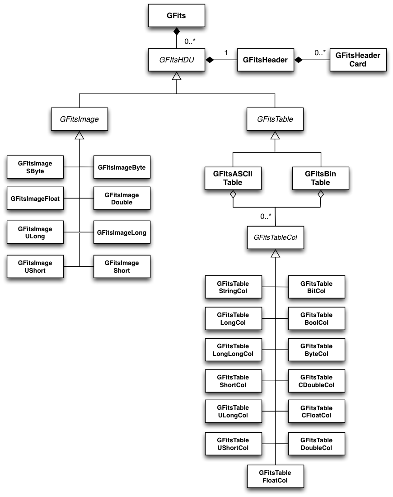

.. _sec_fits:

FITS file interface
-------------------

Overview
~~~~~~~~

:ref:`fig_uml_fits` present an overview over the C++ classes of the FITS
module and their relations.

.. _fig_uml_fits:

   FITS module

The FITS module provides a high-level interface to FITS files. The module
is based on the cfitsio library for file access. The C++ classes of the
module implement a logical representation of the FITS file in memory that
can be handled independently of the file representation on disk.

The central class of the FITS module is the :doxy:`GFits` class that represents
a FITS file. The class is a container for classes derived from the abstract
:doxy:`GFitsHDU` base class which represents a FITS extension (also called 
Header-Data Unit, HDU). Each extension is composed of one header,
implemented by the :doxy:`GFitsHeader` class and one data unit.
The header is composed of cards representing the meta-data of the fits
file. The cards are implemented by the :doxy:`GFitsHeaderCard` class.
The data unit is either an image, represented by the abstract
:doxy:`GFitsImage` base class, or a table, represented by the abstract
:doxy:`GFitsTable` base class. The image can be stored in various data
types, each of which is implemented by a specific class derived from
:doxy:`GFitsImage`. The table can be either an ASCII table,
implemented by the :doxy:`GFitsAsciiTable` class or a binary table,
implemented by the :doxy:`GFitsBinTable` class.
Each table is comprised of columns, represented by the abstract
:doxy:`GFitsTableCol` base class. This class is the same for ASCII and binary
tables. Similar to images, table column data can be stored in a variety
of data types, each of which is implemented by a specific class derived
from :doxy:`GFitsTableCol`.

Creating a FITS file
~~~~~~~~~~~~~~~~~~~~

The following example illustrates the creation of a FITS file comprising
one image and one table (see ``examples/cpp/createfits/createfits.cpp`` for the
source code; the line numbers are for reference and are not part of
the source code):

.. code-block:: cpp
   :linenos:

   GFits fits;
   GFitsImageDouble image(20,10);
   for (int x = 0; x < 20; ++x) {
       for (int y = 0; y < 10; ++y) {
          image(x,y) = x+100.0*y;
       }
   }
   fits.append(image);
   GFitsBinTable       table;
   GFitsTableDoubleCol column("ENERGY", 10, 3);
   for (int row = 0; row < 10; ++row) {
       for (int index = 0; index < 3; ++index) {
           column(row, index) = row*100.0+index;
       }
   }
   table.append(column);
   fits.append(table);
   fits.saveto("my_fits_file.fits", true);
   fits.close();

In line 1, a FITS object is allocated in memory.
An image is created in line 2, comprising 20 pixels in the x-direction
and 10 pixels in the y-direction, each pixel being a double precision
value. Lines 3-7 fill the image by a nested loop over all pixels.
The image is then appended to the FITS object in line 8.
In line 9, a binary table is created. A column comprising double precision
values is created in line 10. The name of the column is set to ``ENERGY``,
and comprises 10 rows, each of which is composed of a 3-element vector.
This so-called vector column is filled by the nested loop in lines 11-15.
In line 16, the column is appended to the binary table, which in turn is
appended to the FITS object in line 17.

In line 18, the FITS object is saved into the file ``my_fits_file.fits``.
The (optional) argument ``true`` indicates that any existing file with
the same name will be overwritten (by default, an attempt to overwrite an
existing file will lead to an exception, hence if overwriting is desired
it has to be explicitly specified).

In line 19, the FITS object is closed, implying that all memory related
to the object is deallocated. Note that saving of a FITS object does not
close the object itself; it continues to exist in memory and can be
manipulated further, independently of the FITS file on disk. Line 19 could
however be omitted, as a FITS object is automatically closed upon
destruction of the object.

Note also that up to line 17, the FITS object only exists in memory.
The FITS file on disk is only created in line 18.
Alternatively, one could have written::

    1  GFits fits("my_fits_file.fits", true);
       ...
   18  fits.save(true);

Here, the FITS file on disk is created in line 1. The (optional) ``true``
argument specifies that the FITS file should be created if it does not
yet exist. By default, this argument is set to ``false``, and an exception
is raised when creating the :doxy:`GFits` object. If a file exists already,
line 1 will in fact open the file, and lines 2-17 will add an image and
a table *in addition* to the image and table that exists already in the
file. Line 1 is in fact identical to:

.. code-block:: cpp

    GFits fits;
    fits.open("my_fits_file.fits", true);

hence it creates an instance of the :doxy:`GFits` object and then opens the
file ``my_fits_file.fits``. Line 18 then saves the FITS file taking into
account the modifications that have been made. Note that only at this point
the modifications will be written to disk. The :doxy:`GFits::save` method does not
take any filename as it saves a file that has been opened before. It takes
however the (optional) clobber flag that specifies whether a file should
be overwritten or not (as for the :doxy:`GFits::saveto` method this flag is set to 
``false`` by default).

Note that one can also combine file opening with the :doxy:`GFits::saveto` method
to create a copy of the FITS file. Specifying::

    1  GFits fits("my_fits_file.fits", true);
       ...
   18  fits.saveto("my_fits_file2.fits", true);

will open the file ``my_fits_file.fits`` and save the FITS object after
the manipulations of line 2-17 into the file ``my_fits_file2.fits``.

A final word on the ``append`` methods that are
used in the example to append the image and tables to the FITS object,
and the column to the binary table. These methods will append a *copy*
of the object to the FITS object, hence after appending, any manipulations
on the original object will not be reflected in the FITS object. If an
object should be manipulated after it has been appended, a pointer to
the object has to be retrieved from the FITS object using:

.. code-block:: cpp

    GFitsImage*    image  = fits.image(0);
    GFitsTable*    table  = fits.table(1);
    GFitsTableCol* column = (*table)["ENERGY"];
    
For reference, a screen capture of the FITS file that is created by the
above example is shown below.

.. _fig_fits_example:

.. figure:: fits_example.png
   :width: 100%

   FITS file example
