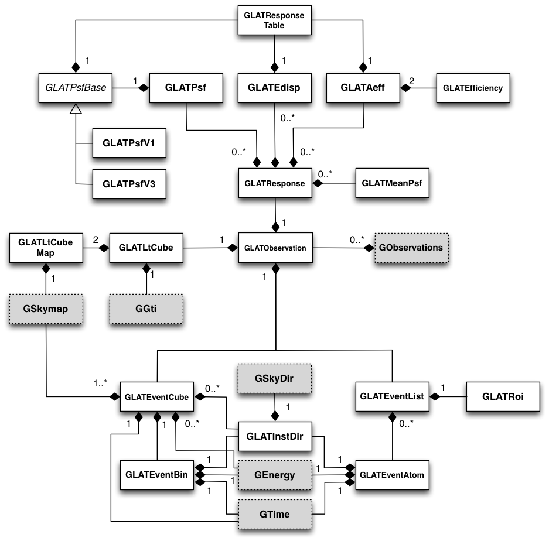

.. _sec_lat:

*Fermi*-LAT interface
---------------------

Overview
~~~~~~~~

The LAT module provides an instrument interface for the Large Area 
Telescope aboard NASA's Fermi satellite.

:ref:`fig_uml_lat` present an overview over the C++ classes of the LAT
module and their relations.

.. _fig_uml_lat:

   LAT module
