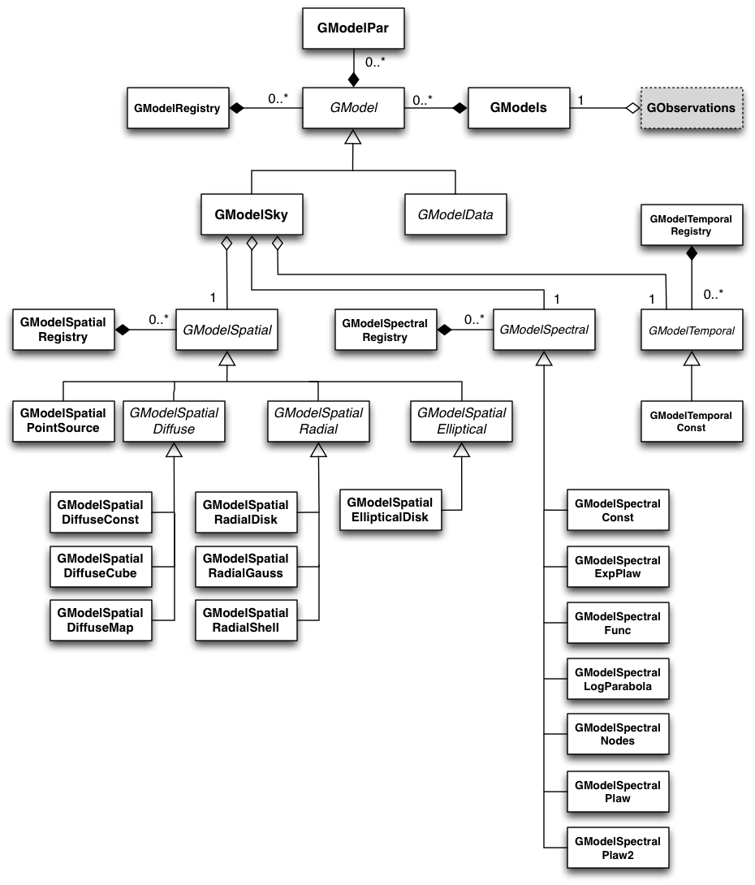
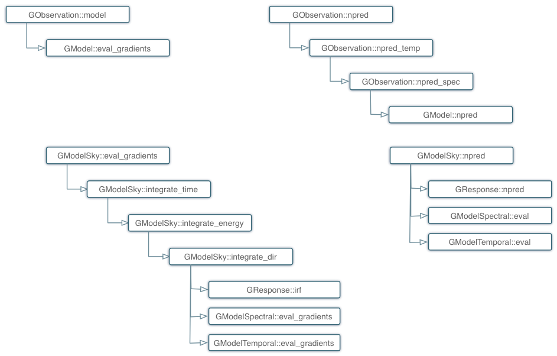

.. _sec_model:

Model handling
--------------

Overview
~~~~~~~~

:ref:`fig_uml_model` present an overview over the C++ classes of the model
module and their relations.

.. _fig_uml_model:

   Model module

The central C++ class of the model module is the abstract base class
``GModel`` which defines a model component. Model compnents are combined
using the ``GModels`` container C++ class.

Evaluating models for observations
~~~~~~~~~~~~~~~~~~~~~~~~~~~~~~~~~~

Models are evaluated by observations using the ``GObservation::model`` 
method. The ``GObservation::npred`` provides the number of predicted 
events by all models within the relevant dataspace for a given observation.

:ref:`fig_calltree_model` shows the call tree of the 
``GObservation::model`` (left) and ``GObservation::npred`` (right) 
methods. The top section shows the abstract methods, the bottom section 
shows the methods that are called for ``GModelSky`` models, i.e. models of 
celestial sources that are folded by the instrument response.

For model evaluation, the ``GObservation::model`` method loops over all 
models in the ``GModels`` container and calls the 
``GModel::eval_gradients`` method of each model. For ``GModelSky`` models, 
this invokes an integration over true time, true energy and all possible 
true photon arrival directions that may result in the observed event 
direction. The latter computation is performed by the abstract ``GResponse::irf`` 
method that needs to be implemented for each instrument.

The ``GObservation::npred`` method performs an integration over observed 
time, observed energy and observed arrival direction. The two former are 
performed by the ``GObservation::npred_temp`` and 
``GObservation::npred_spec`` methods within the ``GObservation`` class, 
the spatial integral is done within the ``GModel`` class by invoking the 
``GModel::npred`` method. For ``GModelSky`` models, the integral is 
performed by the abstract ``GResponse::npred`` method that needs to be 
implemented for each instrument.

.. _fig_calltree_model:

   Call tree for model evaluation

Spectral models
~~~~~~~~~~~~~~~

Constant
^^^^^^^^

The ``GModelSpectralConst`` class implements the constant function

.. math::
    \frac{dN}{dE} = N_0

where the parameters in the XML definition have the following mappings:

* :math:`N_0` = ``Normalization``

The XML format for specifying a constant is:

.. code-block:: xml

   <spectrum type="ConstantValue">
    <parameter name="Normalization" scale="1e-16" value="5.7"  min="1e-07" max="1000.0" free="1"/>
   </spectrum>

Power law
^^^^^^^^^

The ``GModelSpectralPlaw`` class implements the power law function

.. math::
    \frac{dN}{dE} = N_0 \left( \frac{E}{E_0} \right)^{\gamma}

where the parameters in the XML definition have the following mappings:

* :math:`N_0` = ``Prefactor``
* :math:`\gamma` = ``Index``
* :math:`E_0` = ``Scale``

The XML format for specifying a power law is:

.. code-block:: xml

   <spectrum type="PowerLaw">
    <parameter name="Prefactor" scale="1e-16" value="5.7"  min="1e-07" max="1000.0" free="1"/>
    <parameter name="Index"     scale="-1"    value="2.48" min="0.0"   max="+5.0"   free="1"/>
    <parameter name="Scale"     scale="1e6"   value="0.3"  min="0.01"  max="1000.0" free="0"/>
   </spectrum>

An alternative power law function is defined by the ``GModelSpectralPlaw2``
class that uses the integral flux as parameter rather than the Prefactor:

.. math::
    \frac{dN}{dE} = \frac{N(\gamma+1)E^{\gamma}}
                         {E_{\rm max}^{\gamma+1} - E_{\rm min}^{\gamma+1}}

where the parameters in the XML definition have the following mappings:

* :math:`N` = ``Integral``
* :math:`\gamma` = ``Index``
* :math:`E_{\rm min}` = ``LowerLimit``
* :math:`E_{\rm max}` = ``UpperLimit``

The XML format for specifying a power law defined by the integral flux is:

.. code-block:: xml

   <spectrum type="PowerLaw2">
    <parameter scale="1e-07" name="Integral"   min="1e-07" max="1000.0"    value="1.0" free="1"/>
    <parameter scale="1.0"   name="Index"      min="-5.0"  max="+5.0"      value="-2.0" free="1"/>
    <parameter scale="1.0"   name="LowerLimit" min="10.0"  max="1000000.0" value="100.0" free="0"/>
    <parameter scale="1.0"   name="UpperLimit" min="10.0"  max="1000000.0" value="500000.0" free="0"/>
   </spectrum>

**NOTE:** The UpperLimit and LowerLimit parameters are always treated as fixed and,
as should be apparent from this definition, the flux given by the Integral parameter 
is over the range (LowerLimit, UpperLimit). Use of this model allows the errors on the
integrated flux to be evaluated directly by likelihood, obviating the need to propagate
the errors if one is using the PowerLaw form.

Exponentially cut-off power law
^^^^^^^^^^^^^^^^^^^^^^^^^^^^^^^

The ``GModelSpectralExpPlaw`` class implements the exponentially cut-off power law function

.. math::
    \frac{dN}{dE} = N_0 \left( \frac{E}{E_0} \right)^{\gamma}
                    \exp \left( \frac{-E}{\tt E_{\rm cut}} \right)

where the parameters in the XML definition have the following mappings:

* :math:`N_0` = ``Prefactor``
* :math:`\gamma` = ``Index``
* :math:`E_0` = ``Scale``
* :math:`E_{\rm cut}` = ``Cutoff``

The XML format for specifying an exponentially cut-off power law is:

.. code-block:: xml

   <spectrum type="ExpCutoff">
    <parameter name="Prefactor" scale="1e-16" value="5.7"  min="1e-07" max="1000.0" free="1"/>
    <parameter name="Index"     scale="-1"    value="2.48" min="0.0"   max="+5.0"   free="1"/>
    <parameter name="Cutoff"    scale="1e6"   value="1.0"  min="0.01"  max="1000.0" free="1"/>
    <parameter name="Scale"     scale="1e6"   value="0.3"  min="0.01"  max="1000.0" free="0"/>
   </spectrum>

Broken power law
^^^^^^^^^^^^^^^^

The ``GModelSpectralBrokenPlaw`` class implements the broken power law function

.. math::

    \frac{dN}{dE} = N_0 \times \left \{
    \begin{eqnarray}
      \left( \frac{E}{E_b} \right)^{\gamma_1} & {\rm if\,\,} E < E_b \\
      \left( \frac{E}{E_b} \right)^{\gamma_2} & {\rm otherwise}
    \end{eqnarray}
    \right .

where the parameters in the XML definition have the following mappings:

* :math:`N_0` = ``Prefactor``
* :math:`\gamma_1` = ``Index1``
* :math:`\gamma_2` = ``Index2``
* :math:`E_b` = ``BreakValue``

The XML format for specifying a broken power law is:

.. code-block:: xml

   <spectrum type="BrokenPowerLaw">
    <parameter name="Prefactor"  scale="1e-16" value="5.7"  min="1e-07" max="1000.0" free="1"/>
    <parameter name="Index1"     scale="-1"    value="2.48" min="0.0"   max="+5.0"   free="1"/>
    <parameter name="BreakValue" scale="1e6"   value="0.3"  min="0.01"  max="1000.0" free="1"/>
    <parameter name="Index2"     scale="-1"    value="2.70" min="0.01"  max="1000.0" free="1"/>
   </spectrum>
   
Gaussian
^^^^^^^^

The ``GModelSpectralGauss`` class implements the gaussian function

.. math::
    \frac{dN}{dE} = \frac{N_0}{\sqrt{2\pi}\sigma}\exp(\frac{-(E-E_bar)^2}{2 \sigma^2})

where the parameters in the XML definition have the following mappings:

* :math:`N_0` = ``Prefactor``
* :math:`E_bar` = ``Mean Energy``
* :math:`sigma` = ``Energy Standard Deviation``

The XML format for specifying a power law is:

.. code-block:: xml

   <spectrum type="Gaussian">
    <parameter name="Normalization" scale="1e-10" value="1.0"  min="1e-07" max="1000.0" free="1"/>
    <parameter name="Mean"          scale="1e6"   value="5.0"  min="0.01"  max="100.0"  free="1"/>
    <parameter name="Sigma"         scale="1e6"   value="1.0"  min="0.01"  max="100.0"  free="1"/>
   </spectrum>

Node function
^^^^^^^^^^^^^

The generalisation of the broken power law is the node function, which is 
defined by a set of energy and intensity values, the so called nodes, 
which are connected by power laws.

The XML format for specifying a node function is:

.. code-block:: xml

   <spectrum type="NodeFunction">
    <node>
      <parameter scale="1.0"   name="Energy"    min="0.1"   max="1.0e20" value="1.0"  free="0"/>
      <parameter scale="1e-07" name="Intensity" min="1e-07" max="1000.0" value="1.0"  free="1"/>
    </node>
    <node>
      <parameter scale="1.0"   name="Energy"    min="0.1"   max="1.0e20" value="10.0" free="0"/>
      <parameter scale="1e-07" name="Intensity" min="1e-07" max="1000.0" value="0.1"  free="1"/>
    </node>
   </spectrum>

(in this example there are two nodes; the number of nodes in a node 
function is arbitrary).

Log parabola
^^^^^^^^^^^^

The ``GModelSpectralLogParabola`` class implements the log parabola function

.. math::
    \frac{dN}{dE} = N_0 \left( \frac{E}{E_0} \right)^{\gamma+\eta \ln(E/E_0)}

where the parameters in the XML definition have the following mappings:

* :math:`N_0` = ``Prefactor``
* :math:`\gamma` = ``Index``
* :math:`\eta` = ``Curvature``
* :math:`E_0` = ``Scale``

The XML format for specifying a log parabola spectrum is:

.. code-block:: xml

   <spectrum type="LogParabola">
    <parameter name="Prefactor" scale="1e-17" value="5.878"   min="1e-07" max="1000.0" free="1"/>
    <parameter name="Index"     scale="-1"    value="2.32473" min="0.0"   max="+5.0"   free="1"/>
    <parameter name="Curvature" scale="-1"    value="0.074"   min="-5.0"  max="+5.0"   free="1"/>
    <parameter name="Scale"     scale="1e6"   value="1.0"     min="0.01"  max="1000.0" free="0"/>
   </spectrum>

An alternative XML format is supported for compatibility with the Fermi/LAT XML format:

.. code-block:: xml

   <spectrum type="LogParabola">
    <parameter name="Prefactor" scale="1e-17" value="5.878"   min="1e-07" max="1000.0" free="1"/>
    <parameter name="alpha"     scale="1"     value="2.32473" min="0.0"   max="+5.0"   free="1"/>
    <parameter name="beta"      scale="1"     value="0.074"   min="-5.0"  max="+5.0"   free="1"/>
    <parameter name="Scale"     scale="1e6"   value="1.0"     min="0.01"  max="1000.0" free="0"/>
   </spectrum>

where

* ``alpha`` = -``Index``
* ``beta`` = -``Curvature``

File function
^^^^^^^^^^^^^

A function defined using an input ASCII file with columns of energy and
differential flux values. The energy units are assumed to be MeV and the
flux values are assumed to 
:math:`{\rm cm}^{-2} {\rm s}^{-1} {\rm MeV}^{-1}`
for a point source and 
:math:`{\rm cm}^{-2} {\rm s}^{-1} {\rm MeV}^{-1} {\rm sr}^{-1}`
for a diffuse source. The sole parameter is a multiplicative normalization:

.. math::
    \frac{dN}{dE} = N_0 \left. \frac{dN}{dE} \right\rvert_{\rm file}

where the parameters in the XML definition have the following mappings:

* :math:`N_0` = ``Normalization``

The XML format for specifying a file function is:

.. code-block:: xml

   <spectrum type="FileFunction" file="data/filefunction.txt">
    <parameter scale="1.0" name="Normalization" min="0.0" max="1000.0" value="1.0" free="1"/>
   </spectrum>

If the file is given as relative path, the path is relative to the working 
directory of the executable. Alternatively, an absolute path may be 
specified. Any environment variable present in the path name will be 
expanded.
