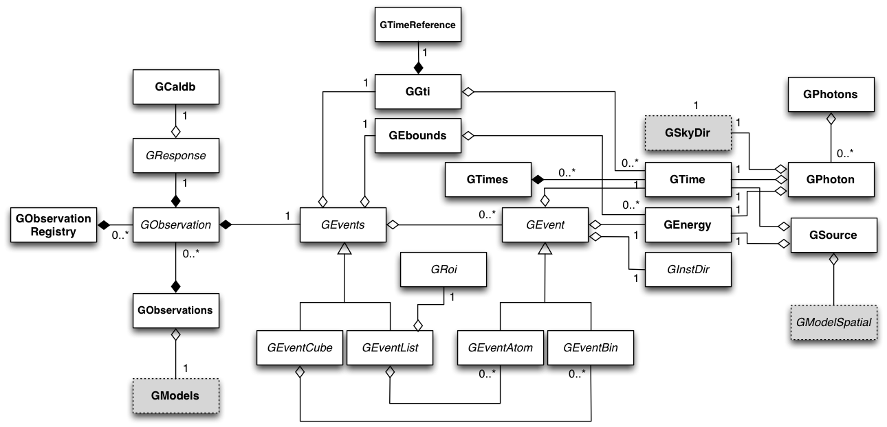

.. _sec_obs:

Observation handling
--------------------

Overview
~~~~~~~~

:ref:`fig_uml_obs` present an overview over the C++ classes of the obs
module and their relations.

.. _fig_uml_obs:

   Observation module

The central C++ class of the obs module is the abstract base class
``GObservation`` which defines the instrument-independent interface for a
gamma-ray observation. A gamma-ray observation is defined for a single
specific instrument, and describes a time period during which the
instrument is in a given stable configuration that can be characterized
by a single specific response function. Each gamma-ray observation is
composed of events, a response function and a pointing.

Observations are collected in the C++ container class :doxy:`GObservations`
which is composed of a list of :doxy:`GObservation` elements (the list is of
arbitrary length; an empty list is a valid state of the :doxy:`GObservations`
class). The observation container is furthermore composed of a :doxy:`GModels`
model container class that holds a list of models used to describe the
event distributions of the observations (see :ref:`sec_model`). The
:doxy:`GObservations` class presents the central element of all scientific data
analyses, as it combines all data and all models in a single entity.

Instrument specific implementations of :doxy:`GObservation` objects are
registered in the C++ registry class :doxy:`GObservationRegistry` which
statically collects one instance of each instrument-specific observation
class that is available in GammaLib (see :ref:`sec_registry` for a general
description of registry classes).

The instrument response for a given observation is defined by the
abstract base class :doxy:`GResponse`. This class is composed of the C++ class
:doxy:`GCaldb` which implements the calibration data base that is required to
compute the response function for a given instrument and observation.
:doxy:`GCaldb` supports the HEASARC CALDB format
(http://heasarc.nasa.gov/docs/heasarc/caldb/), but is sufficiently
general to support also other formats (see :ref:`sec_caldb` to learn
how to setup and to use a calibration database).

The pointing for a given observation is defined by the abstract base
class :doxy:`GPointing`. This class is composed of the C++ class :doxy:`GSkyDir` which
implements a sky direction, which is a position on the celestial sphere
(:doxy:`GSkyDir` returns the position in equatorial and galactic coordinates).
Note that the pointing needs not to be fixed during the observation but
may evolve with time. In this case, the sky direction returned by
:doxy:`GPointing` will explicitly depend on time.

The events for a given observation are defined by the abstract base
class :doxy:`GEvents`. This class is composed of the C++ classes :doxy:`GGti` and
:doxy:`GEbounds`. :doxy:`GGti` implements so called *Good Time Intervals*, which defines
the time period(s) during which the data were taken (see :ref:`sec_time`).
:doxy:`GEbounds` implements so called *Energy Boundaries*, which
define the energy intervals that are covered by the data (see 
:ref:`sec_energy`).

:doxy:`GEvents` is also a container for the individual events, implemented by the
abstract :doxy:`GEvent` base class. 
GammaLib distinguishes two types of events: event
atoms, which are individual events, and event bins, which are
collections of events with similar properties. Event atoms are
implemented by the abstract base class :doxy:`GEventAtom`, while event bins are
implemented by the abstract base class :doxy:`GEventBin`. Both classes derive
from the abstract :doxy:`GEvent` base class.

Each event type has it's own container class, which derives from the
abstract :doxy:`GEvents` base class. Event atoms are collected by the abstract
:doxy:`GEventList` base class, while event bins are collected by the abstract
:doxy:`GEventCube` base class. The :doxy:`GEventList` class contains an instance of the
abstract :doxy:`GRoi` base class.

.. _sec_obsxml:

Describing observations using XML
~~~~~~~~~~~~~~~~~~~~~~~~~~~~~~~~~

Observations can be described in GammaLib using an ASCII file in XML
format. The general format of this file is:

.. code-block:: xml

    <observation_list title="observation library">
        <observation name="..." id="..." instrument="...">
          ...
        </observation>
        <observation name="..." id="..." instrument="...">
          ...
        </observation>
        ...
    </observation_list>

where each ``<observation>`` tag describes one observation. Each observation
has a ``name`` attribute, an ``id`` (identifier) attribute and an
``instrument`` attribute. The latter decides which instrument specific
class will be allocated upon reading the XML file. For a given instrument,
observation identifiers must be unique.

The specific format of the XML file for a given instrument is defined by the
relevant instrument specific :doxy:`GObservation` class. For example, a CTA
observation implemented by the :doxy:`GCTAObservation` class is described by:

.. code-block:: xml

    <observation name="..." id="..." instrument="...">
        <parameter name="EventList"           file="..."/>
        <parameter name="EffectiveArea"       file="..."/>
        <parameter name="PointSpreadFunction" file="..."/>
        <parameter name="EnergyDispersion"    file="..."/>
    </observation>

for an unbinned observation and by:

.. code-block:: xml

    <observation name="..." id="..." instrument="...">
        <parameter name="CountsMap"           file="..."/>
        <parameter name="EffectiveArea"       file="..."/>
        <parameter name="PointSpreadFunction" file="..."/>
        <parameter name="EnergyDispersion"    file="..."/>
    </observation>

for a binned observation. Here, ``EventList`` specifies a FITS file containing
an event list and ``CountsMap`` specifies a FITS file containing a counts map.
The other tags specify the components of the instrumental response function.
Similar definitions exist for the other instruments.

The observations are loaded from the XML file descriptor using the load
constructor:

.. code-block:: cpp

    GObservations obs("my_observations.xml");

Alternatively, the :doxy:`GObservations::load` method can be used:

.. code-block:: cpp

    GObservations obs;
    obs.load("my_observations.xml");

The :doxy:`GObservations::read` method enables loading the observation from an 
already opened XML file:
 
.. code-block:: cpp
 
    GXml xml("my_observations.xml");
    GObservations obs;
    obs.read(xml);

Observations are saved into an XML file descriptor using:

.. code-block:: cpp

    obs.save("my_observations.xml");

or:

.. code-block:: cpp

    GXml xml("my_observations.xml");
    obs.write(xml);

.. _sec_response:

Handling the instrument response
~~~~~~~~~~~~~~~~~~~~~~~~~~~~~~~~

The instrument response to incoming gamma-rays is described by the abstract
:doxy:`GResponse` class from which an instrument specific implemention needs to
be derived.
The general instrument response function
:math:`R(p', E', t' | d, p, E, t)`
is provided by the :doxy:`GResponse::irf(GEvent&, GPhoton&, GObservation&)` method.
:math:`R` is defined as the effective detection area per time, energy and solid 
angle (in units of :math:`cm^2 s^{-1} MeV^{-1} sr^{-1}`) for measuring an event
at position :math:`p'` with an energy of :math:`E'` at time :math:`t'` if the
photon arrives from direction :math:`p` with energy :math:`E` at time 
:math:`t` on the instrument that is pointed towards :math:`d`.
The measured event quantities :math:`p'`, :math:`E'` and :math:`t'` are
combined in the abstract :doxy:`GEvent` class from which an instrument specific
implementation needs to be derived.
The photon characteristics :math:`p`, :math:`E` and :math:`t` are combined in the
:doxy:`GPhoton` class.

The photon arrival direction :math:`p` is expressed by a coordinate on
the celestial sphere, for example Right Ascension and Declination, implemented
by the :doxy:`GSkyDir` class.
For imaging instruments, the measured event position :math:`p'` is
likely also a coordinate on the celestial sphere, while for non-imaging
instruments (such as coded masks or Compton telescopes), :math:`p'`
will be typically the pixel number of the detector that measured the event.
The definition of :math:`p'` needs to be implemented for each instrument
as a derived class from the abstract :doxy:`GInstDir` class.
Energies (:math:`E'` and :math:`E`) are implemented by the :doxy:`GEnergy` class,
times (:math:`t'` and :math:`t`) are represented by the :doxy:`GTime` class.

Assuming that the photon intensity received from a gamma-ray source is described
by the source model :math:`S(p, E, t)`
(in units of :math:`photons \,\, cm^{-2} s^{-1} MeV^{-1} sr^{-1}`)
the probability of measuring an event at position :math:`p'` with 
energy :math:`E'` at time :math:`t'` from the source is given by

.. math::
    P(p', E', t'| d) = 
    \int_{0}^{t'+\Delta t} \int_{E'-\Delta E}^{\infty} \int_{\Omega} 
    S(p, E, t) \, R(p', E', t' | d, p, E, t)
    \, {\rm d}p \, {\rm d}E \,{\rm d}t
    :label: model

(in units of :math:`counts \,\, s^{-1} MeV^{-1} sr^{-1}`).
The terms :math:`\Delta t` and :math:`\Delta E` account for the statistical
jitter related to the measurement process and are of the order of a few time
the rms in the time and energy measurements.

The integration over sky positions :math:`p`, expressed as a zenith angle
:math:`\theta` and an azimuth angle :math:`\phi`, is given by

.. math::
    P_{p}(p', E', t' | d, E, t) = 
    \int_{\theta, \phi} S(\theta, \phi, E, t) \,
    R(p', E', t' | d, \theta, \phi, E, t)
    \sin \theta \, {\rm d}\theta \, {\rm d}\phi
    :label: pirf

which is provided by the :doxy:`GResponse::irf(GEvent&, GSource&, GObservation&)`
method. Note that in contrast to the method described above, this method
takes the :doxy:`GSource` class instead of the :doxy:`GPhoton` class as argument.
:doxy:`GSource` differs from :doxy:`GPhoton` in that the photon arrival direction
:math:`p` is replaced by the spatial component :doxy:`GModelSpatial` of a source
model.
Equation :eq:`pirf` is used by the :doxy:`GModelSky::eval` and
:doxy:`GModelSky::eval_gradients` methods for computation of the instrument
response to a source model (see :ref:`fig_calltree_model`). 

Dependent on the source model type (point source, radial source, elliptical
source or diffuse source), :doxy:`GResponse::irf(GEvent&, GSource&, GObservation&)`
calls the methods ``GResponse::irf_ptsrc``, ``GResponse::irf_radial``,
``GResponse::irf_elliptical`` or ``GResponse::irf_diffuse``. All these methods
have a default implementation in :doxy:`GResponse`, thus formally the methods do
not need to be implemented in the derived class.
However, except for ``GResponse::irf_ptsrc``, the code for the methods has not
been written so far, hence if an instrument should support models others
than the point source model, the respective methods need to be implemented in
the instrument specific implementation of the :doxy:`GResponse` class.

A maximum likelihood analysis of the data generally needs the computation of the
predicted number of events within the selection region for each source model.
Selection region means here the range of measured quantities that is used for
analysis (i.e. range in event position :math:`p'`, measured energy :math:`E'`
and time :math:`t'`).
For a likelihood analysis where the events have been binned in a data cube
(i.e. a so-called binned likelihood analysis), the predicted number of events
is obtained by summing over all bins of the predicted events in the data cube.
For an unbinned likelihood analysis that operates directly on the list of
detected events, the predicted number of events is obtained by integrating
equation :eq:`model` over the selection region:

.. math::
    N_{\rm pred} = \int_{\rm GTI} \int_{E_{\rm bounds}} \int_{\rm ROI} 
    P(p', E', t'| d) \,
    {\rm d}p' \, {\rm d}E' \, {\rm d}t'
    :label: npred

Here, the event selection region is defined by a Region of Interest
(:math:`\rm ROI`) that defines the selected range in event positions 
:math:`p'`, a set of energy boundaries (:math:`E_{\rm bounds}`) that
defines the selected energies :math:`E'`, and Good Time Intervals
(:math:`\rm GTI`) that the define the selected time intervals.
The definition of the Region of Interest is instrument specific and needs
to be implemented by a class derived from the abstract :doxy:`GRoi` class.
Energy boundaries are specified by the :doxy:`GEbounds` class, time intervals
by the :doxy:`GGti` class.

The integration over the region of interest

.. math::
    N_{\rm ROI} = \int_{\rm ROI} (p', E', t'| d) \, {\rm d}p'

is provided by the :doxy:`GResponse::npred(GSource&, GObservation&)` method.
Dependent on the source model type (point source, radial source, elliptical
source or diffuse source), :doxy:`GResponse::npred(GSource&, GObservation&)`
calls the methods ``GResponse::npred_ptsrc``, ``GResponse::npred_radial``,
``GResponse::npred_elliptical`` or ``GResponse::npred_diffuse``.
All these methods have a default implementation in :doxy:`GResponse`, which
all make use of the pure virtual :doxy:`GResponse::npred(GPhoton&, GObservation&)`
method that needs to be implemented by the instrument specific derived
class.
See :ref:`fig_calltree_model` to see how the :doxy:`GResponse::npred` method is
used in response computations of source models.

A final word about deadtime corrections.
Deadtime corrections need to be taken into account at the level of the instrument
specific response classes.
Deadtime corrections can be determined using the :doxy:`GObservation::deadc` method,
which provides the time dependent deadtime correction factor.

.. _sec_caldb:

Setting up and using a calibration database
~~~~~~~~~~~~~~~~~~~~~~~~~~~~~~~~~~~~~~~~~~~

TBW: Describe how to setup and how to use a calibration database.

.. _sec_time:

Times in GammaLib
~~~~~~~~~~~~~~~~~

TBW: Describe how times are implemented in GammaLib. This section should also
handle GTIs.

.. _sec_energy:

Energies in GammaLib
~~~~~~~~~~~~~~~~~~~~

TBW: Describe how energies are implemented in GammaLib. Mention that the
internal energy is MeV. This section should also handle EBOUNDS.

.. _sec_roi:

Regions of Interest
~~~~~~~~~~~~~~~~~~~

TBW: Describe what a ROI is and why this is needed (unbinned analysis).
