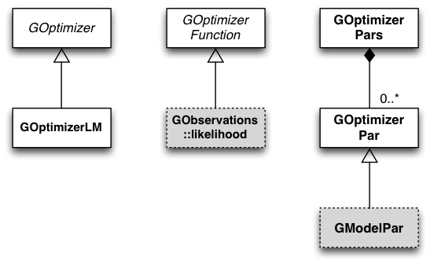

.. _sec_opt:

Optimizers
----------

Overview
~~~~~~~~

The optimizer module provides classes for function optimization.
The abstract ``GOptimizerFunction`` base class defines the interface
for the function that should be optimized. The ``GOptimizerPar``
class defines a parameter of the function, and the ``GOptimizerPars``
container class collects all function parameters. The optimizer
is represented by the abstract ``GOptimizer`` base class. So far,
the only optimizer algorithm implemented in GammaLib is the
Levenberg-Marquardt algorithm, implemented by the class
``GOptimizerLM``.

:ref:`fig_uml_opt` presents an overview over the C++ classes of
the optimizer module and their relations.

.. _fig_uml_opt:

   Optimizer module

The model parameter class ``GModelPar``, as a specific implementation
of the optimizer parameter class, derives from ``GOptimizerPar``.
One implementation of an optimizer function is the
``GObservations::likelihood`` class that is used for maximum
likelihood fitting within GammaLib.

Example: Optimizing a function
~~~~~~~~~~~~~~~~~~~~~~~~~~~~~~

This example illustrates how the minimum of a quadratic function of 
the form :math:`f(x)=ax^2+bx+c` can be determined using the optimizer.

The source code is in ``examples/cpp/optimize/optimize.cpp``.

First, the function to be optimized has to be implemented as a class derived from
``GOptimizerFunction``:

.. literalinclude:: ../../../../examples/cpp/optimize/optimize.cpp
   :language: cpp
   :linenos:
   :lines: 36-57

Lines 1-12 define the ``parabola`` class that requires implementing the
``eval``, ``value``, ``gradient`` and ``curvature`` methods. The ``eval``
method, implement in lines 13-22, performs the computation of the
function value, the gradient and the products of the gradients.

The optimization is then done using the following code:

.. code-block:: cpp
   :linenos:

   GOptimizerLM opt;
   parabola fct;
   GOptimizerPars pars(1);
   pars[0]->value(1.5);
   opt.optimize(fct, pars);
   std::cout << "Function value .....: " << fct.value() << std::endl;
   std::cout << "Parameter value ....: " << pars[0]->value() << std::endl;

Line 1 allocates an Levenberg-Marquardt optimizer, line 2 creates an 
instance of the function to optimize. In line 3, a parameter container
with a single parameter is allocated, and the value of the single parameter
is set to 1.5 in line 4. In line 5, the optimizer is called, and the 
resulting function value and best fitted parameter is logged in to console 
in lines 6-7.

Here's the output::

   $ ./optimize 
   Function value .....: 4.99001e-07
   Parameter value ....: 1.0005

