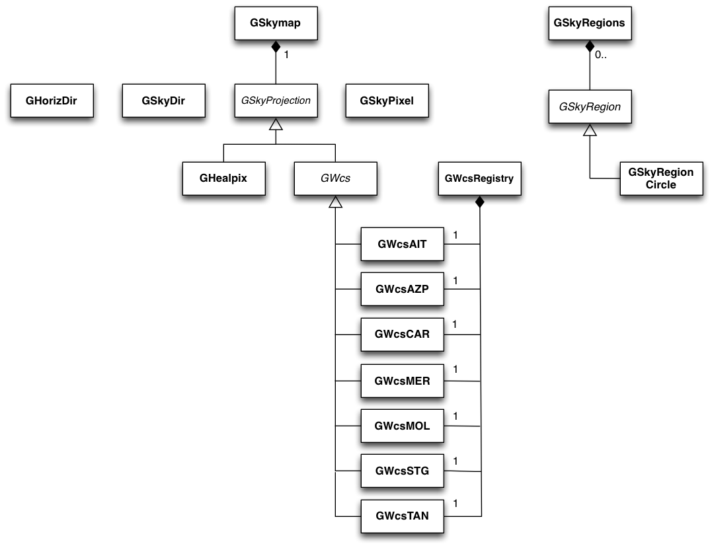

.. _sec_sky:

Sky maps, sky coordinates and sky regions
-----------------------------------------

Overview
~~~~~~~~

The sky module provides classes to handle sky maps, sky coordinates
and sky regions.
Sky maps are implemented by the :doxy:`GSkymap` class which stores
intensities for a defined grid of sky coordinates.
A :doxy:`GSkymap` object may hold several sky maps with identical
pixelisation, for example to represent the energy-dependence of the
sky intensities.
The relation between sky coordinates and pixel coordinates is
defined by the coordinate projection, represented by the abstract
:doxy:`GSkyProjection` base class. The derived class :doxy:`GHealpix`
implements the relation for the HEALPix pixelisation scheme, the 
abstract :doxy:`GWcs` base class represents the relation for World
Coordinate Systems. Specific World Coordinate System projections
are implemented by the :doxy:`GWcsAIT`, :doxy:`GWcsAZP`, :doxy:`GWcsCAR`,
:doxy:`GWcsMER`, :doxy:`GWcsSTG` and :doxy:`GWcsTAN` classes. Instances of
all specific World Coordinate System classes are collected in
the :doxy:`GWcsRegistry` registry class.

Sky coordinates are implemented by the :doxy:`GSkyDir` class that
specifies celestial coordinates in either equatorial (Right Ascension
and Declination) or galactic (longitude and latitude) coordinates.
Transformation between both systems is handled transparently by
:doxy:`GSkyDir`.
Sky map pixels are implemented by the :doxy:`GSkyPixel` class.

Sky regions are represented by the abstract :doxy:`GSkyRegion` base class.
So far, only a simple circular sky region is implemented by the
:doxy:`GSkyRegionCircle` class. Sky regions are collected in the 
:doxy:`GSkyRegions` container class.

:ref:`fig_uml_sky` present an overview over the C++ classes of the sky
module and their relations.

.. _fig_uml_sky:

   Sky module
