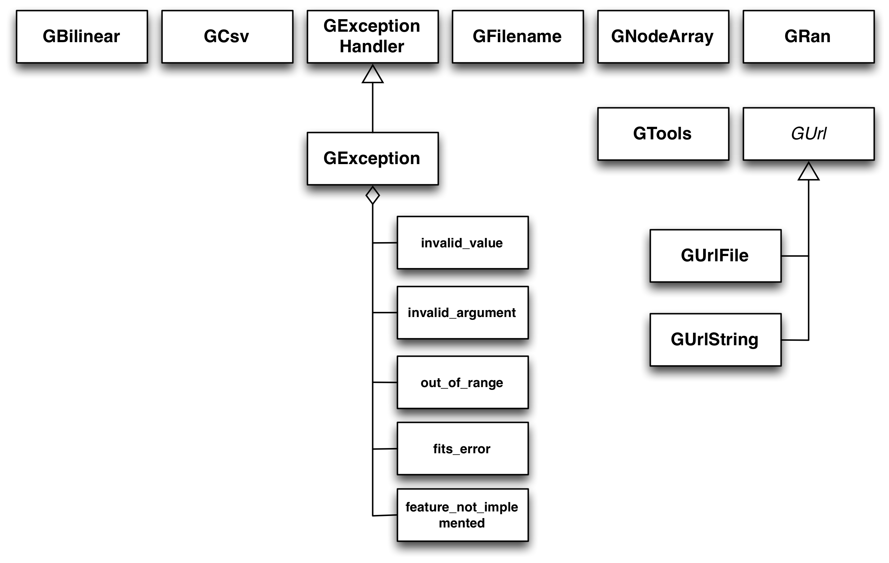

.. _sec_support:

Support functions and classes
-----------------------------

Overview
~~~~~~~~

The support module contains a number of functions and classes that are 
needed to support core functionnalities of GammaLib. An overview of the 
functions and C++ classes present in this module is given in 
:ref:`fig_uml_support`. The ``GCsv`` class supports handling of column 
separated value tables. The ``GExceptionHandler`` class implements an
exception handler that is used through GammaLib for exception handling.
The ``GException`` class derives from this handler, and implements a
number of sub-classes that are actually thrown in exceptions. The
``GNodeArray`` implements methods for linear interpolation between node
values. This is the central interpolation class that is used in GammaLib.
The ``GRan`` class implements a random number generator that is widely used
for Monte Carlo simulations. The ``GTools`` module is not a class, but a
collection of constants and functions that is widely used in GammaLib.
The abstract ``GUrl`` base class represents a unified location for some
information that is independent of the media. The classes ``GUrlFile``
and ``GUrlString`` are derived from ``GUrl`` and implement a file storage 
and a string storage, respectively. As most of the classes are unrelated,
they will be described individually in the following sections.

.. _fig_uml_support:

   Support module

Column Separated Value tables
~~~~~~~~~~~~~~~~~~~~~~~~~~~~~

The ``GCsv`` class handles column separated value tables. Column separated 
value tables are ASCII files representing a table, where individual table
columns a separated by a specific character (for example a whitespace or a 
comma).

Exception handling
~~~~~~~~~~~~~~~~~~

GammaLib uses C++ exceptions to handle any kind of errors or unexpected
values that are encountered. Here an example of how an exception is thrown 
in the ``GModels::at`` method:

.. code-block:: cpp
   :linenos:

    #define G_AT "GModels::at(int&)"
    GModel* GModels::at(const int& index)
    {
        if (index < 0 || index >= size()) {
            throw GException::out_of_range(G_AT, "Model index", index, size());
        }
        return m_models[index];
    }

Line 1 defines the name of the method that is always passed to the 
exception handle to track the origin of the exception. The definition 
should always provide the class name, the method name and the argument
types (as several methods with the same name but a different set of 
arguments may exist). Variable names or const declarations are omitted 
from the definition.

The method is implemented in lines 2-8. Before accessing a model in line 
7, the method checks whether the provided index is in the valid range. 
Note that lower and upper boundary of the index value is systematically 
checked in all GammaLib methods that perform index checking. If one of the 
boundary conditions is violated, the ``throw`` statement is used to throw 
an object of type ``GException::out_of_range``. The object is constructed 
by passing the method name (defined by ``G_AT``), a text string that 
describes the parameter that is out of the valid range, the value of the 
parameter, and the maximum number of elements that are expected in the 
range. This specific instance of the ``GException::out_of_range`` class
assumes that the lower boundary of the valid range is 0, hence it does not 
need to be specified explicitely as an argument.

The actual GammaLib code implements a wealth of possible exceptions, yet 
in a future version of the code, this wealth should be reduced to a 
limited set of standard exceptions. The first class of exceptions are
logic exceptions, which are those that the client could in principle have 
tested before calling the method. These comprise:

==================== =====
Logic exceptions     Usage
==================== =====
``invalid_value``    An invalid value has been encountered in the method.
``invalid_argument`` One of the arguments passed to the method is invalid.
``out_of_range``     An index is outside the expected range.
``fits_error``       An error has occured in FITS file handling.
==================== =====

The second class of exceptions are runtime exceptions, which are those 
that are not testable by the client. Typical runtime exceptions are 
underflow or overflow errors. So far, only one runtime exception is 
implemented in GammaLib:

=========================== =====
Runtime exceptions          Usage
=========================== =====
``feature_not_implemented`` The method has not been implemented.
=========================== =====

Linear interpolation
~~~~~~~~~~~~~~~~~~~~

Linear interpolation is implemented in GammaLib through the ``GNodeArray`` 
class. This class contains a collection of nodes :math:`x_i` that may be
used to describe a functional relation :math:`y_i=f(x_i)`. The following 
code illustrates how the ``GNodeArray`` class is used
(see ``examples/cpp/interpolate/interpolate.cpp`` for the source code):

.. code-block:: cpp
   :linenos:

    double x_i[] = {1.0, 4.0, 6.0};
    double y_i[] = {8.0, 7.0, 2.0};
    GNodeArray nodes(3, x_i);
    for (double x = 0; x < 10.0; x += 0.5) {
        nodes.set_value(x);
        double y = y_i[nodes.inx_left()]  * nodes.wgt_left() + y_i[nodes.inx_right()] * nodes.wgt_right();
        std::cout << "x=" << x << " : y=" << y << std::endl;
    }

In line 1, the nodes :math:`x_i` at which the function values :math:`y_i`
are given are declared, the actual function values :math:`y_i` are
declared in line 2. In line 3, a node array is constructed from the
node values. Note that the actual function values are not part of the
node array, only the node values are in fact used by the ``GNodeArray``
class.

In lines 4-8, the function is interpolated at a number of values in the
interval :math:`[0,10[`. In line 5, the :math:`x` value is set at which
the interpolation should be done. The interpolation is then done in
line 6 using the formula

.. math::
   y = y_{i_{\rm left}} * w_{i_{\rm left}} + y_{i_{\rm right}} * w_{i_{\rm right}}

where :math:`i_{\rm left}` and :math:`i_{\rm right}` are the node indices
that encompass the :math:`x` value, and :math:`w_{i_{\rm left}}` and
:math:`w_{i_{\rm right}}` are the weights with which the function values 
:math:`y_{i_{\rm left}}` and :math:`y_{i_{\rm right}}` need to be multiplied
to obtain the interpolated value :math:`y`. Note that

.. math::
   w_{i_{\rm left}} + w_{i_{\rm right}} = 1

The method also works for extrapolation.
For :math:`x < x_0`, :math:`i_{\rm left}=0` and :math:`i_{\rm right}=1`,
while for :math:`x > x_{i_{\rm last}}`, :math:`i_{\rm left}=i_{\rm last}-1`
and :math:`i_{\rm right}=i_{\rm last}` (where :math:`i_{\rm last}` is the
index of the last node, which is :math:`2` in the example above).
The weights are set so that :math:`y` is extrapolated linearly.

It is obvious that ``GNodeArray`` needs at least 2 node values to operate.

Random number generation
~~~~~~~~~~~~~~~~~~~~~~~~

Constants and utility functions
~~~~~~~~~~~~~~~~~~~~~~~~~~~~~~~

The ``GTools.hpp`` header defines a number of constants and utility 
functions that are widely used in GammaLib.

Constants
^^^^^^^^^

The following constants are available:

======================== =====
Constant                 Value
======================== =====
``gammalib::MeV2erg``    :math:`1.6021765 \times 10^{-6}` (converts MeV to erg)
``gammalib::erg2MeV``    :math:`624150.96` (converts erg to MeV)
``gammalib::pc2cm``      :math:`3.08568025 \times 10^{18}` (converts pc to cm)
``gammalib::sec_in_day`` :math:`86400.0` (number of seconds in one day)
======================== =====

Functions
^^^^^^^^^

The following functions are available:

============================== ===========
Function                       Description
============================== ===========
``gammalib::strip_whitespace`` Strips all leading and trailing whitespace from string.
``gammalib::strip_chars``      Strips all leading and trailing characters from string.
``gammalib::expand_env``       Replace any environment variables in string by its value.
``gammalib::str``              Conversion of C-types to strings.
``gammalib::tochar``           Conversion of string to ``char``.
``gammalib::toshort``          Conversion of string to ``short``.
``gammalib::toushort``         Conversion of string to ``unsigned short``.
``gammalib::toint``            Conversion of string to ``int``.
``gammalib::touint``           Conversion of string to ``unsigned int``.
``gammalib::tolong``           Conversion of string to ``long``.
``gammalib::toulong``          Conversion of string to ``unsigned long``.
``gammalib::tolonglong``       Conversion of string to ``long long``.
``gammalib::toulonglong``      Conversion of string to ``unsigned long long``.
``gammalib::tofloat``          Conversion of string to ``float``.
``gammalib::todouble``         Conversion of string to ``double``.
``gammalib::toupper``          Conversion of string to upper case letters.
``gammalib::tolower``          Conversion of string to lower case letters.
``gammalib::split``            Split string in vector of strings.
``gammalib::fill``             Fill string with a number of replications of a string.
``gammalib::left``             Left justify string to achieve a given length of characters.
``gammalib::right``            Right justify string to achieve a given length of characters.
``gammalib::center``           Center string to achieve a given length of characters.
``gammalib::parformat``        Format string for parameter value display.
``gammalib::plaw_photon_flux`` Compute photon flux under a power law.
``gammalib::plaw_energy_flux`` Compute energy flux under a power law.
``gammalib::file_exists``      Check whether a file exists.
``gammalib::isinfinite``       Check whether a double precision value is infinite.
``gammalib::isnotanumber``     Check whether a double precision value is not a number.
``gammalib::contains``         Check whether a string contains a sub-string.
``gammalib::warning``          Dump warning in console.
============================== ===========

Media independent information handling
~~~~~~~~~~~~~~~~~~~~~~~~~~~~~~~~~~~~~~
