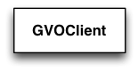

.. _sec_vo:

Virtual Observatory interface
-----------------------------

Overview
~~~~~~~~

The VO module provides classes that interface GammaLib to the Virtual 
Observatory infrastructure. So far the module contains :doxy:`GVOClient`
as only class, which implements a client for the Virtual Observatory.

:ref:`fig_uml_vo` present an overview over the C++ classes of the VO
module and their relations.

.. _fig_uml_vo:

   VO module
