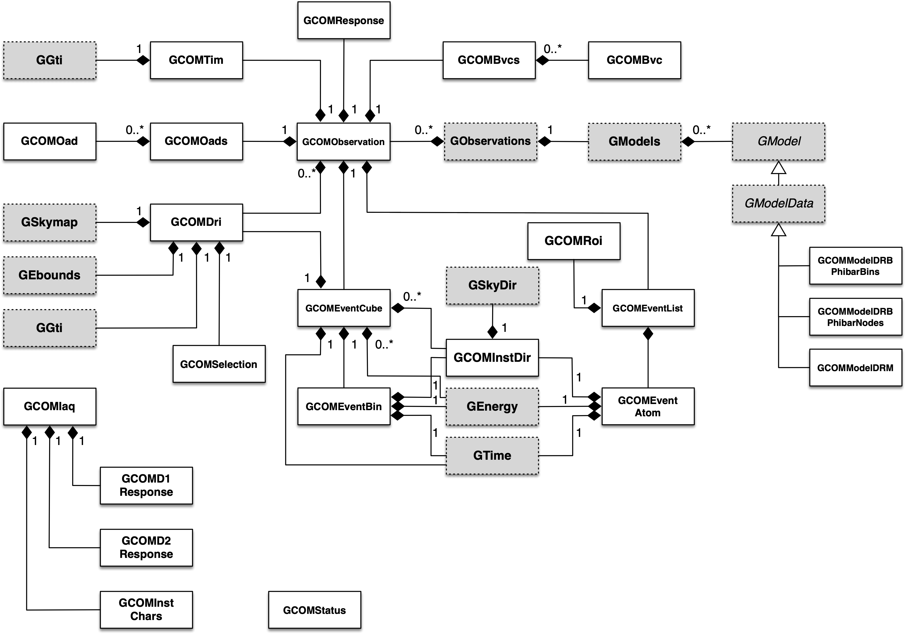

.. um_com:

COMPTEL interface
-----------------

Overview
~~~~~~~~

The COMPTEL module provides an instrument interface for the COMPTEL 
telescope that has been operated on the Compton Gamma-Ray Observatory 
(CGRO) from 1991 to 2000.

The following figure presents an overview over the C++ classes of the COMPTEL
module and their relations.

.. _fig_uml_com:

   *COMPTEL module*

The central object is a COMPTEL observation, implemented by the
:doxy:`GCOMObservation` class. The class either holds a COMPTEL event cube,
implemented by the :doxy:`GCOMEventCube` class, or an event list, implemented
by the :doxy:`GCOMEventList` class. A single bin of the event cube is
implemented by the :doxy:`GCOMEventBin` class, a single event by the
:doxy:`GCOMEventAtom` class.

The :doxy:`GCOMEventCube` class uses the general :doxy:`GCOMDri` class to
store the data. :doxy:`GCOMDri` implements a general three-dimensional
data-space of COMPTEL, spanned by the scatter direction :math:`\chi` and
:math:`\Psi` and the scatter angle :math:`\bar{\varphi}`.
This three-dimensional coordinate is implemented by the :doxy:`GCOMInstDir`
class.
The :doxy:`GCOMDri` class further stores the selection sets, implemented by the
:doxy:`GCOMSelection` class.

The :doxy:`GCOMObservation` class further holds COMPTEL Good Time Intervals,
implemented by the :doxy:`GCOMTim` class, and Orbit Aspect Data, implemented
by the :doxy:`GCOMOads` container class that holds records of  :doxy:`GCOMOad`.

The module also provides a :doxy:`GCOMIaq` class that enables computation of
instrument response functions. The computation is based on the D1 and D2
detector response functions, that are accessed via the :doxy:`GCOMD1Response`
and :doxy:`GCOMD2Response` classes. Instrument characteristics that are also
required for the computation are access via the :doxy:`GCOMInstChars` class.

So far a single COMPTEL background model exists, that performs
:math:`\bar{\varphi}` of a DRI model cube. This model is implemented by the
:doxy:`GCOMModelDRBFitting` class.

Finally, the :doxy:`GCOMStatus` class holds instrument status information.
