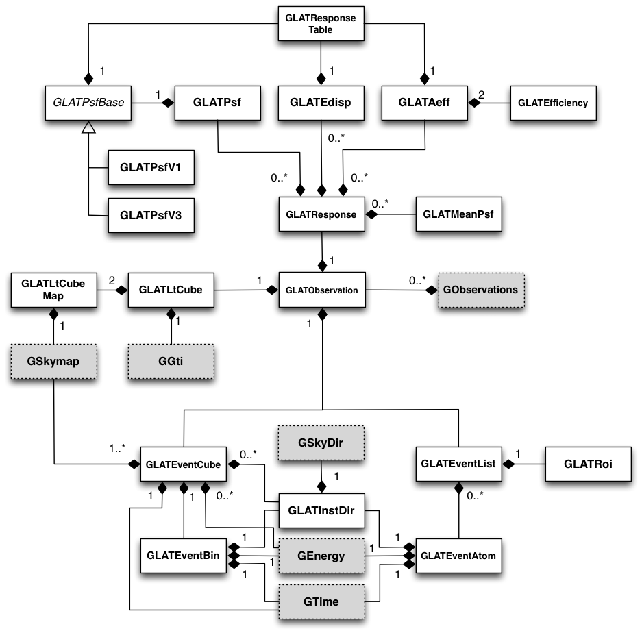

.. _um_lat:

*Fermi*-LAT interface
---------------------

Overview
~~~~~~~~

The following figure presents an overview over the classes of the LAT
module and their relations.

.. _fig_uml_lat:

   *LAT module*

The LAT module provides an instrument interface for the Large Area 
Telescope aboard NASA's Fermi satellite.

