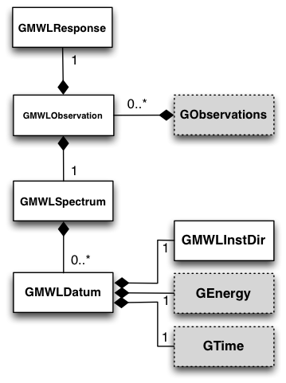

.. _um_mwl:

Multi-wavelength interface
--------------------------

Overview
~~~~~~~~

The following figure presents an overview over the classes of the 
multi-wavelength module and their relations.

.. _fig_uml_mwl:

   *Multi-wavelength module*

The multi-wavelength module provides an interface for spectral energy 
distributions (SEDs). The SED defines the observed photon flux as function 
of energy (or frequency) from a particular source, and this information 
can be used in a fit to determine spectral source parameters.

