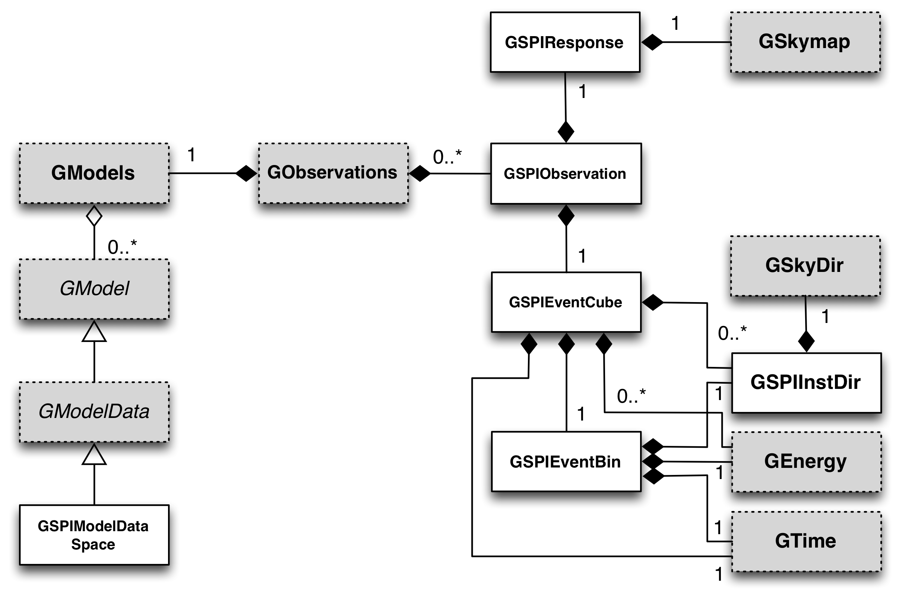

.. um_com:

INTEGRAL/SPI interface
----------------------

Overview
~~~~~~~~

The SPI module supports the Spectrometre on INTEGRAL, an instrument for
low-energy gamma-ray astronomy that currently flies on ESA's INTEGRAL
satellite. The satellite was launched on 17 October 2002 and operates since
then in an elliptical orbit of about three days. The SPI telescope operates
between 20 keV and 8 MeV and is equipped with 19 high-resolution Germanium
detectors. It uses a coded mask to image sources in a field-of-view of about
16 deg in diameter (fully coded). The angular resolution is about 2 deg, the
spectral resolution is about 2 keV.

The following figure presents an overview over the classes of the SPI
module and their relations.

.. _fig_uml_spi:

   *SPI module*

The central object is a SPI observation, implemented by the
:doxy:`GSPIObservation` class.
The class holds a SPI event cube that is implemented by the
:doxy:`GSPIEventCube` class.
The event cube spans the full SPI data space which is 3-dimensional and
spanned by a time axis (defined as the pointing sequence of the telescope),
a detector axis and an energy axis.
A single bin of the event cube is implemented by the :doxy:`GSPIEventBin`
class.
Each event bin contains the instrument direction, implemented by the
:doxy:`GSPIInstDir` class, that is defined by the pointing direction of
the telescope at the time that the event was recorded and the detector
number in which the event occured.
In addition, the event bin contains the energy and trigger time of the
event.

The :doxy:`GSPIObservation` class holds furthermore the Instrument Response
Function (IRF) that is implemented by the :doxy:`GSPIResponse` class.
Internally, :doxy:`GSPIResponse` stores the IRF as a multi-dimensional
sky map.

To model the instrumental background the :doxy:`GSPIModelDataSpace` class
exists which defines scaling factors of a model factor for various data space
sub regions.
Sub regions can be defined in all three data space dimensions.
