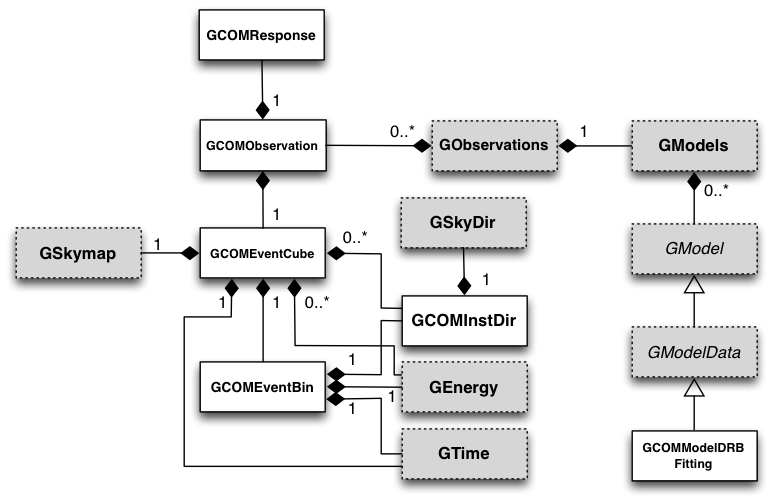

.. _sec_com:

COMPTEL interface
-----------------

Overview
~~~~~~~~

The following figure presents an overview over the C++ classes of the COMPTEL
module and their relations.

.. _fig_uml_com:

   *COMPTEL module*

The COMPTEL module provides an instrument interface for the COMPTEL 
telescope that has been operated on the Compton Gamma-Ray Observatory 
(CGRO) from 1991 to 2000.

