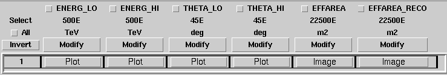
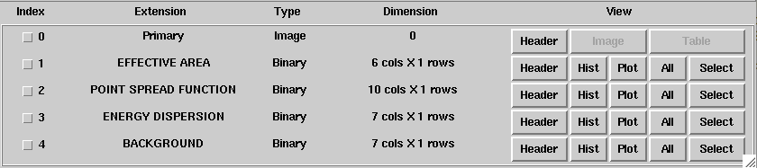

.. _sec_cta_response:

Handling the instrument response
~~~~~~~~~~~~~~~~~~~~~~~~~~~~~~~~

Overview
^^^^^^^^

The CTA specific instrument response is described by the 
:doxy:`GCTAResponseIrf` class (see :ref:`sec_response` for a general
description of response handling in GammaLib).
The CTA response is factorised into 
the effective area :math:`A_{\rm eff}(d, p, E, t)` (units :math:`cm^2`),
the point spread function :math:`PSF(p' | d, p, E, t)`,
and the energy dispersion :math:`E_{\rm disp}(E' | d, p, E, t)`
following:

.. math::
    R(p', E', t' | d, p, E, t) =
    A_{\rm eff}(d, p, E, t) \times
    PSF(p' | d, p, E, t) \times
    E_{\rm disp}(E' | d, p, E, t)
    :label: irf

Three different formats are implemented to specify the response
information for CTA:
Response Tables,
Xspec response files, and
Performance tables.

.. _sec_cta_response_formats:

Response formats
^^^^^^^^^^^^^^^^

.. _sec_cta_rsptable:

Response tables
===============

The CTA response table class :doxy:`GCTAResponseTable` provides a generic 
handle for multi-dimensional response information. It is based on the 
response format used for storing response information for the
Fermi/LAT telescope. In this format, all information is stored in
a single row of a FITS binary table. Each element of the row contains
a vector column, that describes the axes of the  multi-dimensional response
cube and the response information. Note that this class may in the future
be promoted to the GammaLib core, as a similar class has been implemented
in the Fermi/LAT interface.

As an example for the format of a response table, the effective area component
is shown below.
Response information is stored in a n-dimensional cube, and each axis
of this cube is described by the lower and upper edges of the axis bins.
In this example the effective area is stored as a 2D matrix with the
first axis being energy and the second axis being offaxis angle.
Effective area information is stored for true (``EFFAREA``) and
reconstructed (``EFFAREA_RECO``) energy.
Vector columns are used to store all information.

All components of the response ar stored in a single FITS file, and each 
component of the response factorisation is stored in a binary table of that
FITS file.
In addition, the response files contain an additional table that
describes the background rate as function of energy and position in
the field of view.
An example of a CTA response file is shown below:

.. _sec_cta_xspec:

Xspec response format
=====================

For the first CTA Consortium Data Challenge (1DC) the response information
was provided in a format that was inspired from the one use for Xspec.
Effective area information after applying a theta cut was given by so
called ancilliary response files (ARF files).
The energy dispersion was provided as a Redistribution Matrix File (RMF 
files).
There is no Point Spread Function information defined for Xspec, and for 
the sake of the 1DC, a simple one-dimensional vector had been implemented.

GammaLib still supports handling of the 1DC files, but there are no plans 
to use this format in the future.

.. _sec_cta_perftable:

Performance table
=================

Performance tables specify the CTA on-axis performance as function
of energy and have been provided by the Monte Carlo group of the
CTA Consortium for a variety of configurations.
Performance tables are plain ASCII files.
Below an example of a CTA performance table::

  log(E)     Area     r68     r80  ERes. BG Rate    Diff Sens
  -1.7      261.6  0.3621  0.4908 0.5134 0.0189924  6.88237e-11
  -1.5     5458.2  0.2712  0.3685 0.4129 0.1009715  1.72717e-11
  -1.3    15590.0  0.1662  0.2103 0.2721 0.0575623  6.16963e-12
  -1.1    26554.1  0.1253  0.1567 0.2611 0.0213008  2.89932e-12
  -0.9    52100.5  0.1048  0.1305 0.1987 0.0088729  1.39764e-12
  -0.7    66132.1  0.0827  0.1024 0.1698 0.0010976  6.03531e-13
  -0.5   108656.8  0.0703  0.0867 0.1506 0.0004843  3.98147e-13
  -0.3   129833.0  0.0585  0.0722 0.1338 0.0001575  3.23090e-13
  -0.1   284604.3  0.0531  0.0656 0.1008 0.0001367  2.20178e-13
   0.1   263175.3  0.0410  0.0506 0.0831 0.0000210  1.87452e-13
   0.3   778048.6  0.0470  0.0591 0.0842 0.0000692  1.53976e-13
   0.5   929818.8  0.0391  0.0492 0.0650 0.0000146  1.18947e-13
   0.7  1078450.0  0.0335  0.0415 0.0541 0.0000116  1.51927e-13
   0.9  1448579.1  0.0317  0.0397 0.0516 0.0000047  1.42439e-13
   1.1  1899905.0  0.0290  0.0372 0.0501 0.0000081  1.96670e-13
   1.3  2476403.8  0.0285  0.0367 0.0538 0.0000059  2.20695e-13
   1.5  2832570.6  0.0284  0.0372 0.0636 0.0000073  3.22523e-13
   1.7  3534065.3  0.0290  0.0386 0.0731 0.0000135  4.84153e-13
   1.9  3250103.4  0.0238  0.0308 0.0729 0.0000044  6.26265e-13
   2.1  3916071.6  0.0260  0.0354 0.0908 0.0000023  7.69921e-13
   ---------------------------------------------
   1) log(E) = log10(E/TeV) - bin centre
   2) Eff Area - in square metres after background cut (no theta cut)
   3) Ang. Res - 68% containment radius of gamma-ray PSF post cuts - in degrees
   4) Ang. Res - 80% containment radius of gamma-ray PSF post cuts - in degrees
   5) Fractional Energy Resolution (rms)
   6) BG Rate  - inside point-source selection region - post call cuts - in Hz
   7) Diff Sens - differential sensitivity for this bin expressed as E^2 dN/dE
      - in erg cm^-2 s^-1 - for a 50 hours exposure - 5 sigma significance including
      systematics and statistics and at least 10 photons.

Response components
^^^^^^^^^^^^^^^^^^^

Effective area
==============

The :math:`A_{\rm eff}(d, p, E, t)` term is described by the abstract
:doxy:`GCTAAeff` base class. The effective area is determined using
the:
 
.. code-block:: cpp
 
    double GCTAAeff::operator()(const double& logE, 
                                const double& theta = 0.0, 
                                const double& phi = 0.0,
                                const double& zenith = 0.0,
                                const double& azimuth = 0.0,
                                const bool&   etrue = true) const;

operator, where ``logE`` is the base 10 logarithm of the photon energy.
If ``etrue`` is true, ``logE`` is the true photon energy; otherwise,
``logE`` is the measured photon energy.
``theta`` and ``phi`` are the offset and azimuth angle of the incident
photon with respect to the camera pointing,
``zenith`` and ``azimuth`` are the zenith and azimuth angle of the
camera pointing.

The effective area response is implemented by one of the classes
:doxy:`GCTAAeffPerfTable`, :doxy:`GCTAAeffArf` and :doxy:`GCTAAeff2D` that
implement the different response formats that are currently used in
the CTA project. Dependent on the specified response file, the
method :doxy:`GCTAResponseIrf::load_aeff` allocates the appropriate response
class. :doxy:`GCTAAeff2D` is allocated if the response file is a FITS file
containing an extension named ``EFFECTIVE AREA``; :doxy:`GCTAAeffArf` is
allocated if an extension named ``SPECRESP`` is found; otherwise, 
:doxy:`GCTAAeffPerfTable` is allocated.

GCTAAeff2D
""""""""""

:doxy:`GCTAAeff2D` reads the full effective area as function of energies
and off-axis angle from a FITS table. The FITS table is expected to be
in the :ref:`sec_cta_rsptable` format. From this two-dimensional table,
the effective area values are determine by bi-linear interpolation in
the base 10 logarithm of photon energy and the offset angle.

GCTAAeffArf
"""""""""""

:doxy:`GCTAAeffArf` extracts the effective area information from a XSPEC
compatible ancilliary response file (ARF). The ARF contains the effective
area for a specific angular (or theta) cut. It should be noted that the 
:doxy:`GCTAAeffArf` class has been introduced as a work around for digesting
the ARF response provided for the 1st CTA Data Challenge (1DC). It is not
intended to use this class any longer in the future.

To recover the full effective detection area, the value of the theta cut
as well as the form of the point spread function needs to be known. When 
an ARF file is loaded using the :doxy:`GCTAAeffArf::load` method, the ARF 
values are read and stored as they are encountered in the ARF file. To 
recover the full effective detection area the theta cut value has to be 
specified using the :doxy:`GCTAAeffArf::thetacut` method, and the 
:doxy:`GCTAAeffArf::remove_thetacut` method needs to be called to rescale the ARF 
values. Note that :doxy:`GCTAAeffArf::remove_thetacut` shall only be called
once after reading the ARF, as every call of the method will modify the 
effective area values by multiplying it with a scaling factor.
The scaling factor required to recover the full effective area
will be obtained by integrating the area under the point spread function
out to the specified theta cut value. This provides the fraction of all
events that should fall within the theta cut. The applied scaling factor is
the inverse of this fraction:

.. math::
    A_{\rm eff}(E) =
    \frac{1}
    {\int_0^{\theta_{\rm cut}} 2\pi PSF(\theta | E) \sin \theta {\rm d}\theta}
    ARF(E)

An alternative way of selecting the events is to adopt an energy dependent
theta cut so that the selection always contains a fixed fraction of the 
events. This type of cut can be accomodated by specifying a scaling factor
using the :doxy:`GCTAAeffArf::scale` method prior to loading the ARF data. For
example, if the containment fraction was fixed to 80%, a scaling of 1.25
should be applied to recover the full effective detection area.
When response information is specified by an XML file (see :ref:`sec_cta_xml`),
the ``thetacut`` and ``scale`` parameters can be defined using optional 
attributes to the ``EffectiveArea`` parameter.

The ARF format does not provide any information on the off-axis dependence
of the response, as the ARF values are supplied for a specific source 
position, and hence for a specific off-axis angle with respect to the 
camera centre. By default, the same effective area values are thus applied 
to all off-axis angles :math:`\theta`.
An off-axis dependence may however be introduced by supplying a positive
value for the :math:`\sigma` parameter using the :doxy:`GCTAAeffArf::sigma` 
method, or by adding the ``sigma`` attribute to the ``EffectiveArea``
parameter in the XML file. In that case, equation :eq:`cta_aeff_offset`
is used for the off-axis dependence, with the supplied ARF values being
taken as the on-axis values.

GCTAAeffPerfTable
"""""""""""""""""

:doxy:`GCTAAeffPerfTable` reads the effective area information from an ASCII
file that has been defined by the CTA Monte Carlo workpackage
(see :ref:`sec_cta_perftable`). This file provides the full effective detection
area in units of :math:`m^2` after the background cut as function of
the base 10 logarithm of the true photon energy. No theta cut is
applied. For a given energy, the effective area is computed by 
interpolating the performance table in the base 10 logarithm of energy.
Effective areas will always be non-negative.
As the response table provides only the on-axis effective area,
off-axis effective areas are estimated assuming that the radial 
distribution follows a Gaussian distribution in offset angle squared:

.. math::
    A_{\rm eff}(\theta) = A_{\rm eff}(0)
    \exp \left( -\frac{1}{2} \frac{\theta^4}{\sigma^2} \right)
    :label: cta_aeff_offset

where :math:`\sigma` characterises the size of the field of view. The
:math:`\sigma` parameter is set and retrieved using the 
:doxy:`GCTAAeffPerfTable::sigma` methods. When response information is
specified by an XML file (see :ref:`sec_cta_xml`), the :math:`\sigma`
parameter can be set using the optional ``sigma`` attribute.
If the :math:`\sigma` parameter is not explicitly set,
:math:`\sigma=3 \, {\rm deg}^2` is assumed as default.

Point spread function
=====================

The :math:`PSF(p' | d, p, E, t)` term is described by the abstract
:doxy:`GCTAPsf` base class. The point spread function is determined using
the:
 
.. code-block:: cpp
 
    double GCTAPsf::operator()(const double& delta,
                               const double& logE, 
                               const double& theta = 0.0, 
                               const double& phi = 0.0,
                               const double& zenith = 0.0,
                               const double& azimuth = 0.0,
                               const bool&   etrue = true) const;

operator, where 
``delta`` is the angle between true and measured photon arrival direction
and ``logE`` is the base 10 logarithm of the photon energy.
If ``etrue`` is true, ``logE`` is the true photon energy; otherwise,
``logE`` is the measured photon energy.
``theta`` and ``phi`` are the offset and azimuth angle of the incident
photon with respect to the camera pointing,
``zenith`` and ``azimuth`` are the zenith and azimuth angle of the
camera pointing.

GCTAPsf2D
"""""""""

GCTAPsfKing
"""""""""""

GCTAPsfVector
"""""""""""""

GCTAPsfPerfTable
""""""""""""""""

Energy dispersion
=================

The :math:`E_{\rm disp}(E' | d, p, E, t)` term is described by the abstract
:doxy:`GCTAEdisp` base class. The energy dispersion is determined using
the:
 
.. code-block:: cpp
 
    double GCTAEdisp::operator()(const double& logEobs, 
                                 const double& logEsrc, 
                                 const double& theta = 0.0, 
                                 const double& phi = 0.0,
                                 const double& zenith = 0.0,
                                 const double& azimuth = 0.0) const;

operator, where 
``logEobs`` is the base 10 logarithm of the measured energy,
``logEsrc`` is the base 10 logarithm of the true energy,
``theta`` and ``phi`` are the offset and azimuth angle of the incident
photon with respect to the camera pointing, and
``zenith`` and ``azimuth`` are the zenith and azimuth angle of the
camera pointing.

GCTAEdisp2D
"""""""""""

GCTAEdispRmf
""""""""""""

GCTAEdispPerfTable
""""""""""""""""""

Background template
===================

The background is described by the abstract :doxy:`GCTABackground` base
class. The background is determined using the:
 
.. code-block:: cpp
 
    double GCTABackground::operator()(const double& logE, 
                                      const double& detx, 
                                      const double& dety) const;

operator, where 
``logE`` is the base 10 logarithm of the measured energy, and
``detx`` and ``dety`` are the measured arrival directions in the
nominal camera system.

GCTABackground3D
""""""""""""""""

GCTABackgroundPerfTable
"""""""""""""""""""""""
