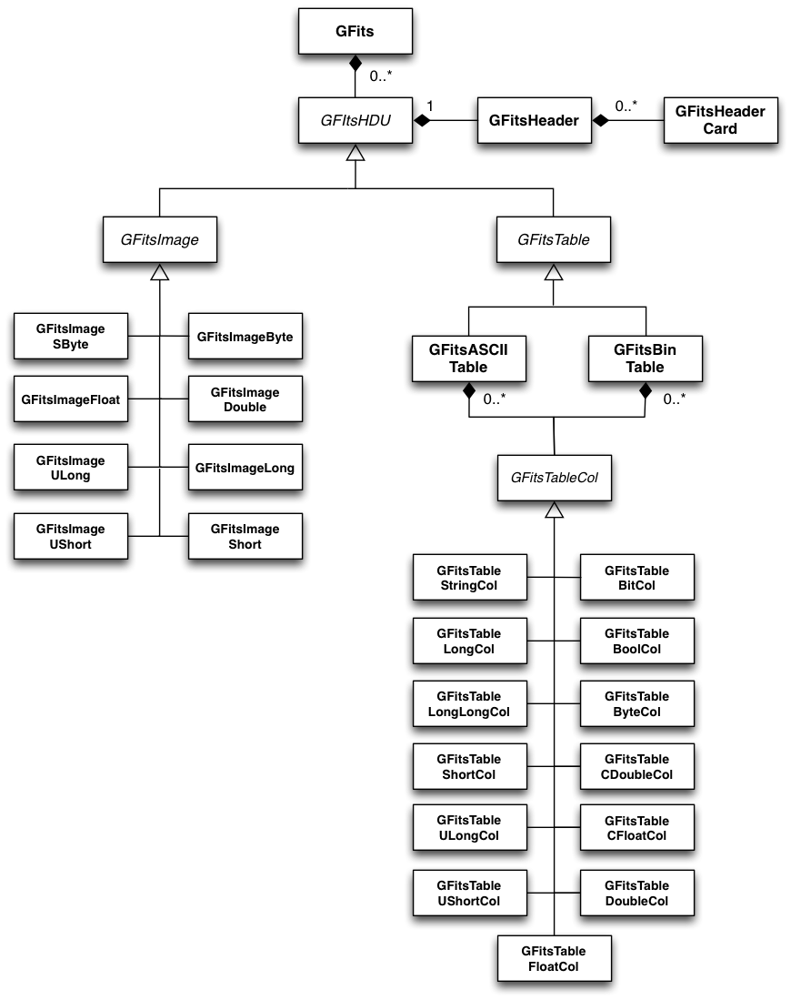

Overview
========

The following figure presents an overview over the classes of the FITS
module and their relations.

.. _fig_uml_fits:

   *FITS module*

The FITS module provides a high-level interface to FITS files. The module
is based on the cfitsio library for file access. The classes of the
module implement a logical representation of the FITS file in memory that
can be handled independently of the file representation on disk.

The central class of the FITS module is the :doxy:`GFits` class that represents
a FITS file. The class is a container for classes derived from the abstract
:doxy:`GFitsHDU` base class which represents a FITS extension (also called 
Header-Data Unit, HDU). Each extension is composed of one header,
implemented by the :doxy:`GFitsHeader` class and one data unit.
The header is composed of cards representing the meta-data of the fits
file. The cards are implemented by the :doxy:`GFitsHeaderCard` class.
The data unit is either an image, represented by the abstract
:doxy:`GFitsImage` base class, or a table, represented by the abstract
:doxy:`GFitsTable` base class. The image can be stored in various data
types, each of which is implemented by a specific class derived from
:doxy:`GFitsImage`. The table can be either an ASCII table,
implemented by the :doxy:`GFitsAsciiTable` class or a binary table,
implemented by the :doxy:`GFitsBinTable` class.
Each table is comprised of columns, represented by the abstract
:doxy:`GFitsTableCol` base class. This class is the same for ASCII and binary
tables. Similar to images, table column data can be stored in a variety
of data types, each of which is implemented by a specific class derived
from :doxy:`GFitsTableCol`.
