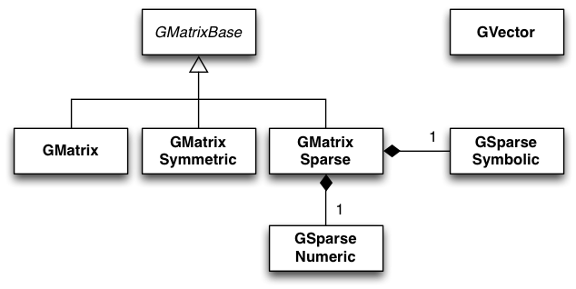

Overview
========

The following figure presents an overview over the classes of
the linear algebra module and their relations.

.. _fig_uml_linalg:

   *Linear algebra module*

The linear algebra module provides classes for vector and matrix 
manipulation. The :doxy:`GVector` class implements a double precision
floating point vector, the classes :doxy:`GMatrix`, :doxy:`GMatrixSymmetric`
and :doxy:`GMatrixSparse` implement a matrix of double precision
floating point values for a generic matrix, a symmetric matrix and
a sparse matrix, respectively. All matrix classes derive from the
abstract :doxy:`GMatrixBase` base class that provides common functionalities
to all matrix classes.

The classes :doxy:`GSparseNumeric` and :doxy:`GSparseSymbolic` are classes
that are used by :doxy:`GMatrixSparse` but these classes are not
exposed to the outside world (i.e. the class definitions are not
part of the GammaLib interface).
