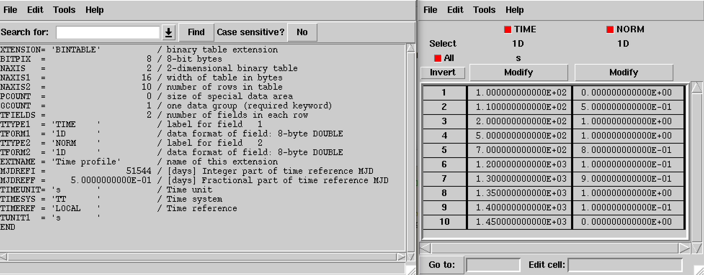
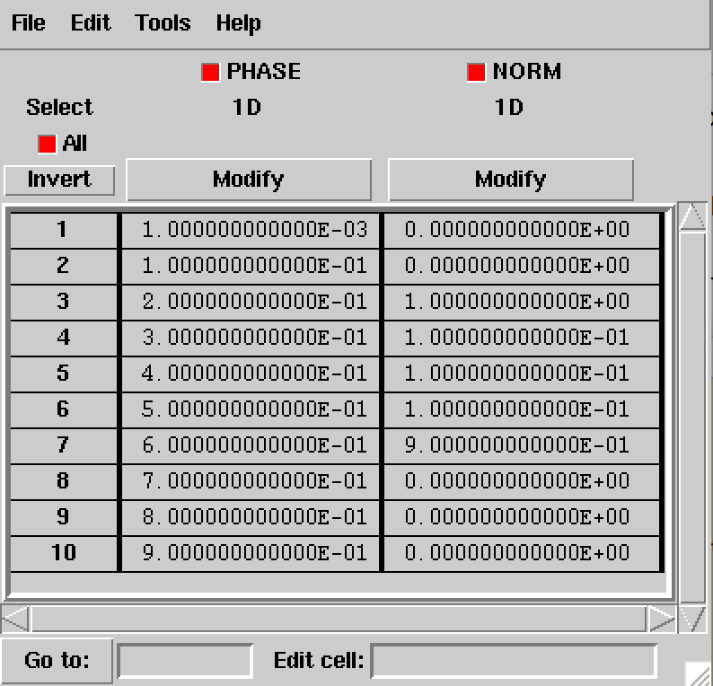

.. _sec_model:

Model handling
--------------

Overview
~~~~~~~~

The following figure presents an overview over the C++ classes of the model
module and their relations.

.. _fig_uml_model:

.. figure:: uml_model.png
   :align: center
   :width: 100%

   *Overview over the model module*

The central C++ class of the model module is the abstract base class
:doxy:`GModel` which defines a model component. Model components are combined
using the :doxy:`GModels` container C++ class.

Sky models
~~~~~~~~~~

Model factorisation
^^^^^^^^^^^^^^^^^^^

Sky models describe the spatial, spectral and temporal properties of a 
gamma-ray source using the following factorisation:

.. math::
   M(p,E,t) = M_{\rm spatial}(p | E,t) \times
              M_{\rm spectral}(E | t) \times
              M_{\rm temporal}(t)

(:math:`M(p,E,t)` is given in units of
:math:`photons \,\, cm^{-2} s^{-1} MeV^{-1} sr^{-1}`).
The spatial model component :math:`M_{\rm spatial}(p|E,t)`
is defined by the abstract :doxy:`GModelSpatial` class, the spectral
model component :math:`M_{\rm spectral}(E|t)` is defined by the
abstract :doxy:`GModelSpectral` class and the temporal component
:math:`M_{\rm temporal}(t)` is defined by the abstract
:doxy:`GModelTemporal` class.

The spatial model component describes the energy and time dependent
morphology of the source.
It satisfies

.. math::
   \int_{\Omega} M_{\rm spatial}(p|E,t) \, d\Omega = 1

for all :math:`E` and :math:`t`, hence the spatial component does not
impact the spatially integrated spectral and temporal properties of the
source (the integration is done here over the spatial parameters
:math:`p` in a spherical coordinate system).
The units of the spatial model component are
:math:`[M_{\rm spatial}] = {\rm sr}^{-1}`.

The spectral model component describes the spatially integrated time
dependent spectral distribution of the source.
It satisfies

.. math::
   \int_{E} M_{\rm spectral}(E | t) \, dE = \Phi

for all :math:`t`, where :math:`\Phi` is the spatially and spectrally
integrated total source flux. The spectral component does not impact
the temporal properties of the integrated flux :math:`\Phi`.
The units of the spectral model component
are :math:`[M_{\rm spectral}] = {\rm cm}^{-2} {\rm s}^{-1} {\rm MeV}^{-1}`.

The temporal model component describes the relative variation of the
source flux with respect to the mean value given by the spectral model
component.
The temporal model component is unit less.

XML model definition format
^^^^^^^^^^^^^^^^^^^^^^^^^^^

Sky models can be defined using an XML file format that is inspired by the format
used for the Large Area Telescope (LAT) aboard NASA's Fermi satellite. To
illustrate the format, the definition of a point source at the position of
the Crab nebula with a power spectral shape is shown below. The tags
``<spatialModel>``, ``<spectrum>`` and ``<temporalModel>`` describe the
spatial, spectral and temporal model components defined above. The
``<temporalModel>`` tag can be omitted, which will automatically allocate a
constant temporal component for the model.

Each source model needs to have a unique name specified by the ``name``
attributes. The ``type`` attribute specifies the type of the model and
needs to be one of ``PointSource``, ``ExtendedSource``, ``DiffuseSource``
and ``CompositeSource``. Optional attributes include:

* ``id``, specifying an identifier string for a model that can be used to tie
  the source model to one or several observations;,
* ``ts``, specifying the Test Statistic value of the source model component, and
* ``tscalc``, specifying whether the Test Statistic value should be computed
  in a maximum-likelihood computation.

.. code-block:: xml

  <?xml version="1.0" standalone="no"?>
  <source_library title="source library">
    <source name="Crab" type="PointSource">
      <spatialModel type="PointSource">
        <parameter name="RA"  scale="1.0" value="83.6331" min="-360" max="360" free="1"/>
        <parameter name="DEC" scale="1.0" value="22.0145" min="-90"  max="90"  free="1"/>
      </spatialModel>
      <spectrum type="PowerLaw">
        <parameter name="Prefactor"   scale="1e-16" value="5.7"  min="1e-07" max="1000.0" free="1"/>
        <parameter name="Index"       scale="-1"    value="2.48" min="0.0"   max="+5.0"   free="1"/>
        <parameter name="PivotEnergy" scale="1e6"   value="0.3"  min="0.01"  max="1000.0" free="0"/>
      </spectrum>
      <temporalModel type="Constant">
        <parameter name="Normalization" scale="1.0" value="1.0" min="0.1" max="10.0" free="0"/>
      </temporalModel>
    </source>
  </source_library>

To accomodate for possible calibration biases for different instruments,
instrument specific scaling factors can be specified as part of a model.
In the example below, the model will be multiplied by a factor of 1 for ``LAT``
and a factor of 0.5 for ``CTA``.

.. code-block:: xml

  <?xml version="1.0" standalone="no"?>
  <source_library title="source library">
    <source name="Crab" type="PointSource">
      ...
      <scaling>
        <instrument name="LAT" scale="1.0" min="0.1" max="10.0" value="1.0" free="0"/>
        <instrument name="CTA" scale="1.0" min="0.1" max="10.0" value="0.5" free="0"/>
      </scaling>
    </source>
  </source_library>

Spatial components
^^^^^^^^^^^^^^^^^^

Point source
============

.. code-block:: xml

  <source name="Crab" type="PointSource">
    <spatialModel type="PointSource">
      <parameter name="RA"  scale="1.0" value="83.6331" min="-360" max="360" free="1"/>
      <parameter name="DEC" scale="1.0" value="22.0145" min="-90"  max="90"  free="1"/>
    </spatialModel>
    <spectrum type="...">
      ...
    </spectrum>
  </source>

An alternative XML format is supported for compatibility with the Fermi/LAT XML
format:

.. code-block:: xml

  <source name="Crab" type="PointSource">
    <spatialModel type="SkyDirFunction">
      <parameter name="RA"  scale="1.0" value="83.6331" min="-360" max="360" free="1"/>
      <parameter name="DEC" scale="1.0" value="22.0145" min="-90"  max="90"  free="1"/>
    </spatialModel>
    <spectrum type="...">
      ...
    </spectrum>
  </source>

Radial disk
===========

.. code-block:: xml

  <source name="Crab" type="ExtendedSource">
    <spatialModel type="RadialDisk">
      <parameter name="RA"     scale="1.0" value="83.6331" min="-360" max="360" free="1"/>
      <parameter name="DEC"    scale="1.0" value="22.0145" min="-90"  max="90"  free="1"/>
      <parameter name="Radius" scale="1.0" value="0.20"    min="0.01" max="10"  free="1"/>
    </spatialModel>
    <spectrum type="...">
      ...
    </spectrum>
  </source>

Radial Gaussian
===============

.. code-block:: xml

  <source name="Crab" type="ExtendedSource">
    <spatialModel type="RadialGaussian">
      <parameter name="RA"    scale="1.0" value="83.6331" min="-360" max="360" free="1"/>
      <parameter name="DEC"   scale="1.0" value="22.0145" min="-90"  max="90"  free="1"/>
      <parameter name="Sigma" scale="1.0" value="0.20"    min="0.01" max="10"  free="1"/>
    </spatialModel>
    <spectrum type="...">
      ...
    </spectrum>
  </source>

Radial shell
============

.. code-block:: xml

  <source name="Crab" type="ExtendedSource">
    <spatialModel type="RadialShell">
      <parameter name="RA"     scale="1.0" value="83.6331" min="-360" max="360" free="1"/>
      <parameter name="DEC"    scale="1.0" value="22.0145" min="-90"  max="90"  free="1"/>
      <parameter name="Radius" scale="1.0" value="0.30"    min="0.01" max="10"  free="1"/>
      <parameter name="Width"  scale="1.0" value="0.10"    min="0.01" max="10"  free="1"/>
    </spatialModel>
    <spectrum type="...">
      ...
    </spectrum>
  </source>

Elliptical disk
===============

.. code-block:: xml

  <source name="Crab" type="ExtendedSource">
    <spatialModel type="EllipticalDisk">
      <parameter name="RA"          scale="1.0" value="83.6331" min="-360"  max="360" free="1"/>
      <parameter name="DEC"         scale="1.0" value="22.0145" min="-90"   max="90"  free="1"/>
      <parameter name="PA"          scale="1.0" value="45.0"    min="-360"  max="360" free="1"/>
      <parameter name="MinorRadius" scale="1.0" value="0.5"     min="0.001" max="10"  free="1"/>
      <parameter name="MajorRadius" scale="1.0" value="2.0"     min="0.001" max="10"  free="1"/>
    </spatialModel>
    <spectrum type="...">
      ...
    </spectrum>
  </source>

Elliptical Gaussian
===================

.. code-block:: xml

  <source name="Crab" type="ExtendedSource">
    <spatialModel type="EllipticalGaussian">
      <parameter name="RA"          scale="1.0" value="83.6331" min="-360"  max="360" free="1"/>
      <parameter name="DEC"         scale="1.0" value="22.0145" min="-90"   max="90"  free="1"/>
      <parameter name="PA"          scale="1.0" value="45.0"    min="-360"  max="360" free="1"/>
      <parameter name="MinorRadius" scale="1.0" value="0.5"     min="0.001" max="10"  free="1"/>
      <parameter name="MajorRadius" scale="1.0" value="2.0"     min="0.001" max="10"  free="1"/>
    </spatialModel>
    <spectrum type="...">
      ...
    </spectrum>
  </source>

Isotropic source
================

.. code-block:: xml

  <source name="Crab" type="DiffuseSource">
    <spatialModel type="DiffuseIsotropic">
       <parameter name="Value" scale="1" value="1" min="1"  max="1" free="0"/>
    </spatialModel>
    <spectrum type="...">
      ...
    </spectrum>
  </source>

An alternative XML format is supported for compatibility with the Fermi/LAT XML
format:

.. code-block:: xml

  <source name="Crab" type="DiffuseSource">
    <spatialModel type="ConstantValue">
       <parameter name="Value" scale="1" value="1" min="1"  max="1" free="0"/>
    </spatialModel>
    <spectrum type="...">
      ...
    </spectrum>
  </source>

Diffuse map
===========

.. code-block:: xml

  <source name="Crab" type="DiffuseSource">
    <spatialModel type="DiffuseMap" file="map.fits">
       <parameter name="Normalization" scale="1" value="1" min="0.001" max="1000.0" free="0"/>
    </spatialModel>
    <spectrum type="...">
      ...
    </spectrum>
  </source>

An alternative XML format is supported for compatibility with the Fermi/LAT XML
format:

.. code-block:: xml

  <source name="Crab" type="DiffuseSource">
    <spatialModel type="SpatialMap" file="map.fits">
       <parameter name="Prefactor" scale="1" value="1" min="0.001" max="1000.0" free="0"/>
    </spatialModel>
    <spectrum type="...">
      ...
    </spectrum>
  </source>

Diffuse map cube
================

.. code-block:: xml

  <source name="Crab" type="DiffuseSource">
    <spatialModel type="DiffuseMapCube" file="map_cube.fits">
      <parameter name="Normalization" scale="1" value="1" min="0.001" max="1000.0" free="0"/>
    </spatialModel>
    <spectrum type="...">
      ...
    </spectrum>
  </source>

An alternative XML format is supported for compatibility with the Fermi/LAT XML
format:

.. code-block:: xml

  <source name="Crab" type="DiffuseSource">
    <spatialModel type="MapCubeFunction" file="map_cube.fits">
      <parameter name="Value" scale="1" value="1" min="0.001" max="1000.0" free="0"/>
    </spatialModel>
    <spectrum type="...">
      ...
    </spectrum>
  </source>

Composite model
===============

Spatial model components can be combined into a single model using the
:doxy:`GModelSpatialComposite class`. The class computes

.. math::
   M_{\rm spatial}(p|E,t) = \frac{1}{N} \sum_{i=0}^{N-1} M_{\rm spatial}^{(i)}(p|E,t)

where :math:`M_{\rm spatial}^{(i)}(p|E,t)` is any spatial model component
(including another composite model), and :math:`N` is the number of
model components that are combined.

An example of an XML file for a composite spatial model is shown below. In
this example, a point source is added to a radial Gaussian source to form
a composite spatial model. All spatial parameters of the composite model are
fitted.

.. code-block:: xml

  <source name="Crab" type="CompositeSource">
    <spatialModel type="Composite">
      <spatialModel type="PointSource" component="PointSource">
        <parameter name="RA"    scale="1.0" value="83.6331" min="-360" max="360" free="1"/>
        <parameter name="DEC"   scale="1.0" value="22.0145" min="-90"  max="90"  free="1"/>
      </spatialModel>
      <spatialModel type="RadialGaussian">
        <parameter name="RA"    scale="1.0" value="83.6331" min="-360" max="360" free="1"/>
        <parameter name="DEC"   scale="1.0" value="22.0145" min="-90"  max="90"  free="1"/>
        <parameter name="Sigma" scale="1.0" value="0.20"    min="0.01" max="10"  free="1"/>
      </spatialModel>
    </spatialModel>
    <spectrum type="...">
      ...
    </spectrum>
  </source>

Spectral components
^^^^^^^^^^^^^^^^^^^

Constant
========

The :doxy:`GModelSpectralConst` class implements the constant function

.. math::
    \frac{dN}{dE} = N_0

where the parameters in the XML definition have the following mappings:

* :math:`N_0` = ``Normalization``

The XML format for specifying a constant is:

.. code-block:: xml

   <spectrum type="Constant">
    <parameter name="Normalization" scale="1e-16" value="5.7"  min="1e-07" max="1000.0" free="1"/>
   </spectrum>

An alternative XML format is supported for compatibility with the Fermi/LAT XML
format:

.. code-block:: xml

   <spectrum type="ConstantValue">
    <parameter name="Value" scale="1e-16" value="5.7"  min="1e-07" max="1000.0" free="1"/>
   </spectrum>

Node function
=============

The generalisation of the broken power law is the node function, which is 
defined by a set of energy and intensity values, the so called nodes, 
which are connected by power laws.

The XML format for specifying a node function is:

.. code-block:: xml

   <spectrum type="NodeFunction">
    <node>
      <parameter scale="1.0"   name="Energy"    min="0.1"   max="1.0e20" value="1.0"  free="0"/>
      <parameter scale="1e-07" name="Intensity" min="1e-07" max="1000.0" value="1.0"  free="1"/>
    </node>
    <node>
      <parameter scale="1.0"   name="Energy"    min="0.1"   max="1.0e20" value="10.0" free="0"/>
      <parameter scale="1e-07" name="Intensity" min="1e-07" max="1000.0" value="0.1"  free="1"/>
    </node>
   </spectrum>

(in this example there are two nodes; the number of nodes in a node 
function is arbitrary).

File function
=============

A function defined using an input ASCII file with columns of energy and
differential flux values.
The energy values are assumed to be in units of MeV, the flux values are
normally assumed to be in units of
:math:`{\rm cm}^{-2} {\rm s}^{-1} {\rm MeV}^{-1}`.

The only parameter of the model is a multiplicative normalization:

.. math::
    \frac{dN}{dE} = N_0 \left. \frac{dN}{dE} \right\rvert_{\rm file}

where the parameters in the XML definition have the following mappings:

* :math:`N_0` = ``Normalization``

The XML format for specifying a file function is:

.. code-block:: xml

   <spectrum type="FileFunction" file="data/filefunction.txt">
    <parameter scale="1.0" name="Normalization" min="0.0" max="1000.0" value="1.0" free="1"/>
   </spectrum>

If the ``file`` attribute is a relative path, the path is relative to the
directory where the XML file resides. Alternatively, an absolute path may be
specified. Any environment variable present in the path name will be 
expanded.

Power law
=========

The :doxy:`GModelSpectralPlaw` class implements the power law function

.. math::
    \frac{dN}{dE} = k_0 \left( \frac{E}{E_0} \right)^{\gamma}

where the parameters in the XML definition have the following mappings:

* :math:`k_0` = ``Prefactor``
* :math:`\gamma` = ``Index``
* :math:`E_0` = ``PivotEnergy``

The XML format for specifying a power law is:

.. code-block:: xml

   <spectrum type="PowerLaw">
    <parameter name="Prefactor"   scale="1e-16" value="5.7"  min="1e-07" max="1000.0" free="1"/>
    <parameter name="Index"       scale="-1"    value="2.48" min="0.0"   max="+5.0"   free="1"/>
    <parameter name="PivotEnergy" scale="1e6"   value="0.3"  min="0.01"  max="1000.0" free="0"/>
   </spectrum>

An alternative XML format is supported for compatibility with the Fermi/LAT XML
format:

.. code-block:: xml

   <spectrum type="PowerLaw">
    <parameter name="Prefactor" scale="1e-16" value="5.7"  min="1e-07" max="1000.0" free="1"/>
    <parameter name="Index"     scale="-1"    value="2.48" min="0.0"   max="+5.0"   free="1"/>
    <parameter name="Scale"     scale="1e6"   value="0.3"  min="0.01"  max="1000.0" free="0"/>
   </spectrum>

An alternative power law function is defined by the
:doxy:`GModelSpectralPlawPhotonFlux` class that uses the integral photon flux
as parameter rather than the ``Prefactor``:

.. math::
    \frac{dN}{dE} = \frac{F_{\rm ph}(\gamma+1)E^{\gamma}}
                         {E_{\rm max}^{\gamma+1} - E_{\rm min}^{\gamma+1}}

where the parameters in the XML definition have the following mappings:

* :math:`F_{\rm ph}` = ``PhotonFlux``
* :math:`\gamma` = ``Index``
* :math:`E_{\rm min}` = ``LowerLimit``
* :math:`E_{\rm max}` = ``UpperLimit``

The XML format for specifying a power law defined by the integral photon flux
is:

.. code-block:: xml

   <spectrum type="PowerLaw">
    <parameter scale="1e-07" name="PhotonFlux" min="1e-07" max="1000.0"    value="1.0"      free="1"/>
    <parameter scale="1.0"   name="Index"      min="-5.0"  max="+5.0"      value="-2.0"     free="1"/>
    <parameter scale="1.0"   name="LowerLimit" min="10.0"  max="1000000.0" value="100.0"    free="0"/>
    <parameter scale="1.0"   name="UpperLimit" min="10.0"  max="1000000.0" value="500000.0" free="0"/>
   </spectrum>

An alternative XML format is supported for compatibility with the Fermi/LAT XML
format:

.. code-block:: xml

   <spectrum type="PowerLaw2">
    <parameter scale="1e-07" name="Intergal"   min="1e-07" max="1000.0"    value="1.0"      free="1"/>
    <parameter scale="1.0"   name="Index"      min="-5.0"  max="+5.0"      value="-2.0"     free="1"/>
    <parameter scale="1.0"   name="LowerLimit" min="10.0"  max="1000000.0" value="100.0"    free="0"/>
    <parameter scale="1.0"   name="UpperLimit" min="10.0"  max="1000000.0" value="500000.0" free="0"/>
   </spectrum>

.. note::

   The ``UpperLimit`` and ``LowerLimit`` parameters are always treated as fixed
   and, as should be apparent from this definition, the flux given by the
   ``PhotonFlux`` parameter is over the range [``LowerLimit``, ``UpperLimit``].
   Use of this model allows the errors on the integrated photon flux to be
   evaluated directly by likelihood, obviating the need to propagate the errors
   if one is using the PowerLaw form.

Another alternative power law function is defined by the
:doxy:`GModelSpectralPlawEnergyFlux` class that uses the integral energy flux
as parameter rather than the ``Prefactor``:

.. math::
    \frac{dN}{dE} = \frac{F_{\rm E}(\gamma+2)E^{\gamma}}
                         {E_{\rm max}^{\gamma+2} - E_{\rm min}^{\gamma+2}}

where the parameters in the XML definition have the following mappings:

* :math:`F_{\rm E}` = ``EnergyFlux``
* :math:`\gamma` = ``Index``
* :math:`E_{\rm min}` = ``LowerLimit``
* :math:`E_{\rm max}` = ``UpperLimit``

The XML format for specifying a power law defined by the integral energy flux
is:

.. code-block:: xml

   <spectrum type="PowerLaw">
    <parameter scale="1e-07" name="EnergyFlux" min="1e-07" max="1000.0"    value="1.0"      free="1"/>
    <parameter scale="1.0"   name="Index"      min="-5.0"  max="+5.0"      value="-2.0"     free="1"/>
    <parameter scale="1.0"   name="LowerLimit" min="10.0"  max="1000000.0" value="100.0"    free="0"/>
    <parameter scale="1.0"   name="UpperLimit" min="10.0"  max="1000000.0" value="500000.0" free="0"/>
   </spectrum>

.. note::

   The ``UpperLimit`` and ``LowerLimit`` parameters are always treated as fixed
   and, as should be apparent from this definition, the flux given by the
   ``EnergyFlux`` parameter is over the range [``LowerLimit``, ``UpperLimit``].
   Use of this model allows the errors on the integrated energy flux to be
   evaluated directly by likelihood, obviating the need to propagate the errors
   if one is using the PowerLaw form.

Exponentially cut-off power law
===============================

The :doxy:`GModelSpectralExpPlaw` class implements the exponentially 
cut-off power law function

.. math::
    \frac{dN}{dE} = k_0 \left( \frac{E}{E_0} \right)^{\gamma}
                    \exp \left( \frac{-E}{E_{\rm cut}} \right)

where the parameters in the XML definition have the following mappings:

* :math:`k_0` = ``Prefactor``
* :math:`\gamma` = ``Index``
* :math:`E_0` = ``PivotEnergy``
* :math:`E_{\rm cut}` = ``CutoffEnergy``

The XML format for specifying an exponentially cut-off power law is:

.. code-block:: xml

   <spectrum type="ExponentialCutoffPowerLaw">
    <parameter name="Prefactor"    scale="1e-16" value="5.7"  min="1e-07" max="1000.0" free="1"/>
    <parameter name="Index"        scale="-1"    value="2.48" min="0.0"   max="+5.0"   free="1"/>
    <parameter name="CutoffEnergy" scale="1e6"   value="1.0"  min="0.01"  max="1000.0" free="1"/>
    <parameter name="PivotEnergy"  scale="1e6"   value="0.3"  min="0.01"  max="1000.0" free="0"/>
   </spectrum>

An alternative XML format is supported for compatibility with the Fermi/LAT XML
format:

.. code-block:: xml

   <spectrum type="ExpCutoff">
    <parameter name="Prefactor" scale="1e-16" value="5.7"  min="1e-07" max="1000.0" free="1"/>
    <parameter name="Index"     scale="-1"    value="2.48" min="0.0"   max="+5.0"   free="1"/>
    <parameter name="Cutoff"    scale="1e6"   value="1.0"  min="0.01"  max="1000.0" free="1"/>
    <parameter name="Scale"     scale="1e6"   value="0.3"  min="0.01"  max="1000.0" free="0"/>
   </spectrum>

An alternative exponentially cut-off power law function is defined by the 
:doxy:`GModelSpectralExpInvPlaw` class which makes use of the inverse of the 
cut-off energy for function parametrisation:

.. math::
    \frac{dN}{dE} = k_0 \left( \frac{E}{E_0} \right)^{\gamma}
                    \exp \left( -\lambda E \right)

where the parameters in the XML definition have the following mappings:

* :math:`k_0` = ``Prefactor``
* :math:`\gamma` = ``Index``
* :math:`E_0` = ``PivotEnergy``
* :math:`\lambda` = ``InverseCutoffEnergy``

The XML format for specifying an exponentially cut-off power law using this 
alternative parametrisation is:

.. code-block:: xml

   <spectrum type="ExponentialCutoffPowerLaw">
    <parameter name="Prefactor"           scale="1e-16" value="5.7"  min="1e-07" max="1000.0" free="1"/>
    <parameter name="Index"               scale="-1"    value="2.48" min="0.0"   max="+5.0"   free="1"/>
    <parameter name="InverseCutoffEnergy" scale="1e-6"  value="1.0"  min="0.0"   max="100.0"  free="1"/>
    <parameter name="PivotEnergy"         scale="1e6"   value="0.3"  min="0.01"  max="1000.0" free="0"/>
   </spectrum>

Super exponentially cut-off power law
=====================================

The :doxy:`GModelSpectralSuperExpPlaw` class implements the super
exponentially cut-off power law function

.. math::
    \frac{dN}{dE} = k_0 \left( \frac{E}{E_0} \right)^{\gamma}
                    \exp \left( 
                      -\left( \frac{E}{E_{\rm cut}} \right)^{\alpha}
                    \right)

where the parameters in the XML definition have the following mappings:

* :math:`k_0` = ``Prefactor``
* :math:`\gamma` = ``Index1``
* :math:`\alpha` = ``Index2``
* :math:`E_0` = ``PivotEnergy``
* :math:`E_{\rm cut}` = ``CutoffEnergy``

.. code-block:: xml

   <spectrum type="SuperExponentialCutoffPowerLaw">
    <parameter name="Prefactor"    scale="1e-16" value="1.0" min="1e-07" max="1000.0" free="1"/>
    <parameter name="Index1"       scale="-1"    value="2.0" min="0.0"   max="+5.0"   free="1"/>
    <parameter name="CutoffEnergy" scale="1e6"   value="1.0" min="0.01"  max="1000.0" free="1"/>
    <parameter name="Index2"       scale="1.0"   value="1.5" min="0.1"   max="5.0"    free="1"/>
    <parameter name="PivotEnergy"  scale="1e6"   value="1.0" min="0.01"  max="1000.0" free="0"/>
   </spectrum>

An alternative XML format is supported for compatibility with the Fermi/LAT XML
format:

.. code-block:: xml

   <spectrum type="PLSuperExpCutoff">
    <parameter name="Prefactor"   scale="1e-16" value="1.0" min="1e-07" max="1000.0" free="1"/>
    <parameter name="Index1"      scale="-1"    value="2.0" min="0.0"   max="+5.0"   free="1"/>
    <parameter name="Cutoff"      scale="1e6"   value="1.0" min="0.01"  max="1000.0" free="1"/>
    <parameter name="Index2"      scale="1.0"   value="1.5" min="0.1"   max="5.0"    free="1"/>
    <parameter name="Scale"       scale="1e6"   value="1.0" min="0.01"  max="1000.0" free="0"/>
   </spectrum>

Broken power law
================

The :doxy:`GModelSpectralBrokenPlaw` class implements the broken power law function

.. math::

    \frac{dN}{dE} = k_0 \times \left \{
    \begin{eqnarray}
      \left( \frac{E}{E_b} \right)^{\gamma_1} & {\rm if\,\,} E < E_b \\
      \left( \frac{E}{E_b} \right)^{\gamma_2} & {\rm otherwise}
    \end{eqnarray}
    \right .

where the parameters in the XML definition have the following mappings:

* :math:`k_0` = ``Prefactor``
* :math:`\gamma_1` = ``Index1``
* :math:`\gamma_2` = ``Index2``
* :math:`E_b` = ``BreakEnergy``

The XML format for specifying a broken power law is:

.. code-block:: xml

   <spectrum type="BrokenPowerLaw">
    <parameter name="Prefactor"   scale="1e-16" value="5.7"  min="1e-07" max="1000.0" free="1"/>
    <parameter name="Index1"      scale="-1"    value="2.48" min="0.0"   max="+5.0"   free="1"/>
    <parameter name="BreakEnergy" scale="1e6"   value="0.3"  min="0.01"  max="1000.0" free="1"/>
    <parameter name="Index2"      scale="-1"    value="2.70" min="0.01"  max="1000.0" free="1"/>
   </spectrum>

An alternative XML format is supported for compatibility with the Fermi/LAT XML
format:

.. code-block:: xml

   <spectrum type="BrokenPowerLaw">
    <parameter name="Prefactor"  scale="1e-16" value="5.7"  min="1e-07" max="1000.0" free="1"/>
    <parameter name="Index1"     scale="-1"    value="2.48" min="0.0"   max="+5.0"   free="1"/>
    <parameter name="BreakValue" scale="1e6"   value="0.3"  min="0.01"  max="1000.0" free="1"/>
    <parameter name="Index2"     scale="-1"    value="2.70" min="0.01"  max="1000.0" free="1"/>
   </spectrum>

Smoothly broken power law
=========================

The :doxy:`GModelSpectralSmoothBrokenPlaw` class implements the smoothly broken
power law function

.. math::

   \frac{dN}{dE} = k_0 \left( \frac{E}{E_0} \right)^{\gamma_1}
                   \left[ 1 +
                   \left( \frac{E}{E_b} \right)^{\frac{\gamma_1 - \gamma_2}{\beta}}
                   \right]^{-\beta}

where the parameters in the XML definition have the following mappings:

* :math:`k_0` = ``Prefactor``
* :math:`\gamma_1` = ``Index1``
* :math:`E_0` = ``PivotEnergy``
* :math:`\gamma_2` = ``Index2``
* :math:`E_b` = ``BreakEnergy``
* :math:`\beta` = ``BreakSmoothness``

The XML format for specifying a smoothly broken power law is:

.. code-block:: xml

   <spectrum type="SmoothBrokenPowerLaw">
     <parameter name="Prefactor"       scale="1e-16" value="5.7"  min="1e-07" max="1000.0" free="1"/>
     <parameter name="Index1"          scale="-1"    value="2.48" min="0.0"   max="+5.0"   free="1"/>
     <parameter name="PivotEnergy"     scale="1e6"   value="1.0"  min="0.01"  max="1000.0" free="0"/>
     <parameter name="Index2"          scale="-1"    value="2.70" min="0.01"  max="+5.0"   free="1"/>
     <parameter name="BreakEnergy"     scale="1e6"   value="0.3"  min="0.01"  max="1000.0" free="1"/>
     <parameter name="BreakSmoothness" scale="1.0"   value="0.2"  min="0.01"  max="10.0"   free="0"/>
   </spectrum>

An alternative XML format is supported for compatibility with the Fermi/LAT XML
format:

.. code-block:: xml

   <spectrum type="SmoothBrokenPowerLaw">
     <parameter name="Prefactor"   scale="1e-16" value="5.7"  min="1e-07" max="1000.0" free="1"/>
     <parameter name="Index1"      scale="-1"    value="2.48" min="0.0"   max="+5.0"   free="1"/>
     <parameter name="Scale"       scale="1e6"   value="1.0"  min="0.01"  max="1000.0" free="0"/>
     <parameter name="Index2"      scale="-1"    value="2.70" min="0.01"  max="+5.0"   free="1"/>
     <parameter name="BreakValue"  scale="1e6"   value="0.3"  min="0.01"  max="1000.0" free="1"/>
     <parameter name="Beta"        scale="1.0"   value="0.2"  min="0.01"  max="10.0"   free="0"/>
   </spectrum>

Gaussian
========

The :doxy:`GModelSpectralGauss` class implements the gaussian function

.. math::
    \frac{dN}{dE} = \frac{N_0}{\sqrt{2\pi}\sigma}
                    \exp \left( \frac{-(E-\bar{E})^2}{2 \sigma^2} \right)

where the parameters in the XML definition have the following mappings:

* :math:`N_0` = ``Normalization``
* :math:`\bar{E}` = ``Mean``
* :math:`\sigma` = ``Sigma``

The XML format for specifying a Gaussian is:

.. code-block:: xml

   <spectrum type="Gaussian">
    <parameter name="Normalization" scale="1e-10" value="1.0"  min="1e-07" max="1000.0" free="1"/>
    <parameter name="Mean"          scale="1e6"   value="5.0"  min="0.01"  max="100.0"  free="1"/>
    <parameter name="Sigma"         scale="1e6"   value="1.0"  min="0.01"  max="100.0"  free="1"/>
   </spectrum>

Log parabola
============

The :doxy:`GModelSpectralLogParabola` class implements the log parabola function

.. math::
    \frac{dN}{dE} = k_0 \left( \frac{E}{E_0} \right)^{\gamma+\eta \ln(E/E_0)}

where the parameters in the XML definition have the following mappings:

* :math:`k_0` = ``Prefactor``
* :math:`\gamma` = ``Index``
* :math:`\eta` = ``Curvature``
* :math:`E_0` = ``PivotEnergy``

The XML format for specifying a log parabola spectrum is:

.. code-block:: xml

   <spectrum type="LogParabola">
    <parameter name="Prefactor"   scale="1e-17" value="5.878"   min="1e-07" max="1000.0" free="1"/>
    <parameter name="Index"       scale="-1"    value="2.32473" min="0.0"   max="+5.0"   free="1"/>
    <parameter name="Curvature"   scale="-1"    value="0.074"   min="-5.0"  max="+5.0"   free="1"/>
    <parameter name="PivotEnergy" scale="1e6"   value="1.0"     min="0.01"  max="1000.0" free="0"/>
   </spectrum>

An alternative XML format is supported for compatibility with the Fermi/LAT XML
format:

.. code-block:: xml

   <spectrum type="LogParabola">
    <parameter name="norm"  scale="1e-17" value="5.878"   min="1e-07" max="1000.0" free="1"/>
    <parameter name="alpha" scale="1"     value="2.32473" min="0.0"   max="+5.0"   free="1"/>
    <parameter name="beta"  scale="1"     value="0.074"   min="-5.0"  max="+5.0"   free="1"/>
    <parameter name="Eb"    scale="1e6"   value="1.0"     min="0.01"  max="1000.0" free="0"/>
   </spectrum>

where

* ``alpha`` = -``Index``
* ``beta`` = -``Curvature``

Composite model
===============

Spectral model components can be combined into a single model using the
:doxy:`GModelSpectralComposite class`. The class computes

.. math::
   M_{\rm spectral}(E | t) = \sum_{i=0}^{N-1} M_{\rm spectral}^{(i)}(E | t)

where :math:`M_{\rm spectral}^{(i)}(E | t)` is any spectral model component
(including another composite model), and :math:`N` is the number of
model components that are combined.

The XML format for specifying a composite spectral model is:

.. code-block:: xml

    <spectrum type="Composite">
      <spectrum type="PowerLaw" component="SoftComponent">     
        <parameter name="Prefactor"   scale="1e-17" value="3"  min="1e-07" max="1000.0" free="1"/>
        <parameter name="Index"       scale="-1"    value="3.5" min="0.0"   max="+5.0"   free="1"/>
        <parameter name="PivotEnergy" scale="1e6"   value="1"  min="0.01"  max="1000.0" free="0"/>
      </spectrum>
      <spectrum type="PowerLaw" component="HardComponent">     
        <parameter name="Prefactor"   scale="1e-17" value="5"  min="1e-07" max="1000.0" free="1"/>
        <parameter name="Index"       scale="-1"    value="2.0" min="0.0"   max="+5.0"   free="1"/>
        <parameter name="PivotEnergy" scale="1e6"   value="1"  min="0.01"  max="1000.0" free="0"/>
      </spectrum>
    </spectrum>

Multiplicative model
====================

Another composite spectral model is the multiplicative spectral model that is
implemented by the :doxy:`GModelSpectralMultiplicative class`. The class
computes

.. math::
   M_{\rm spectral}(E | t) = \prod_{i=0}^{N-1} M_{\rm spectral}^{(i)}(E | t)

where :math:`M_{\rm spectral}^{(i)}(E | t)` is any spectral model component
(including another composite or multiplicative model), and :math:`N` is the
number of model components that are multiplied. This model can for example
be used to model any kind of gamma-ray absorption.

The XML format for specifying a multiplicative spectral model is:

.. code-block:: xml

    <spectrum type="Multiplicative">
      <spectrum type="PowerLaw" component="PowerLawComponent">
        <parameter name="Prefactor"   scale="1e-17" value="1.0"  min="1e-07" max="1000.0" free="1"/>
        <parameter name="Index"       scale="-1"    value="2.48" min="0.0"   max="+5.0"   free="1"/>
        <parameter name="PivotEnergy" scale="1e6"   value="1.0"  min="0.01"  max="1000.0" free="0"/>
      </spectrum>
      <spectrum type="ExponentialCutoffPowerLaw" component="CutoffComponent">
        <parameter name="Prefactor"    scale="1.0" value="1.0" min="1e-07" max="1000.0" free="0"/>
        <parameter name="Index"        scale="1.0" value="0.0" min="-2.0"  max="+2.0"   free="0"/>
        <parameter name="CutoffEnergy" scale="1e6" value="1.0" min="0.01"  max="1000.0" free="1"/>
        <parameter name="PivotEnergy"  scale="1e6" value="1.0" min="0.01"  max="1000.0" free="0"/>
      </spectrum>
    </spectrum>

Exponential model
====================

Yet another composite model is the exponential model that is implemented by
the  :doxy:`GModelSpectralExponential class`. The class computes the
exponential of a spectral model

.. math::
   M_{\rm spectral}(E | t) = \exp \left( M_{\rm spectral}(E | t) \right)

where :math:`M_{\rm spectral}(E | t)` is any spectral model component.

The XML format for specifying an exponential spectral model is:

.. code-block:: xml

	<spectrum type="Exponential">
	  <spectrum type="Constant">
	    <parameter name="Normalization" scale="-1.0" value="3.5" min="0.0" max="1000." free="1"/>
	  </spectrum>
    </spectrum>

Temporal components
^^^^^^^^^^^^^^^^^^^

Constant
========

The :doxy:`GModelTemporalConst` class implements a temporal model that is
constant in time and defined by

.. math::
   M_{\rm temporal}(t) = N_0

where the parameter in the XML definition has the following mapping:

* :math:`N_0` = ``Normalization``

The XML format for specifying a constant temporal model is:

.. code-block:: xml

   <temporal type="Constant">
     <parameter name="Normalization" scale="1.0" value="1.0" min="0.1" max="10.0" free="0"/>
   </temporal>

Light Curve
===========

The :doxy:`GModelTemporalLightCurve` class implements a temporal model that
defines an arbitrary light curve, defined by a function in a FITS file.

The only parameter of the model is a multiplicative normalization:

.. math::
   M_{\rm temporal}(t) = N_0 r(t)

where the parameter in the XML definition has the following mapping:

* :math:`N_0` = ``Normalization``

The XML format for specifying a light curve is:

.. code-block:: xml

   <temporal type="LightCurve" file="model_temporal_lightcurve.fits">
     <parameter name="Normalization" scale="1" value="1.0" min="0.0" max="1000.0" free="0"/>
   </temporal>

If the ``file`` attribute is a relative path, the path is relative to the
directory where the XML file resides. Alternatively, an absolute path may be
specified. Any environment variable present in the path name will be 
expanded.

The structure of the light curve FITS file is shown in the figure below.
The light curve is defined in the first extension of the FITS file and
consists of a binary table with the columns ``TIME`` and ``NORM``.
Times in the ``TIME`` columns are given in seconds and are counted with
respect to a time reference that is defined in the header of the binary
table. Times need to be specified in ascending order. The values in the
``NORM`` column specify :math:`r(t)` at times :math:`t`, and should be
comprised between 0 and 1.

.. _fig_model_lightcurve:

   *Structure of light curve FITS file*

Phase Curve
===========

The :doxy:`GModelTemporalPhaseCurve` class implements a temporal model that
defines a temporal variation based on an arbitrary phase :math:`\Phi(t)`
that is computed using

.. math::
   \Phi(t) = \Phi_0 + f(t-t_0) + \frac{1}{2}\dot{f} (t-t_0)^2 +
                                 \frac{1}{6}\ddot{f} (t-t_0)^3

where

* :math:`t_0` is a reference time,
* :math:`\Phi_0` is the phase at the reference time,
* :math:`f` is the variation frequency at the reference time,
* :math:`\dot{f}` is the first derivative of the variation frequency at
  the reference time, and
* :math:`\ddot{f}` is the second derivative of the variation frequency at
  the reference time.

The temporal variation is computed using

.. math::
   M_{\rm temporal}(t) = N_0 r(\Phi(t))

The parameters in the XML definition have the following mappings:

* :math:`N_0` = ``Normalization``
* :math:`t_0` = ``MJD``
* :math:`\Phi_0` = ``Phase``
* :math:`f` = ``F0``
* :math:`\dot{f}` = ``F1``
* :math:`\ddot{f}` = ``F2``

The XML format for specifying a phase curve is:

.. code-block:: xml

   <temporal type="PhaseCurve" file="model_temporal_phasecurve.fits">
     <parameter name="Normalization" scale="1" value="1.0"     min="0.0" max="1000.0"   free="0"/>
     <parameter name="MJD"           scale="1" value="51544.5" min="0.0" max="100000.0" free="0"/>
     <parameter name="Phase"         scale="1" value="0.0"     min="0.0" max="1.0"      free="0"/>
     <parameter name="F0"            scale="1" value="1.0"     min="0.0" max="1000.0"   free="0"/>
     <parameter name="F1"            scale="1" value="0.1"     min="0.0" max="1000.0"   free="0"/>
     <parameter name="F2"            scale="1" value="0.01"    min="0.0" max="1000.0"   free="0"/>
   </temporal>

If the ``file`` attribute is a relative path, the path is relative to the
directory where the XML file resides. Alternatively, an absolute path may be
specified. Any environment variable present in the path name will be 
expanded.

The structure of the phase curve FITS file is shown in the figure below.
The phase curve is defined in the first extension of the FITS file and
consists of a binary table with the columns ``PHASE`` and ``NORM``.
Phase values in the ``PHASE`` column need to be comprised between 0 and 1
and need to be given in ascending order. The values in the ``NORM`` column
specify :math:`r(\Phi(t))` at phases :math:`\Phi(t)`, and should be comprised
between 0 and 1.

.. _fig_model_phasecurve:

   *Structure of phase curve FITS file*

By default, the ``NORM`` values are recomputed internally so that the
phase-averaged normalisation is one. In that case, the spectral component corresponds
to the phase-averaged spectrum. If the internal normalisation should be disabled
the ``normalize="0"`` attribute needs to be added to the temporal tag, i.e.

.. code-block:: xml

   <temporal type="PhaseCurve" file="model_temporal_phasecurve.fits" normalize="0">

In that case the ``NORM`` values are directly multiplied with the spectral
component.

Background models
~~~~~~~~~~~~~~~~~

Background models differ from sky models in that those models are not convolved
with the instrument response function, and directly provide the number of
predicted background counts as function of measured event properties.
Background models need to be implemented in the instrument specific models.
All background models derive from the abstract :doxy:`GModelData` base
class.

