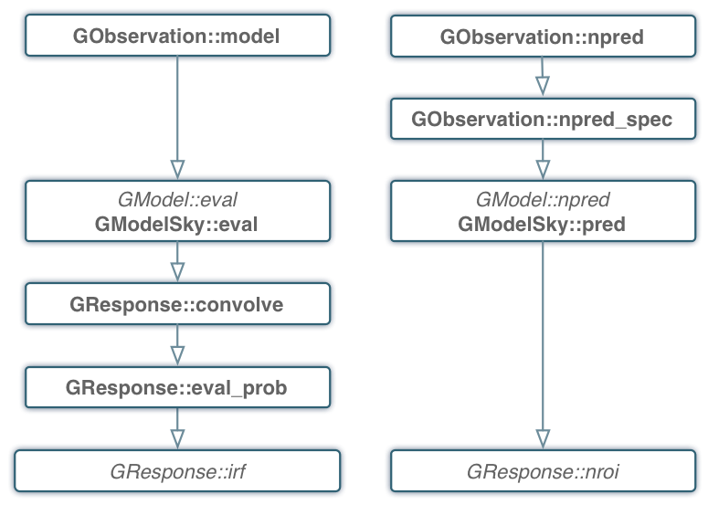

.. _sec_model:

Model handling
--------------

Overview
~~~~~~~~

The following figure presents an overview over the C++ classes of the model
module and their relations.

.. _fig_uml_model:

.. figure:: uml_model.png
   :align: center
   :width: 100%

   *Overview over the model module*

The central C++ class of the model module is the abstract base class
:doxy:`GModel` which defines a model component. Model components are combined
using the :doxy:`GModels` container C++ class.

Evaluating models for observations
~~~~~~~~~~~~~~~~~~~~~~~~~~~~~~~~~~

Models are evaluated by observations using the ``GObservation::model``
method. The ``GObservation::npred`` provides the number of predicted 
events by all models within the relevant dataspace for a given observation.

:ref:`fig_calltree_model` shows the call tree of the 
``GObservation::model`` (left) and ``GObservation::npred`` (right) 
methods.

For model evaluation, the :doxy:``GObservation::model`` method loops over all 
models in the :doxy:`GModels` container and calls the 
:doxy:`GModel::eval_gradients` method of each model. 
For :doxy:`GModelSky` models this method invokes the :doxy:`GResponse::convolve`
method that calls among others the :doxy:`GResponse::irf` method.
That method needs to be implement for each instruments.

The ``GObservation::npred`` method performs an integration over observed 
time, observed energy and observed arrival direction. 
The integrate over observed time is for the moment a simple multiplication
with ontime.
The integral over observed energy is performed by the 
``GObservation::npred_spec`` method that calls the
:doxy:`GModel::eval_gradients` method.
For :doxy:`GModelSky` models this method calls the :doxy:`GResponse::nroi`
method that needs to be implement for each instruments.

.. _fig_calltree_model:

   *Call tree for model evaluation*

Sky models
~~~~~~~~~~

Sky models describe the spatial, spectral and temporal properties of a 
gamma-ray source using the following factorization:

.. math::
   M(\alpha,\delta,E,t) = M_{\rm spatial}(\alpha,\delta | E,t) \times
                          M_{\rm spectral}(E | t) \times 
                          M_{\rm temporal}(t)

The spatial model component :math:`M_{\rm spatial}(\alpha,\delta|E,t)`
is defined by the abstract :doxy:`GModelSpatial` class, the spectral
model component :math:`M_{\rm spectral}(E|t)` is defined by the
abstract :doxy:`GModelSpectral` class and the temporal component
:math:`M_{\rm temporal}(t)` is defined by the abstract
:doxy:`GModelTemporal` class.

The spatial model component describes the energy and time dependent
morphology of the source.
It satisfies

.. math::
   \int_{\Omega} M_{\rm spatial}(\alpha,\delta|E,t) d\Omega = 1

for all :math:`E` and :math:`t`, hence the spatial component does not
impact the spatially integrated spectral and temporal properties of the
source (the integration is done here over the spatial parameters
:math:`\alpha` and :math:`\delta` in a spherical coordinate system).

The spectral model component describes the spatially integrated time
dependent spectral distribution of the source.
It satisfies

.. math::
   \int_{E} M_{\rm spectral}(E | t) dE = \Phi

for all :math:`t`, where :math:`\Phi` is the spatially and spectrally
integrated total source flux. The spectral component does not impact
the temporal properties of the integrated flux :math:`\Phi`.

The temporal model component describes the relative variation of the
source flux with respect to the mean value given by the spectral model
component.

Spatial components
^^^^^^^^^^^^^^^^^^

Point source
============

.. code-block:: xml

  <source name="Crab" type="PointSource">
    <spatialModel type="PointSource">
      <parameter name="RA"  scale="1.0" value="83.6331" min="-360" max="360" free="1"/>
      <parameter name="DEC" scale="1.0" value="22.0145" min="-90"  max="90"  free="1"/>
    </spatialModel>
    <spectrum type="...">
      ...
    </spectrum>
  </source>

An alternative XML format is supported for compatibility with the Fermi/LAT XML
format:

.. code-block:: xml

  <source name="Crab" type="PointSource">
    <spatialModel type="SkyDirFunction">
      <parameter name="RA"  scale="1.0" value="83.6331" min="-360" max="360" free="1"/>
      <parameter name="DEC" scale="1.0" value="22.0145" min="-90"  max="90"  free="1"/>
    </spatialModel>
    <spectrum type="...">
      ...
    </spectrum>
  </source>

Radial disk
===========

.. code-block:: xml

  <source name="Crab" type="ExtendedSource">
    <spatialModel type="RadialDisk">
      <parameter name="RA"     scale="1.0" value="83.6331" min="-360" max="360" free="1"/>
      <parameter name="DEC"    scale="1.0" value="22.0145" min="-90"  max="90"  free="1"/>
      <parameter name="Radius" scale="1.0" value="0.20"    min="0.01" max="10"  free="1"/>
    </spatialModel>
    <spectrum type="...">
      ...
    </spectrum>
  </source>

Radial Gaussian
===============

.. code-block:: xml

  <source name="Crab" type="ExtendedSource">
    <spatialModel type="RadialGaussian">
      <parameter name="RA"    scale="1.0" value="83.6331" min="-360" max="360" free="1"/>
      <parameter name="DEC"   scale="1.0" value="22.0145" min="-90"  max="90"  free="1"/>
      <parameter name="Sigma" scale="1.0" value="0.20"    min="0.01" max="10"  free="1"/>
    </spatialModel>
    <spectrum type="...">
      ...
    </spectrum>
  </source>

Radial shell
============

.. code-block:: xml

  <source name="Crab" type="ExtendedSource">
    <spatialModel type="RadialShell">
      <parameter name="RA"     scale="1.0" value="83.6331" min="-360" max="360" free="1"/>
      <parameter name="DEC"    scale="1.0" value="22.0145" min="-90"  max="90"  free="1"/>
      <parameter name="Radius" scale="1.0" value="0.30"    min="0.01" max="10"  free="1"/>
      <parameter name="Width"  scale="1.0" value="0.10"    min="0.01" max="10"  free="1"/>
    </spatialModel>
    <spectrum type="...">
      ...
    </spectrum>
  </source>

Elliptical disk
===============

.. code-block:: xml

  <source name="Crab" type="ExtendedSource">
    <spatialModel type="EllipticalDisk">
      <parameter name="RA"          scale="1.0" value="83.6331" min="-360"  max="360" free="1"/>
      <parameter name="DEC"         scale="1.0" value="22.0145" min="-90"   max="90"  free="1"/>
      <parameter name="PA"          scale="1.0" value="45.0"    min="-360"  max="360" free="1"/>
      <parameter name="MinorRadius" scale="1.0" value="0.5"     min="0.001" max="10"  free="1"/>
      <parameter name="MajorRadius" scale="1.0" value="2.0"     min="0.001" max="10"  free="1"/>
    </spatialModel>
    <spectrum type="...">
      ...
    </spectrum>
  </source>

Elliptical Gaussian
===================

.. code-block:: xml

  <source name="Crab" type="ExtendedSource">
    <spatialModel type="EllipticalGaussian">
      <parameter name="RA"          scale="1.0" value="83.6331" min="-360"  max="360" free="1"/>
      <parameter name="DEC"         scale="1.0" value="22.0145" min="-90"   max="90"  free="1"/>
      <parameter name="PA"          scale="1.0" value="45.0"    min="-360"  max="360" free="1"/>
      <parameter name="MinorRadius" scale="1.0" value="0.5"     min="0.001" max="10"  free="1"/>
      <parameter name="MajorRadius" scale="1.0" value="2.0"     min="0.001" max="10"  free="1"/>
    </spatialModel>
    <spectrum type="...">
      ...
    </spectrum>
  </source>

Isotropic source
================

.. code-block:: xml

  <source name="Crab" type="DiffuseSource">
    <spatialModel type="DiffuseIsotropic">
       <parameter name="Value" scale="1" value="1" min="1"  max="1" free="0"/>
    </spatialModel>
    <spectrum type="...">
      ...
    </spectrum>
  </source>

An alternative XML format is supported for compatibility with the Fermi/LAT XML
format:

.. code-block:: xml

  <source name="Crab" type="DiffuseSource">
    <spatialModel type="ConstantValue">
       <parameter name="Value" scale="1" value="1" min="1"  max="1" free="0"/>
    </spatialModel>
    <spectrum type="...">
      ...
    </spectrum>
  </source>

Diffuse map
===========

.. code-block:: xml

  <source name="Crab" type="DiffuseSource">
    <spatialModel type="DiffuseMap" file="map.fits">
       <parameter name="Normalization" scale="1" value="1" min="0.001" max="1000.0" free="0"/>
    </spatialModel>
    <spectrum type="...">
      ...
    </spectrum>
  </source>

An alternative XML format is supported for compatibility with the Fermi/LAT XML
format:

.. code-block:: xml

  <source name="Crab" type="DiffuseSource">
    <spatialModel type="SpatialMap" file="map.fits">
       <parameter name="Prefactor" scale="1" value="1" min="0.001" max="1000.0" free="0"/>
    </spatialModel>
    <spectrum type="...">
      ...
    </spectrum>
  </source>

Diffuse map cube
================

.. code-block:: xml

  <source name="Crab" type="DiffuseSource">
    <spatialModel type="DiffuseMapCube" file="map_cube.fits">
      <parameter name="Normalization" scale="1" value="1" min="0.001" max="1000.0" free="0"/>
    </spatialModel>
    <spectrum type="...">
      ...
    </spectrum>
  </source>

An alternative XML format is supported for compatibility with the Fermi/LAT XML
format:

.. code-block:: xml

  <source name="Crab" type="DiffuseSource">
    <spatialModel type="MapCubeFunction" file="map_cube.fits">
      <parameter name="Value" scale="1" value="1" min="0.001" max="1000.0" free="0"/>
    </spatialModel>
    <spectrum type="...">
      ...
    </spectrum>
  </source>

Spectral components
^^^^^^^^^^^^^^^^^^^

Constant
========

The :doxy:`GModelSpectralConst` class implements the constant function

.. math::
    \frac{dN}{dE} = N_0

where the parameters in the XML definition have the following mappings:

* :math:`N_0` = ``Normalization``

The XML format for specifying a constant is:

.. code-block:: xml

   <spectrum type="Constant">
    <parameter name="Normalization" scale="1e-16" value="5.7"  min="1e-07" max="1000.0" free="1"/>
   </spectrum>

An alternative XML format is supported for compatibility with the Fermi/LAT XML
format:

.. code-block:: xml

   <spectrum type="ConstantValue">
    <parameter name="Value" scale="1e-16" value="5.7"  min="1e-07" max="1000.0" free="1"/>
   </spectrum>

Node function
=============

The generalisation of the broken power law is the node function, which is 
defined by a set of energy and intensity values, the so called nodes, 
which are connected by power laws.

The XML format for specifying a node function is:

.. code-block:: xml

   <spectrum type="NodeFunction">
    <node>
      <parameter scale="1.0"   name="Energy"    min="0.1"   max="1.0e20" value="1.0"  free="0"/>
      <parameter scale="1e-07" name="Intensity" min="1e-07" max="1000.0" value="1.0"  free="1"/>
    </node>
    <node>
      <parameter scale="1.0"   name="Energy"    min="0.1"   max="1.0e20" value="10.0" free="0"/>
      <parameter scale="1e-07" name="Intensity" min="1e-07" max="1000.0" value="0.1"  free="1"/>
    </node>
   </spectrum>

(in this example there are two nodes; the number of nodes in a node 
function is arbitrary).

File function
=============

A function defined using an input ASCII file with columns of energy and
differential flux values.
The energy values are assumed to be in units of MeV, the flux values are
normally assumed to be in units of
:math:`{\rm cm}^{-2} {\rm s}^{-1} {\rm MeV}^{-1}`.
The only exception to this rule is the isotropic diffuse model
:doxy:`GModelSpatialDiffuseConst` for which the flux values are given
in units of :math:`{\rm cm}^{-2} {\rm s}^{-1} {\rm MeV}^{-1} {\rm sr}^{-1}`.

The only parameter of the model is a multiplicative normalization:

.. math::
    \frac{dN}{dE} = N_0 \left. \frac{dN}{dE} \right\rvert_{\rm file}

where the parameters in the XML definition have the following mappings:

* :math:`N_0` = ``Normalization``

The XML format for specifying a file function is:

.. code-block:: xml

   <spectrum type="FileFunction" file="data/filefunction.txt">
    <parameter scale="1.0" name="Normalization" min="0.0" max="1000.0" value="1.0" free="1"/>
   </spectrum>

If the file is given as relative path, the path is relative to the working 
directory of the executable. Alternatively, an absolute path may be 
specified. Any environment variable present in the path name will be 
expanded.

Power law
=========

The :doxy:`GModelSpectralPlaw` class implements the power law function

.. math::
    \frac{dN}{dE} = k_0 \left( \frac{E}{E_0} \right)^{\gamma}

where the parameters in the XML definition have the following mappings:

* :math:`k_0` = ``Prefactor``
* :math:`\gamma` = ``Index``
* :math:`E_0` = ``PivotEnergy``

The XML format for specifying a power law is:

.. code-block:: xml

   <spectrum type="PowerLaw">
    <parameter name="Prefactor"   scale="1e-16" value="5.7"  min="1e-07" max="1000.0" free="1"/>
    <parameter name="Index"       scale="-1"    value="2.48" min="0.0"   max="+5.0"   free="1"/>
    <parameter name="PivotEnergy" scale="1e6"   value="0.3"  min="0.01"  max="1000.0" free="0"/>
   </spectrum>

An alternative XML format is supported for compatibility with the Fermi/LAT XML
format:

.. code-block:: xml

   <spectrum type="PowerLaw">
    <parameter name="Prefactor" scale="1e-16" value="5.7"  min="1e-07" max="1000.0" free="1"/>
    <parameter name="Index"     scale="-1"    value="2.48" min="0.0"   max="+5.0"   free="1"/>
    <parameter name="Scale"     scale="1e6"   value="0.3"  min="0.01"  max="1000.0" free="0"/>
   </spectrum>

An alternative power law function is defined by the :doxy:`GModelSpectralPlawPhotonFlux`
class that uses the integral photon flux as parameter rather than the
Prefactor:

.. math::
    \frac{dN}{dE} = \frac{F_{\rm Ph}(\gamma+1)E^{\gamma}}
                         {E_{\rm max}^{\gamma+1} - E_{\rm min}^{\gamma+1}}

where the parameters in the XML definition have the following mappings:

* :math:`F_{\rm Ph}` = ``PhotonFlux``
* :math:`\gamma` = ``Index``
* :math:`E_{\rm min}` = ``LowerLimit``
* :math:`E_{\rm max}` = ``UpperLimit``

The XML format for specifying a power law defined by the integral photon flux
is:

.. code-block:: xml

   <spectrum type="PowerLaw">
    <parameter scale="1e-07" name="PhotonFlux" min="1e-07" max="1000.0"    value="1.0" free="1"/>
    <parameter scale="1.0"   name="Index"      min="-5.0"  max="+5.0"      value="-2.0" free="1"/>
    <parameter scale="1.0"   name="LowerLimit" min="10.0"  max="1000000.0" value="100.0" free="0"/>
    <parameter scale="1.0"   name="UpperLimit" min="10.0"  max="1000000.0" value="500000.0" free="0"/>
   </spectrum>

An alternative XML format is supported for compatibility with the Fermi/LAT XML
format:

.. code-block:: xml

   <spectrum type="PowerLaw2">
    <parameter scale="1e-07" name="Intergal"   min="1e-07" max="1000.0"    value="1.0" free="1"/>
    <parameter scale="1.0"   name="Index"      min="-5.0"  max="+5.0"      value="-2.0" free="1"/>
    <parameter scale="1.0"   name="LowerLimit" min="10.0"  max="1000000.0" value="100.0" free="0"/>
    <parameter scale="1.0"   name="UpperLimit" min="10.0"  max="1000000.0" value="500000.0" free="0"/>
   </spectrum>

.. note::

   The UpperLimit and LowerLimit parameters are always treated as fixed and,
   as should be apparent from this definition, the flux given by the PhotonFlux
   parameter is over the range (LowerLimit, UpperLimit). Use of this model
   allows the errors on the integrated photon flux to be evaluated directly by
   likelihood, obviating the need to propagate the errors if one is using
   the PowerLaw form.

Another alternative power law function is defined by the :doxy:`GModelSpectralPlawEnergyFlux`
class that uses the integral energy flux as parameter rather than the
Prefactor:

.. math::
    \frac{dN}{dE} = \frac{F_{\rm E}(\gamma+2)E^{\gamma}}
                         {E_{\rm max}^{\gamma+2} - E_{\rm min}^{\gamma+2}}

where the parameters in the XML definition have the following mappings:

* :math:`F_{\rm E}` = ``EnergyFlux``
* :math:`\gamma` = ``Index``
* :math:`E_{\rm min}` = ``LowerLimit``
* :math:`E_{\rm max}` = ``UpperLimit``

The XML format for specifying a power law defined by the integral energy flux
is:

.. code-block:: xml

   <spectrum type="PowerLaw">
    <parameter scale="1e-07" name="EnergyFlux" min="1e-07" max="1000.0"    value="1.0" free="1"/>
    <parameter scale="1.0"   name="Index"      min="-5.0"  max="+5.0"      value="-2.0" free="1"/>
    <parameter scale="1.0"   name="LowerLimit" min="10.0"  max="1000000.0" value="100.0" free="0"/>
    <parameter scale="1.0"   name="UpperLimit" min="10.0"  max="1000000.0" value="500000.0" free="0"/>
   </spectrum>

.. note::

   The UpperLimit and LowerLimit parameters are always treated as fixed and,
   as should be apparent from this definition, the flux given by the EnergyFlux
   parameter is over the range (LowerLimit, UpperLimit). Use of this model
   allows the errors on the integrated energy flux to be evaluated directly by
   likelihood, obviating the need to propagate the errors if one is using
   the PowerLaw form.

Exponentially cut-off power law
===============================

The :doxy:`GModelSpectralExpPlaw` class implements the exponentially 
cut-off power law function

.. math::
    \frac{dN}{dE} = k_0 \left( \frac{E}{E_0} \right)^{\gamma}
                    \exp \left( \frac{-E}{E_{\rm cut}} \right)

where the parameters in the XML definition have the following mappings:

* :math:`k_0` = ``Prefactor``
* :math:`\gamma` = ``Index``
* :math:`E_0` = ``PivotEnergy``
* :math:`E_{\rm cut}` = ``CutoffEnergy``

The XML format for specifying an exponentially cut-off power law is:

.. code-block:: xml

   <spectrum type="ExponentialCutoffPowerLaw">
    <parameter name="Prefactor"    scale="1e-16" value="5.7"  min="1e-07" max="1000.0" free="1"/>
    <parameter name="Index"        scale="-1"    value="2.48" min="0.0"   max="+5.0"   free="1"/>
    <parameter name="CutoffEnergy" scale="1e6"   value="1.0"  min="0.01"  max="1000.0" free="1"/>
    <parameter name="PivotEnergy"  scale="1e6"   value="0.3"  min="0.01"  max="1000.0" free="0"/>
   </spectrum>

An alternative XML format is supported for compatibility with the Fermi/LAT XML
format:

.. code-block:: xml

   <spectrum type="ExpCutoff">
    <parameter name="Prefactor" scale="1e-16" value="5.7"  min="1e-07" max="1000.0" free="1"/>
    <parameter name="Index"     scale="-1"    value="2.48" min="0.0"   max="+5.0"   free="1"/>
    <parameter name="Cutoff"    scale="1e6"   value="1.0"  min="0.01"  max="1000.0" free="1"/>
    <parameter name="Scale"     scale="1e6"   value="0.3"  min="0.01"  max="1000.0" free="0"/>
   </spectrum>

Super exponentially cut-off power law
=====================================

The :doxy:`GModelSpectralSuperExpPlaw` class implements the super
exponentially cut-off power law function

.. math::
    \frac{dN}{dE} = k_0 \left( \frac{E}{E_0} \right)^{\gamma}
                    \exp \left( 
                      -\left( \frac{E}{E_{\rm cut}} \right)^{\alpha}
                    \right)

where the parameters in the XML definition have the following mappings:

* :math:`k_0` = ``Prefactor``
* :math:`\gamma` = ``Index1``
* :math:`\alpha` = ``Index2``
* :math:`E_0` = ``PivotEnergy``
* :math:`E_{\rm cut}` = ``CutoffEnergy``

.. code-block:: xml

   <spectrum type="SuperExponentialCutoffPowerLaw">
    <parameter name="Prefactor"    scale="1e-16" value="1.0" min="1e-07" max="1000.0" free="1"/>
    <parameter name="Index1"       scale="-1"    value="2.0" min="0.0"   max="+5.0"   free="1"/>
    <parameter name="CutoffEnergy" scale="1e6"   value="1.0" min="0.01"  max="1000.0" free="1"/>
    <parameter name="Index2"       scale="1.0"   value="1.5" min="0.1"   max="5.0"    free="1"/>
    <parameter name="PivotEnergy"  scale="1e6"   value="1.0" min="0.01"  max="1000.0" free="0"/>
   </spectrum>

An alternative XML format is supported for compatibility with the Fermi/LAT XML
format:

.. code-block:: xml

   <spectrum type="PLSuperExpCutoff">
    <parameter name="Prefactor"   scale="1e-16" value="1.0" min="1e-07" max="1000.0" free="1"/>
    <parameter name="Index1"      scale="-1"    value="2.0" min="0.0"   max="+5.0"   free="1"/>
    <parameter name="Cutoff"      scale="1e6"   value="1.0" min="0.01"  max="1000.0" free="1"/>
    <parameter name="Index2"      scale="1.0"   value="1.5" min="0.1"   max="5.0"    free="1"/>
    <parameter name="Scale"       scale="1e6"   value="1.0" min="0.01"  max="1000.0" free="0"/>
   </spectrum>

Broken power law
================

The :doxy:`GModelSpectralBrokenPlaw` class implements the broken power law function

.. math::

    \frac{dN}{dE} = k_0 \times \left \{
    \begin{eqnarray}
      \left( \frac{E}{E_b} \right)^{\gamma_1} & {\rm if\,\,} E < E_b \\
      \left( \frac{E}{E_b} \right)^{\gamma_2} & {\rm otherwise}
    \end{eqnarray}
    \right .

where the parameters in the XML definition have the following mappings:

* :math:`k_0` = ``Prefactor``
* :math:`\gamma_1` = ``Index1``
* :math:`\gamma_2` = ``Index2``
* :math:`E_b` = ``BreakEnergy``

The XML format for specifying a broken power law is:

.. code-block:: xml

   <spectrum type="BrokenPowerLaw">
    <parameter name="Prefactor"   scale="1e-16" value="5.7"  min="1e-07" max="1000.0" free="1"/>
    <parameter name="Index1"      scale="-1"    value="2.48" min="0.0"   max="+5.0"   free="1"/>
    <parameter name="BreakEnergy" scale="1e6"   value="0.3"  min="0.01"  max="1000.0" free="1"/>
    <parameter name="Index2"      scale="-1"    value="2.70" min="0.01"  max="1000.0" free="1"/>
   </spectrum>

An alternative XML format is supported for compatibility with the Fermi/LAT XML
format:

.. code-block:: xml

   <spectrum type="BrokenPowerLaw">
    <parameter name="Prefactor"  scale="1e-16" value="5.7"  min="1e-07" max="1000.0" free="1"/>
    <parameter name="Index1"     scale="-1"    value="2.48" min="0.0"   max="+5.0"   free="1"/>
    <parameter name="BreakValue" scale="1e6"   value="0.3"  min="0.01"  max="1000.0" free="1"/>
    <parameter name="Index2"     scale="-1"    value="2.70" min="0.01"  max="1000.0" free="1"/>
   </spectrum>

Gaussian
========

The :doxy:`GModelSpectralGauss` class implements the gaussian function

.. math::
    \frac{dN}{dE} = \frac{N_0}{\sqrt{2\pi}\sigma}
                    \exp \left( \frac{-(E-\bar{E})^2}{2 \sigma^2} \right)

where the parameters in the XML definition have the following mappings:

* :math:`N_0` = ``Normalization``
* :math:`\bar{E}` = ``Mean``
* :math:`\sigma` = ``Sigma``

The XML format for specifying a Gaussian is:

.. code-block:: xml

   <spectrum type="Gaussian">
    <parameter name="Normalization" scale="1e-10" value="1.0"  min="1e-07" max="1000.0" free="1"/>
    <parameter name="Mean"          scale="1e6"   value="5.0"  min="0.01"  max="100.0"  free="1"/>
    <parameter name="Sigma"         scale="1e6"   value="1.0"  min="0.01"  max="100.0"  free="1"/>
   </spectrum>

Log parabola
============

The :doxy:`GModelSpectralLogParabola` class implements the log parabola function

.. math::
    \frac{dN}{dE} = k_0 \left( \frac{E}{E_0} \right)^{\gamma+\eta \ln(E/E_0)}

where the parameters in the XML definition have the following mappings:

* :math:`k_0` = ``Prefactor``
* :math:`\gamma` = ``Index``
* :math:`\eta` = ``Curvature``
* :math:`E_0` = ``PivotEnergy``

The XML format for specifying a log parabola spectrum is:

.. code-block:: xml

   <spectrum type="LogParabola">
    <parameter name="Prefactor"   scale="1e-17" value="5.878"   min="1e-07" max="1000.0" free="1"/>
    <parameter name="Index"       scale="-1"    value="2.32473" min="0.0"   max="+5.0"   free="1"/>
    <parameter name="Curvature"   scale="-1"    value="0.074"   min="-5.0"  max="+5.0"   free="1"/>
    <parameter name="PivotEnergy" scale="1e6"   value="1.0"     min="0.01"  max="1000.0" free="0"/>
   </spectrum>

An alternative XML format is supported for compatibility with the Fermi/LAT XML
format:

.. code-block:: xml

   <spectrum type="LogParabola">
    <parameter name="norm"  scale="1e-17" value="5.878"   min="1e-07" max="1000.0" free="1"/>
    <parameter name="alpha" scale="1"     value="2.32473" min="0.0"   max="+5.0"   free="1"/>
    <parameter name="beta"  scale="1"     value="0.074"   min="-5.0"  max="+5.0"   free="1"/>
    <parameter name="Eb"    scale="1e6"   value="1.0"     min="0.01"  max="1000.0" free="0"/>
   </spectrum>

where

* ``alpha`` = -``Index``
* ``beta`` = -``Curvature``

Temporal components
^^^^^^^^^^^^^^^^^^^

Constant
========

The only temporal model component that exists so far is the constant model
that is implemented by the :doxy:`GModelTemporalConst` class.

The XML format for specifying a constant temporal model is:

.. code-block:: xml

   <temporalModel type="Constant">
     <parameter name="Normalization" scale="1.0" value="1.0" min="0.1" max="10.0" free="0"/>
   </temporalModel>

Background models
~~~~~~~~~~~~~~~~~
