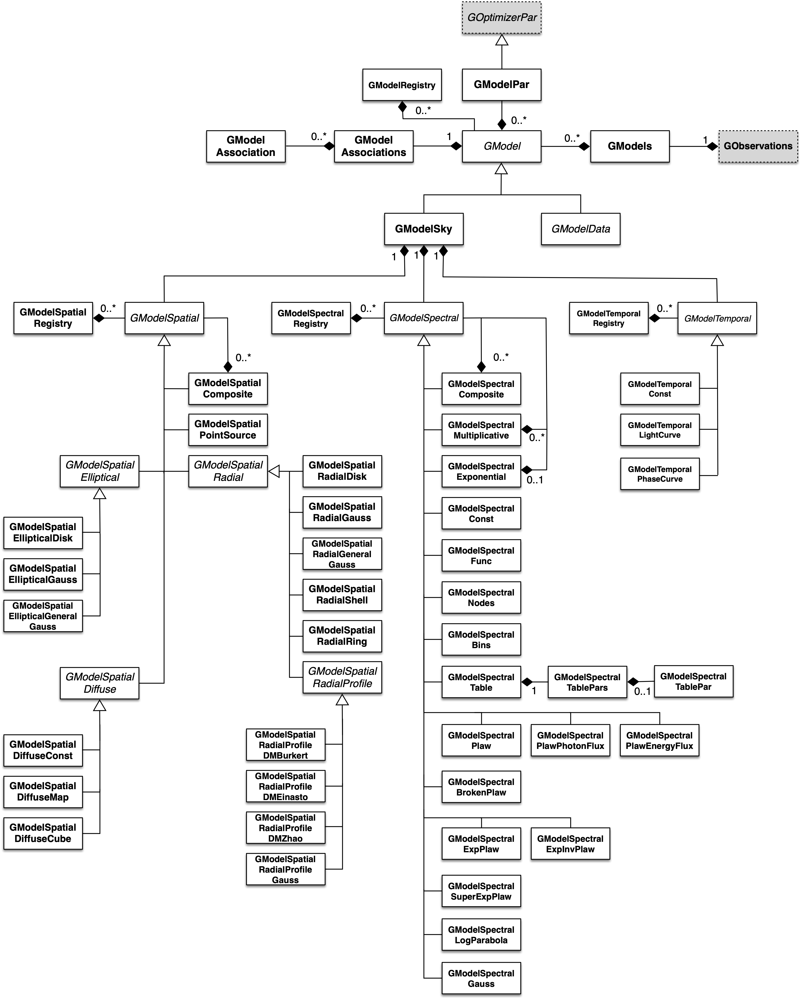

Overview
========

The following figure presents an overview over the C++ classes of the model
module and their relations.

.. _fig_uml_model:

   *Overview over the model module*

The central C++ class of the model module is the abstract base class
:doxy:`GModel` which defines a model component. Two fundamental model types
derive from this class: :doxy:`GModelSky` which implements a model of a
gamma-ray source, and :doxy:`GModelData` which is an abstract base class for
models that directly describe the event distribution in the data-space.

In general, models are parametric, and model parameters are implemented by
:doxy:`GModelPar` which derives from the abstract :doxy:`GOptimizerPar`
base class.

Model components are combined using the :doxy:`GModels` container C++ class.
