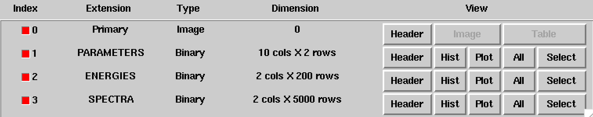
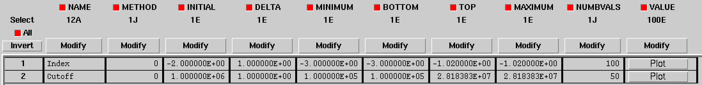
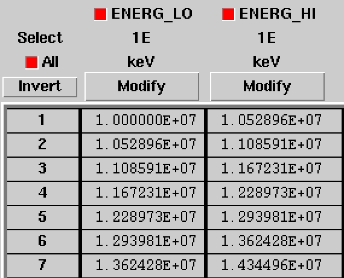
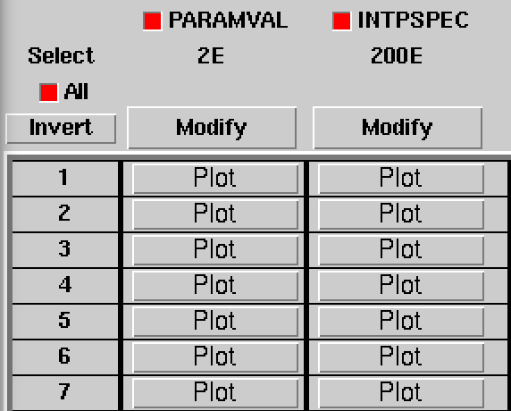

Spectral components
^^^^^^^^^^^^^^^^^^^

Constant
========

The :doxy:`GModelSpectralConst` class implements the constant function

.. math::
    \frac{dN}{dE} = N_0

where the parameters in the XML definition have the following mappings:

* :math:`N_0` = ``Normalization``

The XML format for specifying a constant is:

.. code-block:: xml

   <spectrum type="Constant">
     <parameter name="Normalization" scale="1e-16" value="5.7"  min="1e-07" max="1000.0" free="1"/>
   </spectrum>

An alternative XML format is supported for compatibility with the Fermi/LAT XML
format:

.. code-block:: xml

   <spectrum type="ConstantValue">
     <parameter name="Value" scale="1e-16" value="5.7"  min="1e-07" max="1000.0" free="1"/>
   </spectrum>

Node function
=============

The generalisation of the broken power law is the node function, which is 
defined by a set of energy and intensity values, the so called nodes, 
which are connected by power laws.

The XML format for specifying a node function is:

.. code-block:: xml

   <spectrum type="NodeFunction">
     <node>
       <parameter scale="1.0"   name="Energy"    min="0.1"   max="1.0e20" value="1.0"  free="0"/>
       <parameter scale="1e-07" name="Intensity" min="1e-07" max="1000.0" value="1.0"  free="1"/>
     </node>
     <node>
       <parameter scale="1.0"   name="Energy"    min="0.1"   max="1.0e20" value="10.0" free="0"/>
       <parameter scale="1e-07" name="Intensity" min="1e-07" max="1000.0" value="0.1"  free="1"/>
     </node>
   </spectrum>

(in this example there are two nodes; the number of nodes in a node 
function is arbitrary).

File function
=============

A function defined using an input ASCII file with columns of energy and
differential flux values.
The energy values are assumed to be in units of MeV, the flux values are
normally assumed to be in units of
:math:`{\rm cm}^{-2} {\rm s}^{-1} {\rm MeV}^{-1}`.

The only parameter of the model is a multiplicative normalization:

.. math::
    \frac{dN}{dE} = N_0 \left. \frac{dN}{dE} \right\rvert_{\rm file}

where the parameters in the XML definition have the following mappings:

* :math:`N_0` = ``Normalization``

The XML format for specifying a file function is:

.. code-block:: xml

   <spectrum type="FileFunction" file="data/filefunction.txt">
     <parameter scale="1.0" name="Normalization" min="0.0" max="1000.0" value="1.0" free="1"/>
   </spectrum>

If the ``file`` attribute is a relative path, the path is relative to the
directory where the XML file resides. Alternatively, an absolute path may be
specified. Any environment variable present in the path name will be 
expanded.

Table model
===========

An arbitrary spectral model defined on a M-dimensional grid of parameter
values. The spectrum is computed using M-dimensional linear interpolation.
The model definition is provided by a FITS file that follows the
`<https://heasarc.gsfc.nasa.gov/docs/heasarc/ofwg/docs/general/ogip_92_009/ogip_92_009.html>`_
standard.

The structure of the table model FITS file is shown below. The FITS file
contains three binary table extensions after an empty image extension.

.. _fig_model_table:

   *Structure of table model FITS file*

The ``PARAMETERS`` extension contains the definition of the model parameters.
Each row defines one model parameter. Each model parameter is defined by a
unique ``NAME``. The ``METHOD`` column indicates whether the model should be
interpolated linarly (value ``0``) or logarithmically (value ``1``). GammaLib
so far only supports linear interpolation, hence the field is ignored.
The ``INITIAL`` column indicates the initial parameter value, if the value in
the ``DELTA`` column is negative the parameter will be fixed, otherwise it will
be fitted. The ``MINIMUM`` and ``MAXIMUM`` columns indicate the range of values
for a given parameter, the ``BOTTOM`` and ``TOP`` columns are ignored by
GammaLib. The ``NUMBVALS`` column indicates the number of parameter values for
which the table model was computed, the ``VALUE`` column indicates the
specific parameter values.

In the example below there are two parameters named ``Index`` and ``Cutoff``,
and spectra were computed for 100 index values and 50 cutoff values, hence
a total of 5000 spectra are stored in the table model.

.. _fig_model_table_parameters:

   *Table model parameters extension*

The ``ENERGIES`` extension contains the energy boundaries for the spectra in
the usual OGIP format:

.. _fig_model_table_energies:

   *Energy boundaries extension*

The ``SPECTRA`` extension contains the spectra of the table model. It consists
of two vector column. The ``PARAMVAL`` column provides the parameter values
for which the spectrum was computed. Since there are two parameters in the
example the vector column has two entries. The ``INTPSPEC`` column provides
the spectrum :math:`\frac{dN(p)}{dE}` for the specific parameters. Since there
are 200 energy bins in this example the vector column has 200 entries.

.. _fig_model_table_spectra:

   *Spectra extension*

The model is defined using:

.. math::
    \frac{dN}{dE} = N_0 \left. \frac{dN(p)}{dE} \right\rvert_{\rm file}

where the parameters in the XML definition have the following mappings:

* :math:`N_0` = ``Normalization``
* :math:`p` = M model parameters (e.g. ``Index``, ``Cutoff``)

The XML format for specifying a table model is:

.. code-block:: xml

   <spectrum type="TableModel" file="model_table.fits">
     <parameter scale="1.0" name="Normalization" min="0.0" max="1000.0" value="1.0" free="1"/>
   </spectrum>

If the ``file`` attribute is a relative path, the path is relative to the
directory where the XML file resides. Alternatively, an absolute path may be
specified. Any environment variable present in the path name will be 
expanded.

Note that the default parameters of the table model are provided in the FITS
file, according to the
`<https://heasarc.gsfc.nasa.gov/docs/heasarc/ofwg/docs/general/ogip_92_009/ogip_92_009.html>`_
standard.
However, table model parameters may also be specified in the XML file, and
these parameter will then overwrite the parameters in the FITS file. For
example, for a 2-dimensional table model with an ``Index`` and a ``Cutoff``
parameter, the XML file may look like

.. code-block:: xml

   <spectrum type="TableModel" file="model_table.fits">
     <parameter scale="1e-16" name="Normalization" min="1e-07" max="1000" value="5.8"  free="1"/>
     <parameter scale="-1"    name="Index"         min="1.0"   max="3.0"  value="2.4"  free="1"/>
     <parameter scale="1e6"   name="Cutoff"        min="0.1"   max="28.2" value="0.89" free="1"/>
   </spectrum>

Power law
=========

The :doxy:`GModelSpectralPlaw` class implements the power law function

.. math::
    \frac{dN}{dE} = k_0 \left( \frac{E}{E_0} \right)^{\gamma}

where the parameters in the XML definition have the following mappings:

* :math:`k_0` = ``Prefactor``
* :math:`\gamma` = ``Index``
* :math:`E_0` = ``PivotEnergy``

The XML format for specifying a power law is:

.. code-block:: xml

   <spectrum type="PowerLaw">
     <parameter name="Prefactor"   scale="1e-16" value="5.7"  min="1e-07" max="1000.0" free="1"/>
     <parameter name="Index"       scale="-1"    value="2.48" min="0.0"   max="+5.0"   free="1"/>
     <parameter name="PivotEnergy" scale="1e6"   value="0.3"  min="0.01"  max="1000.0" free="0"/>
   </spectrum>

An alternative XML format is supported for compatibility with the Fermi/LAT XML
format:

.. code-block:: xml

   <spectrum type="PowerLaw">
     <parameter name="Prefactor" scale="1e-16" value="5.7"  min="1e-07" max="1000.0" free="1"/>
     <parameter name="Index"     scale="-1"    value="2.48" min="0.0"   max="+5.0"   free="1"/>
     <parameter name="Scale"     scale="1e6"   value="0.3"  min="0.01"  max="1000.0" free="0"/>
   </spectrum>

An alternative power law function is defined by the
:doxy:`GModelSpectralPlawPhotonFlux` class that uses the integral photon flux
as parameter rather than the ``Prefactor``:

.. math::
    \frac{dN}{dE} = \frac{F_{\rm ph}(\gamma+1)E^{\gamma}}
                         {E_{\rm max}^{\gamma+1} - E_{\rm min}^{\gamma+1}}

where the parameters in the XML definition have the following mappings:

* :math:`F_{\rm ph}` = ``PhotonFlux``
* :math:`\gamma` = ``Index``
* :math:`E_{\rm min}` = ``LowerLimit``
* :math:`E_{\rm max}` = ``UpperLimit``

The XML format for specifying a power law defined by the integral photon flux
is:

.. code-block:: xml

   <spectrum type="PowerLaw">
     <parameter scale="1e-07" name="PhotonFlux" min="1e-07" max="1000.0"    value="1.0"      free="1"/>
     <parameter scale="1.0"   name="Index"      min="-5.0"  max="+5.0"      value="-2.0"     free="1"/>
     <parameter scale="1.0"   name="LowerLimit" min="10.0"  max="1000000.0" value="100.0"    free="0"/>
     <parameter scale="1.0"   name="UpperLimit" min="10.0"  max="1000000.0" value="500000.0" free="0"/>
   </spectrum>

An alternative XML format is supported for compatibility with the Fermi/LAT XML
format:

.. code-block:: xml

   <spectrum type="PowerLaw2">
     <parameter scale="1e-07" name="Intergal"   min="1e-07" max="1000.0"    value="1.0"      free="1"/>
     <parameter scale="1.0"   name="Index"      min="-5.0"  max="+5.0"      value="-2.0"     free="1"/>
     <parameter scale="1.0"   name="LowerLimit" min="10.0"  max="1000000.0" value="100.0"    free="0"/>
     <parameter scale="1.0"   name="UpperLimit" min="10.0"  max="1000000.0" value="500000.0" free="0"/>
   </spectrum>

.. note::

   The ``UpperLimit`` and ``LowerLimit`` parameters are always treated as fixed
   and, as should be apparent from this definition, the flux given by the
   ``PhotonFlux`` parameter is over the range [``LowerLimit``, ``UpperLimit``].
   Use of this model allows the errors on the integrated photon flux to be
   evaluated directly by likelihood, obviating the need to propagate the errors
   if one is using the PowerLaw form.

Another alternative power law function is defined by the
:doxy:`GModelSpectralPlawEnergyFlux` class that uses the integral energy flux
as parameter rather than the ``Prefactor``:

.. math::
    \frac{dN}{dE} = \frac{F_{\rm E}(\gamma+2)E^{\gamma}}
                         {E_{\rm max}^{\gamma+2} - E_{\rm min}^{\gamma+2}}

where the parameters in the XML definition have the following mappings:

* :math:`F_{\rm E}` = ``EnergyFlux``
* :math:`\gamma` = ``Index``
* :math:`E_{\rm min}` = ``LowerLimit``
* :math:`E_{\rm max}` = ``UpperLimit``

The XML format for specifying a power law defined by the integral energy flux
is:

.. code-block:: xml

   <spectrum type="PowerLaw">
     <parameter scale="1e-07" name="EnergyFlux" min="1e-07" max="1000.0"    value="1.0"      free="1"/>
     <parameter scale="1.0"   name="Index"      min="-5.0"  max="+5.0"      value="-2.0"     free="1"/>
     <parameter scale="1.0"   name="LowerLimit" min="10.0"  max="1000000.0" value="100.0"    free="0"/>
     <parameter scale="1.0"   name="UpperLimit" min="10.0"  max="1000000.0" value="500000.0" free="0"/>
   </spectrum>

.. note::

   The ``UpperLimit`` and ``LowerLimit`` parameters are always treated as fixed
   and, as should be apparent from this definition, the flux given by the
   ``EnergyFlux`` parameter is over the range [``LowerLimit``, ``UpperLimit``].
   Use of this model allows the errors on the integrated energy flux to be
   evaluated directly by likelihood, obviating the need to propagate the errors
   if one is using the PowerLaw form.

Exponentially cut-off power law
===============================

The :doxy:`GModelSpectralExpPlaw` class implements the exponentially 
cut-off power law function

.. math::
    \frac{dN}{dE} = k_0 \left( \frac{E}{E_0} \right)^{\gamma}
                    \exp \left( \frac{-E}{E_{\rm cut}} \right)

where the parameters in the XML definition have the following mappings:

* :math:`k_0` = ``Prefactor``
* :math:`\gamma` = ``Index``
* :math:`E_0` = ``PivotEnergy``
* :math:`E_{\rm cut}` = ``CutoffEnergy``

The XML format for specifying an exponentially cut-off power law is:

.. code-block:: xml

   <spectrum type="ExponentialCutoffPowerLaw">
     <parameter name="Prefactor"    scale="1e-16" value="5.7"  min="1e-07" max="1000.0" free="1"/>
     <parameter name="Index"        scale="-1"    value="2.48" min="0.0"   max="+5.0"   free="1"/>
     <parameter name="CutoffEnergy" scale="1e6"   value="1.0"  min="0.01"  max="1000.0" free="1"/>
     <parameter name="PivotEnergy"  scale="1e6"   value="0.3"  min="0.01"  max="1000.0" free="0"/>
   </spectrum>

An alternative XML format is supported for compatibility with the Fermi/LAT XML
format:

.. code-block:: xml

   <spectrum type="ExpCutoff">
     <parameter name="Prefactor" scale="1e-16" value="5.7"  min="1e-07" max="1000.0" free="1"/>
     <parameter name="Index"     scale="-1"    value="2.48" min="0.0"   max="+5.0"   free="1"/>
     <parameter name="Cutoff"    scale="1e6"   value="1.0"  min="0.01"  max="1000.0" free="1"/>
     <parameter name="Scale"     scale="1e6"   value="0.3"  min="0.01"  max="1000.0" free="0"/>
   </spectrum>

An alternative exponentially cut-off power law function is defined by the 
:doxy:`GModelSpectralExpInvPlaw` class which makes use of the inverse of the 
cut-off energy for function parametrisation:

.. math::
    \frac{dN}{dE} = k_0 \left( \frac{E}{E_0} \right)^{\gamma}
                    \exp \left( -\lambda E \right)

where the parameters in the XML definition have the following mappings:

* :math:`k_0` = ``Prefactor``
* :math:`\gamma` = ``Index``
* :math:`E_0` = ``PivotEnergy``
* :math:`\lambda` = ``InverseCutoffEnergy``

The XML format for specifying an exponentially cut-off power law using this 
alternative parametrisation is:

.. code-block:: xml

   <spectrum type="ExponentialCutoffPowerLaw">
     <parameter name="Prefactor"           scale="1e-16" value="5.7"  min="1e-07" max="1000.0" free="1"/>
     <parameter name="Index"               scale="-1"    value="2.48" min="0.0"   max="+5.0"   free="1"/>
     <parameter name="InverseCutoffEnergy" scale="1e-6"  value="1.0"  min="0.0"   max="100.0"  free="1"/>
     <parameter name="PivotEnergy"         scale="1e6"   value="0.3"  min="0.01"  max="1000.0" free="0"/>
   </spectrum>

Super exponentially cut-off power law
=====================================

The :doxy:`GModelSpectralSuperExpPlaw` class implements the super
exponentially cut-off power law function

.. math::
    \frac{dN}{dE} = k_0 \left( \frac{E}{E_0} \right)^{\gamma}
                    \exp \left( 
                      -\left( \frac{E}{E_{\rm cut}} \right)^{\alpha}
                    \right)

where the parameters in the XML definition have the following mappings:

* :math:`k_0` = ``Prefactor``
* :math:`\gamma` = ``Index1``
* :math:`\alpha` = ``Index2``
* :math:`E_0` = ``PivotEnergy``
* :math:`E_{\rm cut}` = ``CutoffEnergy``

.. code-block:: xml

   <spectrum type="SuperExponentialCutoffPowerLaw">
     <parameter name="Prefactor"    scale="1e-16" value="1.0" min="1e-07" max="1000.0" free="1"/>
     <parameter name="Index1"       scale="-1"    value="2.0" min="0.0"   max="+5.0"   free="1"/>
     <parameter name="CutoffEnergy" scale="1e6"   value="1.0" min="0.01"  max="1000.0" free="1"/>
     <parameter name="Index2"       scale="1.0"   value="1.5" min="0.1"   max="5.0"    free="1"/>
     <parameter name="PivotEnergy"  scale="1e6"   value="1.0" min="0.01"  max="1000.0" free="0"/>
   </spectrum>

An alternative XML format is supported for compatibility with the Fermi/LAT XML
format:

.. code-block:: xml

   <spectrum type="PLSuperExpCutoff">
     <parameter name="Prefactor"   scale="1e-16" value="1.0" min="1e-07" max="1000.0" free="1"/>
     <parameter name="Index1"      scale="-1"    value="2.0" min="0.0"   max="+5.0"   free="1"/>
     <parameter name="Cutoff"      scale="1e6"   value="1.0" min="0.01"  max="1000.0" free="1"/>
     <parameter name="Index2"      scale="1.0"   value="1.5" min="0.1"   max="5.0"    free="1"/>
     <parameter name="Scale"       scale="1e6"   value="1.0" min="0.01"  max="1000.0" free="0"/>
   </spectrum>

Broken power law
================

The :doxy:`GModelSpectralBrokenPlaw` class implements the broken power law function

.. math::

    \frac{dN}{dE} = k_0 \times \left \{
    \begin{eqnarray}
      \left( \frac{E}{E_b} \right)^{\gamma_1} & {\rm if\,\,} E < E_b \\
      \left( \frac{E}{E_b} \right)^{\gamma_2} & {\rm otherwise}
    \end{eqnarray}
    \right .

where the parameters in the XML definition have the following mappings:

* :math:`k_0` = ``Prefactor``
* :math:`\gamma_1` = ``Index1``
* :math:`\gamma_2` = ``Index2``
* :math:`E_b` = ``BreakEnergy``

The XML format for specifying a broken power law is:

.. code-block:: xml

   <spectrum type="BrokenPowerLaw">
     <parameter name="Prefactor"   scale="1e-16" value="5.7"  min="1e-07" max="1000.0" free="1"/>
     <parameter name="Index1"      scale="-1"    value="2.48" min="0.0"   max="+5.0"   free="1"/>
     <parameter name="BreakEnergy" scale="1e6"   value="0.3"  min="0.01"  max="1000.0" free="1"/>
     <parameter name="Index2"      scale="-1"    value="2.70" min="0.01"  max="1000.0" free="1"/>
   </spectrum>

An alternative XML format is supported for compatibility with the Fermi/LAT XML
format:

.. code-block:: xml

   <spectrum type="BrokenPowerLaw">
     <parameter name="Prefactor"  scale="1e-16" value="5.7"  min="1e-07" max="1000.0" free="1"/>
     <parameter name="Index1"     scale="-1"    value="2.48" min="0.0"   max="+5.0"   free="1"/>
     <parameter name="BreakValue" scale="1e6"   value="0.3"  min="0.01"  max="1000.0" free="1"/>
     <parameter name="Index2"     scale="-1"    value="2.70" min="0.01"  max="1000.0" free="1"/>
   </spectrum>

Smoothly broken power law
=========================

The :doxy:`GModelSpectralSmoothBrokenPlaw` class implements the smoothly broken
power law function

.. math::

   \frac{dN}{dE} = k_0 \left( \frac{E}{E_0} \right)^{\gamma_1}
                   \left[ 1 +
                   \left( \frac{E}{E_b} \right)^{\frac{\gamma_1 - \gamma_2}{\beta}}
                   \right]^{-\beta}

where the parameters in the XML definition have the following mappings:

* :math:`k_0` = ``Prefactor``
* :math:`\gamma_1` = ``Index1``
* :math:`E_0` = ``PivotEnergy``
* :math:`\gamma_2` = ``Index2``
* :math:`E_b` = ``BreakEnergy``
* :math:`\beta` = ``BreakSmoothness``

The XML format for specifying a smoothly broken power law is:

.. code-block:: xml

   <spectrum type="SmoothBrokenPowerLaw">
     <parameter name="Prefactor"       scale="1e-16" value="5.7"  min="1e-07" max="1000.0" free="1"/>
     <parameter name="Index1"          scale="-1"    value="2.48" min="0.0"   max="+5.0"   free="1"/>
     <parameter name="PivotEnergy"     scale="1e6"   value="1.0"  min="0.01"  max="1000.0" free="0"/>
     <parameter name="Index2"          scale="-1"    value="2.70" min="0.01"  max="+5.0"   free="1"/>
     <parameter name="BreakEnergy"     scale="1e6"   value="0.3"  min="0.01"  max="1000.0" free="1"/>
     <parameter name="BreakSmoothness" scale="1.0"   value="0.2"  min="0.01"  max="10.0"   free="0"/>
   </spectrum>

An alternative XML format is supported for compatibility with the Fermi/LAT XML
format:

.. code-block:: xml

   <spectrum type="SmoothBrokenPowerLaw">
     <parameter name="Prefactor"   scale="1e-16" value="5.7"  min="1e-07" max="1000.0" free="1"/>
     <parameter name="Index1"      scale="-1"    value="2.48" min="0.0"   max="+5.0"   free="1"/>
     <parameter name="Scale"       scale="1e6"   value="1.0"  min="0.01"  max="1000.0" free="0"/>
     <parameter name="Index2"      scale="-1"    value="2.70" min="0.01"  max="+5.0"   free="1"/>
     <parameter name="BreakValue"  scale="1e6"   value="0.3"  min="0.01"  max="1000.0" free="1"/>
     <parameter name="Beta"        scale="1.0"   value="0.2"  min="0.01"  max="10.0"   free="0"/>
   </spectrum>

Gaussian
========

The :doxy:`GModelSpectralGauss` class implements the gaussian function

.. math::
    \frac{dN}{dE} = \frac{N_0}{\sqrt{2\pi}\sigma}
                    \exp \left( \frac{-(E-\bar{E})^2}{2 \sigma^2} \right)

where the parameters in the XML definition have the following mappings:

* :math:`N_0` = ``Normalization``
* :math:`\bar{E}` = ``Mean``
* :math:`\sigma` = ``Sigma``

The XML format for specifying a Gaussian is:

.. code-block:: xml

   <spectrum type="Gaussian">
     <parameter name="Normalization" scale="1e-10" value="1.0"  min="1e-07" max="1000.0" free="1"/>
     <parameter name="Mean"          scale="1e6"   value="5.0"  min="0.01"  max="100.0"  free="1"/>
     <parameter name="Sigma"         scale="1e6"   value="1.0"  min="0.01"  max="100.0"  free="1"/>
   </spectrum>

Log parabola
============

The :doxy:`GModelSpectralLogParabola` class implements the log parabola function

.. math::
    \frac{dN}{dE} = k_0 \left( \frac{E}{E_0} \right)^{\gamma+\eta \ln(E/E_0)}

where the parameters in the XML definition have the following mappings:

* :math:`k_0` = ``Prefactor``
* :math:`\gamma` = ``Index``
* :math:`\eta` = ``Curvature``
* :math:`E_0` = ``PivotEnergy``

The XML format for specifying a log parabola spectrum is:

.. code-block:: xml

   <spectrum type="LogParabola">
     <parameter name="Prefactor"   scale="1e-17" value="5.878"   min="1e-07" max="1000.0" free="1"/>
     <parameter name="Index"       scale="-1"    value="2.32473" min="0.0"   max="+5.0"   free="1"/>
     <parameter name="Curvature"   scale="-1"    value="0.074"   min="-5.0"  max="+5.0"   free="1"/>
     <parameter name="PivotEnergy" scale="1e6"   value="1.0"     min="0.01"  max="1000.0" free="0"/>
   </spectrum>

An alternative XML format is supported for compatibility with the Fermi/LAT XML
format:

.. code-block:: xml

   <spectrum type="LogParabola">
     <parameter name="norm"  scale="1e-17" value="5.878"   min="1e-07" max="1000.0" free="1"/>
     <parameter name="alpha" scale="1"     value="2.32473" min="0.0"   max="+5.0"   free="1"/>
     <parameter name="beta"  scale="1"     value="0.074"   min="-5.0"  max="+5.0"   free="1"/>
     <parameter name="Eb"    scale="1e6"   value="1.0"     min="0.01"  max="1000.0" free="0"/>
   </spectrum>

where

* ``alpha`` = -``Index``
* ``beta`` = -``Curvature``

Composite model
===============

Spectral model components can be combined into a single model using the
:doxy:`GModelSpectralComposite class`. The class computes

.. math::
   M_{\rm spectral}(E | t) = \sum_{i=0}^{N-1} M_{\rm spectral}^{(i)}(E | t)

where :math:`M_{\rm spectral}^{(i)}(E | t)` is any spectral model component
(including another composite model), and :math:`N` is the number of
model components that are combined.

The XML format for specifying a composite spectral model is:

.. code-block:: xml

    <spectrum type="Composite">
      <spectrum type="PowerLaw" component="SoftComponent">     
        <parameter name="Prefactor"   scale="1e-17" value="3"  min="1e-07" max="1000.0" free="1"/>
        <parameter name="Index"       scale="-1"    value="3.5" min="0.0"   max="+5.0"   free="1"/>
        <parameter name="PivotEnergy" scale="1e6"   value="1"  min="0.01"  max="1000.0" free="0"/>
      </spectrum>
      <spectrum type="PowerLaw" component="HardComponent">     
        <parameter name="Prefactor"   scale="1e-17" value="5"  min="1e-07" max="1000.0" free="1"/>
        <parameter name="Index"       scale="-1"    value="2.0" min="0.0"   max="+5.0"   free="1"/>
        <parameter name="PivotEnergy" scale="1e6"   value="1"  min="0.01"  max="1000.0" free="0"/>
      </spectrum>
    </spectrum>

Multiplicative model
====================

Another composite spectral model is the multiplicative spectral model that is
implemented by the :doxy:`GModelSpectralMultiplicative class`. The class
computes

.. math::
   M_{\rm spectral}(E | t) = \prod_{i=0}^{N-1} M_{\rm spectral}^{(i)}(E | t)

where :math:`M_{\rm spectral}^{(i)}(E | t)` is any spectral model component
(including another composite or multiplicative model), and :math:`N` is the
number of model components that are multiplied. This model can for example
be used to model any kind of gamma-ray absorption.

The XML format for specifying a multiplicative spectral model is:

.. code-block:: xml

    <spectrum type="Multiplicative">
      <spectrum type="PowerLaw" component="PowerLawComponent">
        <parameter name="Prefactor"   scale="1e-17" value="1.0"  min="1e-07" max="1000.0" free="1"/>
        <parameter name="Index"       scale="-1"    value="2.48" min="0.0"   max="+5.0"   free="1"/>
        <parameter name="PivotEnergy" scale="1e6"   value="1.0"  min="0.01"  max="1000.0" free="0"/>
      </spectrum>
      <spectrum type="ExponentialCutoffPowerLaw" component="CutoffComponent">
        <parameter name="Prefactor"    scale="1.0" value="1.0" min="1e-07" max="1000.0" free="0"/>
        <parameter name="Index"        scale="1.0" value="0.0" min="-2.0"  max="+2.0"   free="0"/>
        <parameter name="CutoffEnergy" scale="1e6" value="1.0" min="0.01"  max="1000.0" free="1"/>
        <parameter name="PivotEnergy"  scale="1e6" value="1.0" min="0.01"  max="1000.0" free="0"/>
      </spectrum>
    </spectrum>

Exponential model
====================

Yet another composite model is the exponential model that is implemented by
the  :doxy:`GModelSpectralExponential class`. The class computes the
exponential of a spectral model

.. math::
   M_{\rm spectral}(E | t) = \exp \left( M_{\rm spectral}(E | t) \right)

where :math:`M_{\rm spectral}(E | t)` is any spectral model component.

The XML format for specifying an exponential spectral model is:

.. code-block:: xml

   <spectrum type="Exponential">
     <spectrum type="Constant">
       <parameter name="Normalization" scale="-1.0" value="3.5" min="0.0" max="1000." free="1"/>
     </spectrum>
   </spectrum>
