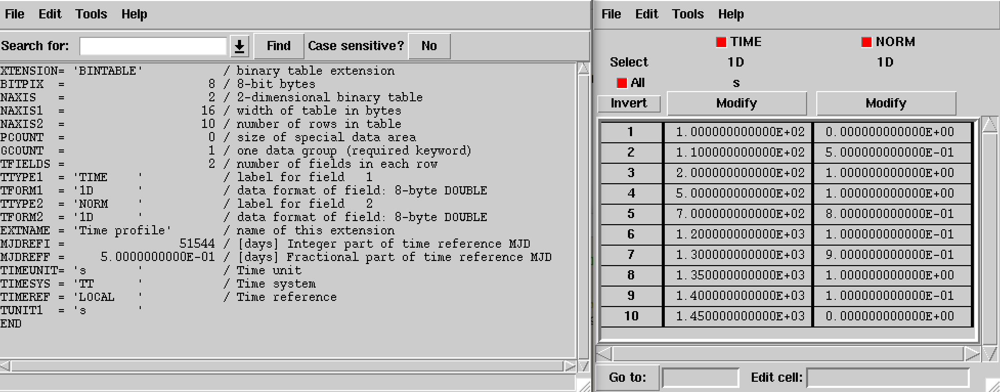
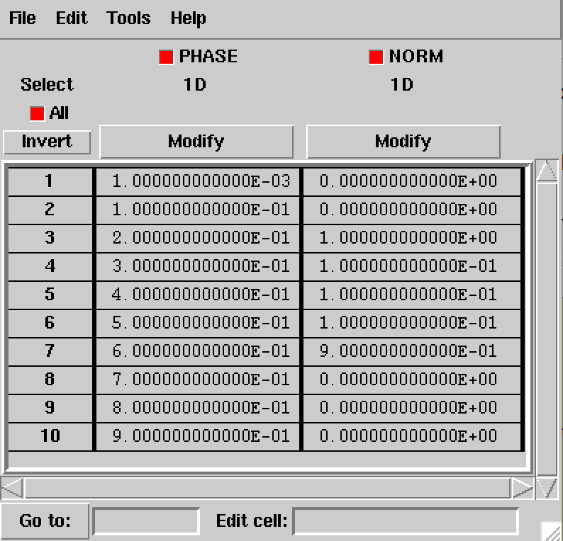

Temporal components
^^^^^^^^^^^^^^^^^^^

Constant
========

The :doxy:`GModelTemporalConst` class implements a temporal model that is
constant in time and defined by

.. math::
   M_{\rm temporal}(t) = N_0

where the parameter in the XML definition has the following mapping:

* :math:`N_0` = ``Normalization``

The XML format for specifying a constant temporal model is:

.. code-block:: xml

   <temporal type="Constant">
     <parameter name="Normalization" scale="1.0" value="1.0" min="0.1" max="10.0" free="0"/>
   </temporal>

Light Curve
===========

The :doxy:`GModelTemporalLightCurve` class implements a temporal model that
defines an arbitrary light curve, defined by a function in a FITS file.

The only parameter of the model is a multiplicative normalization:

.. math::
   M_{\rm temporal}(t) = N_0 r(t)

where the parameter in the XML definition has the following mapping:

* :math:`N_0` = ``Normalization``

The XML format for specifying a light curve is:

.. code-block:: xml

   <temporal type="LightCurve" file="model_temporal_lightcurve.fits">
     <parameter name="Normalization" scale="1" value="1.0" min="0.0" max="1000.0" free="0"/>
   </temporal>

If the ``file`` attribute is a relative path, the path is relative to the
directory where the XML file resides. Alternatively, an absolute path may be
specified. Any environment variable present in the path name will be 
expanded.

The structure of the light curve FITS file is shown in the figure below.
The light curve is defined in the first extension of the FITS file and
consists of a binary table with the columns ``TIME`` and ``NORM``.
Times in the ``TIME`` columns are given in seconds and are counted with
respect to a time reference that is defined in the header of the binary
table. Times need to be specified in ascending order. The values in the
``NORM`` column specify :math:`r(t)` at times :math:`t`, and should be
comprised between 0 and 1.

.. _fig_model_lightcurve:

   *Structure of light curve FITS file*

Phase Curve
===========

The :doxy:`GModelTemporalPhaseCurve` class implements a temporal model that
defines a temporal variation based on an arbitrary phase :math:`\Phi(t)`
that is computed using

.. math::
   \Phi(t) = \Phi_0 + f(t-t_0) + \frac{1}{2}\dot{f} (t-t_0)^2 +
                                 \frac{1}{6}\ddot{f} (t-t_0)^3

where

* :math:`t_0` is a reference time,
* :math:`\Phi_0` is the phase at the reference time,
* :math:`f` is the variation frequency at the reference time,
* :math:`\dot{f}` is the first derivative of the variation frequency at
  the reference time, and
* :math:`\ddot{f}` is the second derivative of the variation frequency at
  the reference time.

The temporal variation is computed using

.. math::
   M_{\rm temporal}(t) = N_0 r(\Phi(t))

The parameters in the XML definition have the following mappings:

* :math:`N_0` = ``Normalization``
* :math:`t_0` = ``MJD``
* :math:`\Phi_0` = ``Phase``
* :math:`f` = ``F0``
* :math:`\dot{f}` = ``F1``
* :math:`\ddot{f}` = ``F2``

The XML format for specifying a phase curve is:

.. code-block:: xml

   <temporal type="PhaseCurve" file="model_temporal_phasecurve.fits">
     <parameter name="Normalization" scale="1" value="1.0"     min="0.0" max="1000.0"   free="0"/>
     <parameter name="MJD"           scale="1" value="51544.5" min="0.0" max="100000.0" free="0"/>
     <parameter name="Phase"         scale="1" value="0.0"     min="0.0" max="1.0"      free="0"/>
     <parameter name="F0"            scale="1" value="1.0"     min="0.0" max="1000.0"   free="0"/>
     <parameter name="F1"            scale="1" value="0.1"     min="0.0" max="1000.0"   free="0"/>
     <parameter name="F2"            scale="1" value="0.01"    min="0.0" max="1000.0"   free="0"/>
   </temporal>

If the ``file`` attribute is a relative path, the path is relative to the
directory where the XML file resides. Alternatively, an absolute path may be
specified. Any environment variable present in the path name will be 
expanded.

The structure of the phase curve FITS file is shown in the figure below.
The phase curve is defined in the first extension of the FITS file and
consists of a binary table with the columns ``PHASE`` and ``NORM``.
Phase values in the ``PHASE`` column need to be comprised between 0 and 1
and need to be given in ascending order. The values in the ``NORM`` column
specify :math:`r(\Phi(t))` at phases :math:`\Phi(t)`, and should be comprised
between 0 and 1.

.. _fig_model_phasecurve:

   *Structure of phase curve FITS file*

By default, the ``NORM`` values are recomputed internally so that the
phase-averaged normalisation is one. In that case, the spectral component corresponds
to the phase-averaged spectrum. If the internal normalisation should be disabled
the ``normalize="0"`` attribute needs to be added to the temporal tag, i.e.

.. code-block:: xml

   <temporal type="PhaseCurve" file="model_temporal_phasecurve.fits" normalize="0">

In that case the ``NORM`` values are directly multiplied with the spectral
component.

