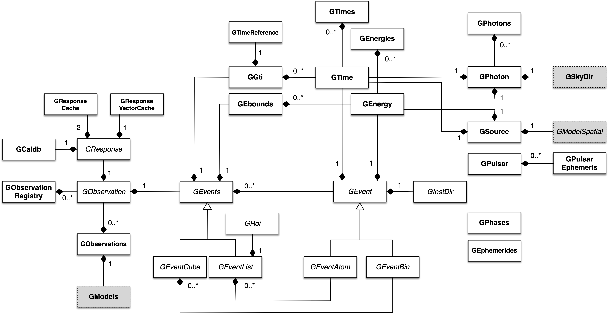

Overview
========

The following figure presents an overview over the C++ classes of the obs
module and their relations.

.. _fig_uml_obs:

   *Overview over the obs module*

The central C++ class of the obs module is the abstract base class
:doxy:`GObservation` which defines the instrument-independent interface for a
gamma-ray observation. A gamma-ray observation is defined for a single
specific instrument, and describes a time period during which the
instrument is in a given stable configuration that can be characterized
by a single specific response function. Each gamma-ray observation is
composed of events and a response function.

Observations are collected in the C++ container class :doxy:`GObservations`
which is composed of a list of :doxy:`GObservation` elements (the list is of
arbitrary length; an empty list is a valid state of the :doxy:`GObservations`
class). The observation container is furthermore composed of a :doxy:`GModels`
model container class that holds a list of models used to describe the
event distributions of the observations (see :ref:`um_model`). The
:doxy:`GObservations` class presents the central element of all scientific data
analyses, as it combines all data and all models in a single entity.

Instrument specific implementations of :doxy:`GObservation` objects are
registered in the C++ registry class :doxy:`GObservationRegistry` which
statically collects one instance of each instrument-specific observation
class that is available in GammaLib (see :ref:`um_registry` for a general
description of registry classes).

The instrument response for a given observation is defined by the
abstract base class :doxy:`GResponse`. This class is composed of the C++ class
:doxy:`GCaldb` which implements the calibration data base that is required to
compute the response function for a given instrument and observation.
:doxy:`GCaldb` supports the HEASARC CALDB format
(http://heasarc.nasa.gov/docs/heasarc/caldb/), but is sufficiently
general to support also other formats (see :ref:`um_obs_caldb` to learn
how to setup and to use a calibration database).

The events for a given observation are defined by the abstract base
class :doxy:`GEvents`. This class is composed of the C++ classes :doxy:`GGti` and
:doxy:`GEbounds`. :doxy:`GGti` implements so called *Good Time Intervals*, which defines
the time period(s) during which the data were taken (see :ref:`um_obs_time`).
:doxy:`GEbounds` implements so called *Energy Boundaries*, which
define the energy intervals that are covered by the data (see 
:ref:`um_obs_energy`).

:doxy:`GEvents` is also a container for the individual events, implemented by the
abstract :doxy:`GEvent` base class. 
GammaLib distinguishes two types of events: event
atoms, which are individual events, and event bins, which are
collections of events with similar properties. Event atoms are
implemented by the abstract base class :doxy:`GEventAtom`, while event bins are
implemented by the abstract base class :doxy:`GEventBin`. Both classes derive
from the abstract :doxy:`GEvent` base class.

Each event type has it's own container class, which derives from the
abstract :doxy:`GEvents` base class. Event atoms are collected by the abstract
:doxy:`GEventList` base class, while event bins are collected by the abstract
:doxy:`GEventCube` base class. The :doxy:`GEventList` class contains an instance of the
abstract :doxy:`GRoi` base class.
