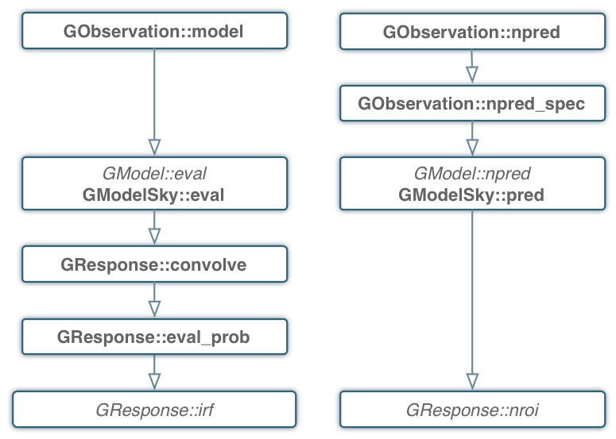

.. _response:

Handling the instrument response
================================

The instrument response to incoming gamma-rays is described by the abstract
:doxy:`GResponse` class from which an instrument specific implemention needs to
be derived. The general instrument response function
:math:`R(p', E', t' | p, E, t)`
is provided by the :doxy:`GResponse::irf(GEvent&, GPhoton&, GObservation&)` method.
:math:`R` is defined as the effective detection area per time, energy and solid 
angle (in units of :math:`cm^2 s^{-1} MeV^{-1} sr^{-1}`) for measuring an event
at position :math:`p'` with an energy of :math:`E'` at time :math:`t'` if the
photon arrives from direction :math:`p` with energy :math:`E` at time 
:math:`t` on the instrument.
The measured event quantities :math:`p'`, :math:`E'` and :math:`t'` are
combined in the abstract :doxy:`GEvent` class from which an instrument specific
implementation needs to be derived.
The photon characteristics :math:`p`, :math:`E` and :math:`t` are combined in the
:doxy:`GPhoton` class.

The photon arrival direction :math:`p` is expressed by a coordinate on
the celestial sphere, for example Right Ascension and Declination, implemented
by the :doxy:`GSkyDir` class.
For imaging instruments, the measured event position :math:`p'` is
likely also a coordinate on the celestial sphere, while for non-imaging
instruments (such as coded masks or Compton telescopes), :math:`p'`
will be typically the pixel number of the detector that measured the event.
The definition of :math:`p'` needs to be implemented for each instrument
as a derived class from the abstract :doxy:`GInstDir` class.
Energies (:math:`E'` and :math:`E`) are implemented by the :doxy:`GEnergy` class,
times (:math:`t'` and :math:`t`) are represented by the :doxy:`GTime` class.

Assuming that the photon intensity received from a gamma-ray source is described
by the source model :math:`M(p, E, t)`
(in units of :math:`photons \,\, cm^{-2} s^{-1} MeV^{-1} sr^{-1}`)
the probability of measuring an event at position :math:`p'` with 
energy :math:`E'` at time :math:`t'` from the source is given by

.. math::
    P(p', E', t') =
    \int_{0}^{t'+\Delta t} \int_{E'-\Delta E}^{\infty} \int_{\Omega} 
    M(p, E, t) \, R(p', E', t' | p, E, t)
    \, {\rm d}p \, {\rm d}E \,{\rm d}t
    :label: model

(in units of :math:`counts \,\, s^{-1} MeV^{-1} sr^{-1}`).
The terms :math:`\Delta t` and :math:`\Delta E` account for the statistical
jitter related to the measurement process and are of the order of a few time
the rms in the time and energy measurements. The evaluation of this function
is implemented by the :doxy:`GResponse::convolve` method.

The integration over sky positions :math:`p`, expressed as a zenith angle
:math:`\theta` and an azimuth angle :math:`\phi`, is given by

.. math::
    P_{p}(p', E', t' | E, t) =
    \int_{\theta, \phi} M(\theta, \phi, E, t) \,
    R(p', E', t' | \theta, \phi, E, t)
    \sin \theta \, {\rm d}\theta \, {\rm d}\phi
    :label: pirf

which is provided by the :doxy:`GResponse::irf(GEvent&, GSource&, GObservation&)`
method. Note that in contrast to the method described above, this method
takes the :doxy:`GSource` class instead of the :doxy:`GPhoton` class as argument.
:doxy:`GSource` differs from :doxy:`GPhoton` in that the photon arrival direction
:math:`p` is replaced by the spatial component :doxy:`GModelSpatial` of a source
model.
Equation :eq:`pirf` is used by the :doxy:`GModelSky::eval` method for
computation of the instrument response to a source model.
The following figure shows in the left panel the call tree of the model
convolution:

.. _fig_calltree_model:

   *Call tree for model evaluation and IRF convolution*

A maximum likelihood analysis of the data generally needs the computation of the
predicted number of events within the selection region for each source model.
Selection region means here the range of measured quantities that is used for
analysis (i.e. range in event position :math:`p'`, measured energy :math:`E'`
and time :math:`t'`).
For a likelihood analysis where the events have been binned in a data cube
(i.e. a so-called binned likelihood analysis), the predicted number of events
is obtained by summing over all bins of the predicted events in the data cube.
For an unbinned likelihood analysis that operates directly on the list of
detected events, the predicted number of events is obtained by integrating
equation :eq:`model` over the selection region:

.. math::
    N_{\rm pred} = \int_{\rm GTI} \int_{E_{\rm bounds}} \int_{\rm ROI} 
    P(p', E', t') \,
    {\rm d}p' \, {\rm d}E' \, {\rm d}t'
    :label: npred

Here, the event selection region is defined by a Region of Interest
(:math:`\rm ROI`) that defines the selected range in event positions 
:math:`p'`, a set of energy boundaries (:math:`E_{\rm bounds}`) that
defines the selected energies :math:`E'`, and Good Time Intervals
(:math:`\rm GTI`) that the define the selected time intervals.
The definition of the Region of Interest is instrument specific and needs
to be implemented by a class derived from the abstract :doxy:`GRoi` class.
Energy boundaries are specified by the :doxy:`GEbounds` class, time intervals
by the :doxy:`GGti` class.

The integration over the region of interest

.. math::
    N_{\rm ROI} = \int_{\rm ROI} (p', E', t') \, {\rm d}p'

is provided by the 
:doxy:`GResponse::nroi(GModelSky&, GEnergy&, GTime&, GObservation&)` method
(see figure above for the call tree).

A final word about deadtime corrections.
Deadtime corrections need to be taken into account at the level of the instrument
specific response classes.
Deadtime corrections can be determined using the :doxy:`GObservation::deadc` method,
which provides the time dependent deadtime correction factor.
