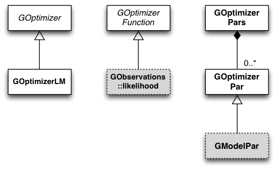

Overview
========

The following figure presents an overview over the C++ classes of
the optimizer module and their relations.

.. _fig_uml_opt:

   *Optimizer module*

The optimizer module provides classes for function optimization.
The abstract :doxy:`GOptimizerFunction` base class defines the interface
for the function that should be optimized. The :doxy:`GOptimizerPar`
class defines a parameter of the function, and the :doxy:`GOptimizerPars`
container class collects all function parameters. The optimizer
is represented by the abstract :doxy:`GOptimizer` base class. So far,
the only optimizer algorithm implemented in GammaLib is the
Levenberg-Marquardt algorithm, implemented by the class
:doxy:`GOptimizerLM`.

The model parameter class :doxy:`GModelPar`, as a specific implementation
of the optimizer parameter class, derives from :doxy:`GOptimizerPar`.
One implementation of an optimizer function is the
:doxy:`GObservations::likelihood` class that is used for maximum
likelihood fitting within GammaLib.
