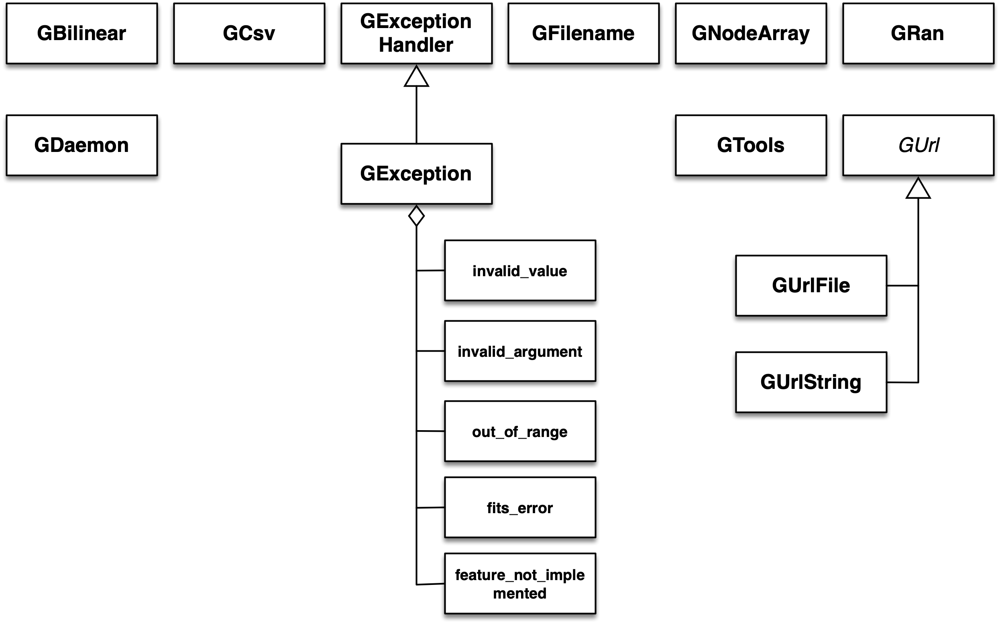

Overview
~~~~~~~~

The following figure presents an overview over the C++ classes of the 
support module and their relations.

.. _fig_uml_support:

   *Support module*

The support module contains a number of functions and classes that are 
needed to support core functionnalities of GammaLib. An overview of the 
functions and C++ classes present in this module is given in 
:ref:`fig_uml_support`. The :doxy:`GCsv` class supports handling of column 
separated value tables. The :doxy:`GExceptionHandler` class implements an
exception handler that is used through GammaLib for exception handling.
The :doxy:`GException` class derives from this handler, and implements a
number of sub-classes that are actually thrown in exceptions. The
:doxy:`GNodeArray` implements methods for linear interpolation between node
values. This is the central interpolation class that is used in GammaLib.
The :doxy:`GRan` class implements a random number generator that is widely used
for Monte Carlo simulations. The :doxy:`GTools.hpp` module is not a class, but a
collection of constants and functions that is widely used in GammaLib.
The abstract :doxy:`GUrl` base class represents a unified location for some
information that is independent of the media. The classes :doxy:`GUrlFile`
and :doxy:`GUrlString` are derived from :doxy:`GUrl` and implement a file storage 
and a string storage, respectively. As most of the classes are unrelated,
they will be described individually in the following sections.
