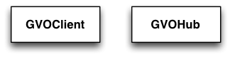

Overview
========

The following figure presents an overview over the classes of the VO
module and their relations.

.. _fig_uml_vo:

   *VO module*

The VO module provides classes that interface GammaLib to the Virtual 
Observatory infrastructure. So far the module contains the :doxy:`GVOClient`
and the :doxy:`GVOHub` classes. :doxy:`GVOClient` implements a 
Virtual Observatory client while :doxy:`GVOHub` implements a hub for
inter-client communication.
If a client needs to connect to a Hub and no Hub is running on the system,
the client will launch it's own Hub.
