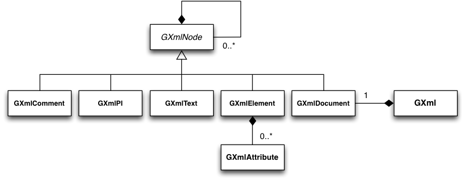

Overview
========

The followinf figure presents an overview over the C++ classes of the XML
module and their relations.

.. _fig_uml_xml:

   *XML module*

The XML module provides classes that allow creation, writing and reading of
files in the Extensible Markup Language (XML) format.
The central class of the XML module is the abstract :doxy:`GXmlNode` base
class which represent a node of the XML document. The essential property
of :doxy:`GXmlNode` is that it may contain a list of :doxy:`GXmlNode` objects,
allowing creating a complex tree of data structures. Nodes in a XML
document may be either elements, comments, some text of a processing
instruction. These different node types are implemented by the
:doxy:`GXmlElement`, :doxy:`GXmlComment`, :doxy:`GXmlText` and :doxy:`GXmlPI` classes,
respectively. A special node if the :doxy:`GXmlDocument` node which provides
the root node of a XML document. This node must exist only once in a XML
tree. The XML file is implement by the :doxy:`GXml` class which contains one
instance of :doxy:`GXmlDocument`.
